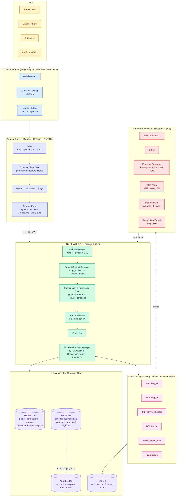

# ERP + SaaS Business Management Platform — Master Build Plan

> **Target domain (primary):** Retail and wholesale shops — starting with electrical / electronic / power-tools / project-goods, built so the same platform resells to any retail + wholesale business (medical store, grocery, hardware, stationery, mobile accessories, etc.) through pluggable vertical packs (§7.4).
>
> The platform assumes **both retail and wholesale flows in the same shop**, on the same inventory, often with the same customer switching roles between walk-in-retail today and wholesale-with-credit-terms next week. Every module in this plan is designed around that duality:
> - **Retail path:** walk-in customer → barcode POS → instant invoice → cash/card/UPI/wallet → receipt printed → SMS sent. Sub-10-second checkout on a 5-year-old PC.
> - **Wholesale path:** known customer with credit limit → quotation (optional) → sales order → delivery challan → tax invoice → net-30 receivable → payment follow-up → partial payments → ledger reconciliation.
>
> Both paths share the same products, same stock, same accounting, same dashboard. The differences are entity states, document types, and permission-gated flows — never parallel codebases.
>
> **Users of a single shop:** shop owner · manager · accountant · cashier (retail counter) · storekeeper (receives & issues stock) · delivery staff · field sales rep (wholesale) · HR admin · read-only auditor. **Users across the platform:** platform admin (Anthropic / you) · SaaS subscription billing admin · support staff (impersonation with audit).
>
> **Target delivery:** Multi-tenant SaaS, resold by subscription to other shop owners. Pluggable verticals (medical, grocery, etc.) in Phase 2.
>
> **Stack:** Angular (signals + OnPush + PrimeNG) • .NET 8 Web API • EF Core 8 (Code-First) • SQL Server • Redis • Hangfire • SignalR
>
> **Platforms:** Web (Angular) • Windows Desktop (Electron shell wrapping Angular build) • Mobile/Tablet (Ionic/Capacitor wrapping the same Angular build) — one codebase, three shells.

---

## Table of Contents

0. [Product Design Flow (diagram)](#0-product-design-flow)
  0.5 [Domain Context — Retail + Wholesale](#05-domain-context)
1. [Architecture Principles](#1-architecture-principles)
2. [Solution Structure (.NET)](#2-solution-structure-net)
3. [Angular Project Structure](#3-angular-project-structure)
4. [Database Philosophy — Code-First, Seeding, Multi-Database Tiers, Multi-Tenancy](#4-database-philosophy)
5. [Cross-Cutting Framework (must exist before any module)](#5-cross-cutting-framework)
   - 5.1 BaseService pattern (try/catch + transaction + CancellationToken)
   - 5.2 Global error handling + ErrorLog table
   - 5.3 Third-Party API logging
   - 5.4 Audit Log system
   - 5.5 DDLKey dropdown engine (dependent + independent)
   - 5.6 Multi-tenancy (ShopId filter)
   - 5.7 RBAC + subscription feature gate
   - 5.8 Dynamic UI / menu engine (Menu → Submenu → Page, permission-cascaded)
   - 5.9 File upload config engine
   - 5.10 SMS / Email config engine
   - 5.11 Notification engine
   - 5.12 Reporting engine (PDF / Excel / CSV)
   - 5.13 Testing framework (unit, integration, E2E, arch, tenant-isolation)
6. [Business Modules (1–24)](#6-business-modules)
   - 6.1–6.14 Identity, Billing, Inventory, Accounting, Warranty, Pricing, Transport, Marketplace, HR, Notifications, Reports, Wallet, Online Payment Tracking, Masters
   - 6.15 Public Landing Page, Service Catalog & API Discovery
   - 6.16 Shift Management (Cashier / Cash Drawer)
   - 6.17 Quotations & Estimates
   - 6.18 Multi-Location / Branch Management
   - 6.19 Offline Mode & Local Sync
   - 6.20 Shop API Access & Outbound Webhooks
   - 6.21 Localization (i18n + Multi-Currency)
   - 6.22 Tenant Lifecycle (Export, Deletion, Backup, Restore)
   - 6.23 Purchase Returns / Debit Notes
   - 6.24 Service / Repair Job Tracking (optional)
7. [Advanced / Platform Modules](#7-advanced-modules)
   - 7.1–7.5 Dashboard, Payment Integration, Branding, Multi-Business Verticals, Admin & Platform
   - 7.6 Usage Metering & Quota Enforcement
   - 7.7 Hardware Integration Layer (receipt / label / drawer / scale / scanner)
8. [Angular Patterns — Signals, OnPush, Stores, PrimeNG](#8-angular-patterns)
9. [Security — Auth, Tokens, Tenant Isolation](#9-security)
10. [DevOps, Environments, CI/CD](#10-devops)
11. [Phased Delivery Roadmap](#11-roadmap)
12. [Definition of Done — per module](#12-definition-of-done)

---

## 0. Product Design Flow

High-level flow of how a request travels through the system, from a user touching a device to data persistence and external side-effects. Render this in any Mermaid-compatible viewer (GitHub, VS Code with the Mermaid extension, Obsidian, `mermaid.live`).



**How to read this diagram:** a request flows top-to-bottom through the solid arrows. Dotted arrows are asynchronous — external APIs are called via the logging delegating handler (§5.3) and webhooks come back in through the same authenticated API pipeline. The only thing that ever writes to the **Log DB** is the cross-cutting layer; the only thing that ever writes to the **Analytics DB** is the ETL relay. Everything else writes to **Platform** or **Tenant** — never both in the same transaction (outbox pattern bridges the two, see §4.5).

**Three simultaneous permission checks** (defense in depth) sit on the path from click to data:
1. **Menu tree filter** at `S2` — the user never sees items they can't use.
2. **Route guard** at `S4` — direct URL entry to an unauthorized page redirects to `/unauthorized`.
3. **API gate** at `A3` — every request re-checks permission + subscription feature server-side and returns 403 / 402 if denied.

All three agree on the same permission codes (Appendix A) and feature codes (Appendix B). A new page added to the system is wired into all three layers via a single seeder + route config + controller attribute set.

---

## 0.5 Domain Context — Retail + Wholesale, Single System

The primary domain is **electrical / electronic / power-tool / project-goods shops** that serve both **retail walk-in customers** and **wholesale trade customers in the same day, from the same stock, under the same GST registration**. Most Indian shops of this type operate in both modes simultaneously — a contractor walks in at 10am for a credit purchase of ₹45,000 worth of wiring, and at 10:15 a household customer buys one LED bulb for ₹180. The system must handle both without context-switching friction, and the design reflects that.

**Two operating modes, one database, one customer master.** There is no separate "retail module" vs "wholesale module." The same `Customer`, the same `Product`, the same `Invoice` entity, the same accounting — but the POS screen, the default behaviors, and the pricing/credit rules branch on a mode toggle and on the customer's `CustomerTypeCode`.

**Retail mode**
- Default customer: "Walk-in" (a reserved customer per shop; no KYC required). Fast lookup to convert a walk-in to a saved customer if they return.
- Barcode-first flow: scan → scan → scan → collect cash/UPI → print receipt. Target: 30 seconds per transaction from first scan to printed receipt.
- Thermal-receipt format (80mm) — no A4, no logos wasting paper, GST summary block fits in 40 lines.
- Price = MRP / retail price list, discounts rare and clerk-level only.
- Payment at time of sale — no credit. Wallet/UPI/Card/Cash tendering.
- Open cashier shift required (§6.16) — every transaction ties to a named shift for end-of-day cash reconciliation.

**Wholesale mode**
- Registered customer required (GST number captured, credit limit set, payment terms configured).
- Quote → confirm → dispatch → invoice → payment workflow (§6.17 Quotations) — sale is not one atomic step.
- Wholesale price list applied automatically based on `Customer.CustomerTypeCode`; volume-tier discounts stack via the pricing engine (§6.6).
- Credit sale common: invoice issued, receivable created, customer pays on terms. Due-date reminders automatic.
- A4 invoice PDF with full letterhead, e-way bill for ≥ ₹50,000 intrastate value, e-invoice IRN.
- Dispatch step: pick list → loading sheet → delivery note → transport assignment (§6.7).

**Mode toggle on the POS.** The `/billing/pos` screen has a prominent Retail ↔ Wholesale switch at the top. Switching does three things: swaps the default customer, swaps the price list, and swaps the invoice template. The entity model is identical — mode is just a lens on the same data.

**Reports and dashboards** (§7.1) are sliceable by mode by default. "Today's sales" shows retail and wholesale side by side; inventory valuation is at cost, unchanged; GST returns (GSTR-1) are unified because they're filed under one GSTIN.

**Why this matters for the plan.** Several modules change shape when you accept both modes as first-class:
- **§6.2 Billing** has explicit retail and wholesale sub-flows, not a single "create invoice" flow.
- **§6.16 Shift Management** is retail-only but every invoice records its `ShiftId` for accountability.
- **§6.17 Quotations** are wholesale-only but integrate tightly with inventory reservations.
- **§6.18 Multi-Location / Branch** matters for both — a chain might have a retail counter and a wholesale counter in different buildings.
- **§6.19 Offline Mode** is mostly a retail concern (POS must keep running) but offline-created wholesale invoices must not jump credit limits when they sync.
- **§7.2 Hardware Integration** adds thermal printers + cash drawers for retail; A4 printers + label printers for wholesale.

All modules below call out retail-mode and wholesale-mode behaviors where they differ.

---

## 1. Architecture Principles

**Monolithic-Modular.** One deployable API + one Angular app, internally split into vertical modules (Billing, Inventory, HR, etc.). Each module owns its entities, services, controllers, DTOs, validators, profiles, and seed data. Modules communicate through interfaces registered in DI — not through direct cross-module DbContext access. This keeps extraction to microservices feasible later without rewriting.

**Code-First + Seeded.** Every table is an EF Core entity. Migrations are generated from code. Seeding is deterministic and idempotent (see §4). No manual SQL except for performance-only indexes that EF can't express cleanly.

**Every service follows one shape** — try/catch, optional transaction, CancellationToken, structured result, audit + error log writes (see §5.1). No exceptions.

**Every external call is logged.** POS, SMS, email, payment gateway, Amazon, Flipkart, GST portal — a row in `ThirdPartyApiLog` with request, response, duration, status (see §5.3).

**Every dropdown is a DDLKey.** Frontend never hardcodes dropdown values. One endpoint, one cache, dependent or independent (see §5.5).

**Multi-tenant by ShopId.** Global query filter on every tenant-scoped entity. Claim-based current-shop resolution. Cross-shop data leakage is architecturally impossible, not policy-enforced.

**Feature-gated by Subscription.** A plan defines which modules + sub-features are exposed. The same gate is enforced at API (filter), UI (directive), and menu-build time.

**Capture everything, analyze later.** The system's long-term value is its data. Every business event (invoice line, payment attempt, stock movement, wallet transaction, notification send, login, config change) is persisted as a structured row — never just a log line. Schemas are designed with reporting and BI in mind: foreign keys preserved, enums stored as codes (not free text), timestamps in UTC with a separate `LocalDate` column for tenant-local reporting, denormalized snapshots on documents (invoice line stores `ProductNameSnapshot`, `UnitPriceSnapshot`, `GstRateSnapshot`) so historical reports stay correct when master data changes later. Every module's Definition of Done includes "analytics fields reviewed."

---

## 2. Solution Structure (.NET)

```
/src
├── ErpSaas.Api                          # ASP.NET Core host, Program.cs, middleware wiring
├── ErpSaas.Core                         # Domain contracts, interfaces, enums, constants, Result<T>
├── ErpSaas.Infrastructure               # EF Core DbContext, migrations, repositories, seeders
├── ErpSaas.Shared                       # Cross-cutting: logging, audit, ddlkey, notifications, files
│   ├── Auditing/
│   ├── ErrorLogging/
│   ├── ThirdPartyLogging/
│   ├── DdlKey/
│   ├── MultiTenancy/
│   ├── Rbac/
│   ├── Subscription/
│   ├── FileStorage/
│   ├── Sms/
│   ├── Email/
│   ├── Notifications/
│   ├── Reporting/
│   └── BaseService/
├── ErpSaas.Modules.Identity             # Users, roles, permissions, shops, subscriptions
├── ErpSaas.Modules.Billing              # Invoices, GST, barcode billing
├── ErpSaas.Modules.Inventory            # Products, stock, categories, variants, barcode
├── ErpSaas.Modules.Accounting           # Ledgers, vouchers, P&L, balance sheet, ITR
├── ErpSaas.Modules.Warranty             # Warranty/guarantee tracking
├── ErpSaas.Modules.Pricing              # Discounts, offers, schemes
├── ErpSaas.Modules.Transport            # Vehicles, delivery, transport charges
├── ErpSaas.Modules.Marketplace          # Amazon, Flipkart, own e-com sync
├── ErpSaas.Modules.Hr                   # Staff, attendance, salary, leave
├── ErpSaas.Modules.Reporting            # Report definitions, exports
├── ErpSaas.Modules.PaymentIntegration   # POS, payment gateways
├── ErpSaas.Modules.Dashboard            # KPI aggregation, analytics
└── ErpSaas.Modules.Admin                # Tenant admin, dynamic menu, config

/tests
├── ErpSaas.UnitTests
├── ErpSaas.IntegrationTests             # Testcontainers-based, real SQL Server
└── ErpSaas.ArchTests                    # NetArchTest — enforces module boundaries
```

Each `ErpSaas.Modules.*` project exposes a single `IServiceCollection` extension:

```csharp
public static class BillingModuleRegistration
{
    public static IServiceCollection AddBillingModule(this IServiceCollection services)
    {
        services.AddScoped<IInvoiceService, InvoiceService>();
        services.AddScoped<IBarcodeBillingService, BarcodeBillingService>();
        // validators, profiles, background jobs...
        return services;
    }
}
```

`Program.cs` just chains them: `.AddIdentityModule().AddBillingModule().AddInventoryModule()...` — adding a new vertical (medical shop) is one line.

---

## 3. Angular Project Structure

```
/src/app
├── core/                                # Singletons, interceptors, guards, base services
│   ├── auth/
│   ├── http/                            # interceptors: auth, tenant, error, loading, retry
│   ├── ddlkey/                          # DdlKeyService + cache signal store
│   ├── subscription/                    # feature-gate directive + service
│   ├── rbac/                            # permission directive + service
│   ├── audit/
│   ├── notifications/
│   ├── error/
│   └── config/
├── shared/                              # Dumb components, pipes, directives, PrimeNG wrappers
│   ├── components/
│   │   ├── ddl-dropdown/                # wraps p-dropdown, signal-driven
│   │   ├── data-table/                  # wraps p-table with server-side signals
│   │   ├── form-field/
│   │   ├── page-header/
│   │   └── confirm-dialog/
│   └── pipes/
├── layout/
│   ├── shell/                           # topbar, sidebar (dynamic menu from API)
│   └── auth-layout/
├── features/                            # One folder per module — lazy-loaded routes
│   ├── billing/
│   ├── inventory/
│   ├── accounting/
│   ├── warranty/
│   ├── pricing/
│   ├── transport/
│   ├── marketplace/
│   ├── hr/
│   ├── reporting/
│   ├── payment/
│   ├── dashboard/
│   └── admin/
└── app.routes.ts                        # All routes lazy
```

Every feature folder uses the same internal convention: `pages/`, `components/`, `services/` (a signal-based store), `models/`, `*.routes.ts`. Covered in §8.

---

## 4. Database Philosophy

### 4.1 Code-First, Always

- `AppDbContext` lives in `ErpSaas.Infrastructure`.
- Each module contributes its entity configurations via `IEntityTypeConfiguration<T>` scanned from module assemblies — the DbContext doesn't hardcode them.
- Migrations generated via `dotnet ef migrations add <Name> --project ErpSaas.Infrastructure --startup-project ErpSaas.Api`.
- On app startup: `db.Database.MigrateAsync()` in Development; in Production, migrations run as a release step (not on boot) to avoid race conditions across replicas.

### 4.2 Base Entity Contract

```csharp
public abstract class BaseEntity
{
    public long Id { get; set; }
    public DateTime CreatedAtUtc { get; set; }
    public long CreatedByUserId { get; set; }
    public DateTime? UpdatedAtUtc { get; set; }
    public long? UpdatedByUserId { get; set; }
    public bool IsDeleted { get; set; }        // soft delete
    public byte[] RowVersion { get; set; } = default!; // optimistic concurrency
}

public abstract class TenantEntity : BaseEntity
{
    public long ShopId { get; set; }
}
```

A `SaveChangesInterceptor` stamps `CreatedAtUtc`, `UpdatedAtUtc`, `CreatedByUserId`, `UpdatedByUserId`, and `ShopId` automatically from the current `ITenantContext` and `ICurrentUser`.

### 4.3 Global Query Filters

```csharp
modelBuilder.Entity<Invoice>()
    .HasQueryFilter(i => !i.IsDeleted && i.ShopId == _tenantContext.ShopId);
```

Applied via reflection for every `TenantEntity` in `OnModelCreating`.

### 4.4 Seeding Strategy (deterministic, idempotent)

Three tiers:

| Tier | Data | When | Mechanism |
|---|---|---|---|
| **System seed** | Permissions, roles, DdlKey catalogs, SubscriptionPlans, NotificationTemplates, ErrorTypes | Every deploy | `ISystemSeeder` interface, run on startup, upserts by natural key |
| **Tenant seed** | Default chart of accounts, default tax rates, default units, default categories | On shop creation | `ITenantSeeder.SeedAsync(shopId)` called inside the "create shop" transaction |
| **Demo seed** | Sample products, customers, invoices | Optional, dev only | CLI command `dotnet run -- seed demo --shopId=X` |

Seeders are collected via DI:

```csharp
public interface ISystemSeeder
{
    int Order { get; }
    Task SeedAsync(AppDbContext db, CancellationToken ct);
}
```

All seeders run inside one transaction; any failure rolls back. Each seeder is idempotent — checks existence by `Code`/`Key` before inserting.

### 4.5 Multi-Tenancy + Multi-Database Model

A single monolithic database is tempting but wrong for this system — it mixes data with very different read/write patterns, lifecycles, and compliance needs. We split into **four logical databases** from day one (all SQL Server by default, but logically independent so any can move to a different engine / server / region later without touching business code).

```
┌─────────────────────────────────────────────────────────────────────────┐
│                             DATABASE TIERS                              │
├─────────────────────────────────────────────────────────────────────────┤
│                                                                         │
│  1. PLATFORM DB   (one, shared by all tenants)                          │
│     ─ Subscription plans, features, pricing                             │
│     ─ Permission catalog, MenuItem definitions                          │
│     ─ System DDL catalogs (COUNTRY, STATE, CITY, HSN etc.)              │
│     ─ Platform admin users, impersonation audit                         │
│     ─ Shop registry → maps each ShopId to its TenantDB connection       │
│     ─ Subscription invoices, platform-level payment transactions        │
│                                                                         │
│  2. TENANT DB(s)   (business OLTP — routed per ShopId)                  │
│     ─ Tiered:                                                           │
│       • STANDARD tier  → shared DB, ShopId discriminator (most shops)   │
│       • PREMIUM tier   → dedicated DB per shop (enterprise/high-volume) │
│       • REGIONAL tier  → DB clustered by geography for data residency   │
│     ─ Everything tenant-owned: Customer, Product, Invoice, Wallet,      │
│       Accounting, HR, Warranty, Transport, Marketplace, Notification    │
│     ─ Tenant-level DDL overrides                                        │
│                                                                         │
│  3. ANALYTICS DB  (read-optimized, eventually-consistent)               │
│     ─ Denormalized / star-schema projections of tenant data             │
│     ─ Fed by CDC or nightly ETL from tenant DBs                         │
│     ─ All heavy reports (P&L across years, sales pivots, cohort         │
│       analysis) hit this, never the OLTP DBs                            │
│     ─ Dashboard materialized snapshots live here                        │
│                                                                         │
│  4. LOG DB   (append-only, high-write, ring-buffered)                   │
│     ─ ErrorLog, ThirdPartyApiLog, AuditLog, NotificationQueue history   │
│     ─ Separated because write volume is 10–100× business data and we    │
│       don't want log I/O to stall POS checkout                          │
│     ─ Retention policies (e.g. 90-day AuditLog, 30-day ThirdPartyLog)   │
│       run here without touching business tables                         │
│                                                                         │
└─────────────────────────────────────────────────────────────────────────┘
```

**Why four, not one:**
- **Isolation of blast radius:** a runaway analytics query can't lock POS checkout. A log-write surge can't fill the tenant DB's transaction log.
- **Independent scaling:** analytics DB can move to a read replica / columnstore. Log DB can move to a cheaper tier (slow disk is fine; nothing reads logs urgently).
- **Compliance:** a single "delete my shop's data" request touches only TenantDB + analytics-projection cleanup; platform data stays pristine.
- **Premium tier upgrade path:** moving a shop from standard to premium = export one ShopId's rows, import to new TenantDB, flip the registry entry. No code change.

**Connection routing.** A `DbContextRegistry` owns four `DbContext` types:
- `PlatformDbContext` — singleton connection string
- `TenantDbContext` — resolved per request; `ITenantContext.ShopId` → `IShopConnectionResolver.Resolve(shopId)` → returns connection string (cached). Standard-tier shops share one string; premium shops have their own.
- `AnalyticsDbContext` — singleton, read-only (enforced at DI registration)
- `LogDbContext` — singleton

Every service class declares which contexts it needs via constructor injection. Arch tests (NetArchTest) forbid business services from touching `PlatformDbContext` or `AnalyticsDbContext` directly. Platform services likewise cannot touch `TenantDbContext`.

**Cross-DB transactions are forbidden.** If a write must span tenants (it almost never should), it goes through an outbox: write locally, a relay job reads the outbox and publishes to the other context. This keeps each context's transaction simple and avoids distributed-transaction landmines.

**Tenant isolation (shared-DB tier):**
- Global query filters on every `TenantEntity` — non-negotiable.
- `ITenantContext.ShopId` resolved from JWT claim `shop_id` (primary) / header `X-Shop-Id` (platform super-admin impersonation only, guarded + audited) / explicit param in background jobs.
- **Integration test suite** (§5.13) runs every endpoint under two shop contexts and asserts zero overlap. This is architectural evidence, not policy.

**Tenant provisioning flow (shop onboarding):**
1. `IShopOnboardingService` begins transaction in PlatformDB → creates `Shop` + `ShopSubscription` (trial) + registry entry (tier=Standard, connection=default-tenant-connection).
2. Opens TenantDbContext for the resolved connection → inserts tenant-scoped seeds (default COA, units, categories, `WalletConfig`, `MessagingConfig`, roles per Appendix C).
3. Commits both or nothing (uses the outbox pattern if DBs are on different servers).

**Moving a shop to premium tier later:** admin action → background job copies the shop's rows to a new DB → switches registry → verifies counts → deletes old rows. Zero downtime (reads get served from old until switch).

---

### 4.6 Module-wise Database Breakdown — Schema per Module, Not DB per Module

The four-tier split (Platform / Tenant / Analytics / Log) in §4.5 is about **data lifecycle and access pattern** — not about module ownership. Inside each tier, we still need a clean boundary between modules so that (a) a developer touching Billing doesn't accidentally read Accounting internals, (b) module extraction to a microservice later stays cheap, (c) backups, retention policies, and migrations can be tuned per module, and (d) the ER diagram for each module fits on one screen.

**The decision — schema per module within each DB, not a separate DB per module.**

Each module owns a SQL schema (e.g. `billing`, `inventory`, `accounting`, `hr`, `wallet`, `marketplace`). All of the module's tables live in that schema. Modules communicate across schema boundaries only through **application-layer interfaces** (DI-registered services) — never by writing raw `JOIN accounting.Voucher ON ...` from a Billing service. Cross-schema foreign keys are allowed (they make referential integrity enforceable at the DB level), but cross-schema **writes** must go through a service interface. Arch tests enforce this.

**Why schema-per-module and not physical-DB-per-module:**
- Transactions span modules constantly (a sale writes Invoice + Stock + Voucher + Wallet + Audit + SequenceCounter + Notification queue — all in one commit). Cross-DB distributed transactions are a pit of snakes. One DB per tier lets us use one local transaction.
- Backups, migrations, monitoring, connection pooling are all simpler with one DB per tier.
- Extraction to microservices later = lift one schema + its owning module code into a new service with a message-bus adapter where the in-process interface used to be. The schema boundary is the extraction boundary.
- Arch tests (NetArchTest + custom T-SQL linter) already give us isolation guarantees; a physical DB split adds operational overhead without new safety.

#### Complete mapping table

For each module, this is the schema it owns, the DB tier(s) it writes to, and the primary tables. Migrations are generated per module by EF Core using `modelBuilder.HasDefaultSchema("billing")` in the module's `DbContext` fragment.

| Module (§) | Schema | Primary DB tier | Key tables |
|---|---|---|---|
| **Identity & Users** (§6.1) | `identity` | PlatformDB (users, roles, permissions) + TenantDB mirror for tenant-scoped role assignments | `User`, `UserShop`, `Role`, `Permission`, `RolePermission`, `UserRole`, `UserSecurityToken`, `TwoFactorSecret` |
| **Shop & Subscriptions** (§6.1) | `platform` | PlatformDB | `Shop`, `ShopSubscription`, `SubscriptionPlan`, `SubscriptionPlanFeature`, `SubscriptionInvoice` |
| **Billing & Invoicing** (§6.2) | `billing` | TenantDB | `Customer`, `Invoice`, `InvoiceLine`, `InvoicePayment`, `SalesReturn`, `SalesReturnLine`, `CreditNote` |
| **Inventory Management** (§6.3) | `inventory` | TenantDB | `Category`, `Brand`, `Product`, `ProductVariant`, `ProductBarcode`, `ProductImage`, `ProductBatch`, `KitComponent`, `Warehouse`, `StockLevel`, `StockMovement`, `PurchaseOrder`, `PurchaseOrderLine`, `Supplier`, `StockCount`, `StockCountLine` |
| **Accounting** (§6.4) | `accounting` | TenantDB | `AccountGroup`, `Account`, `Voucher`, `VoucherEntry`, `Expense`, `BankAccount`, `FinancialYear`, `BankStatement`, `BankStatementLine`, `ReconciliationRule`, `Cheque`, `FixedAsset`, `DepreciationEntry` |
| **Warranty** (§6.5) | `warranty` | TenantDB | `WarrantyRegistration`, `WarrantyClaim` |
| **Discounts & Pricing** (§6.6) | `pricing` | TenantDB | `DiscountRule`, `ExtraChargeRule`, `Offer`, `PriceList`, `PriceListItem` |
| **Transport & Logistics** (§6.7) | `transport` | TenantDB | `Vehicle`, `TransportProvider`, `Delivery`, `DeliveryLog` |
| **Marketplace** (§6.8) | `marketplace` | TenantDB | `MarketplaceAccount`, `MarketplaceProductMapping`, `MarketplaceOrder` |
| **HR & Payroll** (§6.9) | `hr` | TenantDB | `Employee`, `EmployeeDocument`, `SalaryComponent`, `Attendance`, `LeaveType`, `LeaveRequest`, `LeaveBalance`, `Payroll`, `StaffActivity` |
| **Notifications** (§6.10, §5.11) | `notification` | TenantDB (queue + templates) + LogDB (history) | `NotificationTemplate`, `NotificationTemplateTenant`, `NotificationQueue`, `MessagingConfig`, `NotificationSentLog` (LogDB) |
| **Reports** (§6.11) | — | Reads from Analytics DB; no owned tables | (uses materialized snapshots in `analytics.*`) |
| **Customer Wallet** (§6.12) | `wallet` | TenantDB | `CustomerWallet`, `WalletTransaction`, `WalletTopUp`, `WalletAdjustment`, `WalletConfig` |
| **Online Payment Tracking** (§6.13) | `payment` | TenantDB | `PaymentGatewayTransaction`, `PaymentGatewayAccount`, `ReconciliationException` |
| **Master Data Mgmt** (§6.14) | `masters` | PlatformDB (Country, State, City, Currency, HSN — system-wide) + TenantDB (tenant-level masters via separate schema `masters_tenant`) | PlatformDB: `Country`, `State`, `City`, `Pincode`, `Currency`, `HsnSacCode`, `BaseUnitOfMeasure`; TenantDB: `CustomerTypeMaster`, `TaxRate`, `PaymentTerm`, `DeliveryZone` |
| **Landing Page / Catalog** (§6.15) | `catalog` | PlatformDB | `ServiceDescriptor`, `PlatformAnnouncement`, `Lead` |
| **Cashier Shift** (§6.16) | `shift` | TenantDB | `CashierShift`, `PosTerminal`, `CashDrawerMovement` |
| **Quotations / SO / DC** (§6.17) | `quotation` | TenantDB | `Quotation`, `QuotationLine`, `SalesOrder`, `SalesOrderLine`, `DeliveryChallan`, `DeliveryChallanLine` |
| **Multi-Location / Branch** (§6.18) | `branch` | TenantDB | `Branch`, `BranchStaff`, `BranchTransfer` |
| **Offline Mode** (§6.19) | `sync` | TenantDB | `DeviceRegistration`, `OfflineCommand`, `SequenceRangeAllocation` |
| **Dual Hosting On-Prem** (§6.19.a) | `replication` | PlatformDB | `OnPremDeployment`, `ReplicationLog`, `ConflictArchive`, `ChangeTrackingLog` |
| **Shop API & Webhooks** (§6.20) | `api` | TenantDB | `ApiKey`, `WebhookSubscription`, `WebhookDelivery` |
| **Localization** (§6.21) | `i18n` | PlatformDB | `Locale`, `TranslationResource`, `ExchangeRate` |
| **Tenant Lifecycle** (§6.22) | `lifecycle` | PlatformDB | `TenantExportJob`, `TenantDeletionRequest`, `BackupSnapshot` |
| **Purchase Returns** (§6.23) | `inventory` (shares with Inventory — same bounded context) | TenantDB | `PurchaseReturn`, `PurchaseReturnLine`, `DebitNote` |
| **Service / Repair Tracking** (§6.24) | `service` | TenantDB | `ServiceJob`, `ServiceJobLine`, `ServiceTechnician` |
| **CA Support & ITR Filing** (§6.25) | `tax` | TenantDB (documents, filings) + PlatformDB (CaShopAssignment — cross-tenant) | TenantDB: `TaxDocument`, `TaxReturnFiling`, `CaReviewNote`, `TaxDeadlineReminder`; PlatformDB: `CaShopAssignment` |
| **Product Owner / Monitoring** (§6.26) | `platform_admin` | PlatformDB | `PlatformOwnerAction`, `GlobalActivitySnapshot` |
| **Dashboard & Analytics** (§7.1) | `analytics` (Analytics DB) | AnalyticsDB | `DailySalesSnapshot`, `DailyInventorySnapshot`, `TopProductSnapshot`, `HourlyActivitySnapshot` — all materialized |
| **Payment Integration** (§7.2) | `payment` (shares with §6.13) | TenantDB | `PaymentDevice`, `PaymentRequest` |
| **Shop Customization** (§7.3) | `branding` | TenantDB | `ShopBranding`, `ShopSetting`, `InvoiceTemplateOverride` |
| **Vertical Packs** (§7.4) | `verticals` | PlatformDB (pack definitions) + TenantDB (per-shop vertical enablement) | `VerticalPack`, `VerticalFeature`, `ShopVertical`, plus vertical-specific schemas like `verticals_medical`, `verticals_grocery` |
| **Admin & Platform** (§7.5) | `platform_admin` (shares with §6.26) | PlatformDB | (listed under §6.26) |
| **Usage Metering** (§7.6) | `metering` | LogDB (write-heavy counters) + PlatformDB (aggregates) | `UsageEvent` (LogDB), `QuotaSnapshot` (PlatformDB), `OverageCharge` (PlatformDB) |
| **Hardware Integration** (§7.7) | `hardware` | TenantDB | `PrinterDevice`, `LabelTemplate`, `ReceiptPrintLog`, `DeviceProfile` |
| **Sequence Management** (§5.16) | `sequence` | TenantDB (definitions + counters) + LogDB (allocation history) | TenantDB: `SequenceDefinition`, `SequenceCounter`; LogDB: `SequenceAllocation`, `SequenceRangeAllocation` |
| **Error, Audit, 3rd-party logs** (§5.2–5.4) | `logging` | LogDB | `ErrorLog`, `AuditLog`, `ThirdPartyApiLog`, `SlowQueryLog` |
| **DDL Dropdown Engine** (§5.5) | `ddl` | PlatformDB (system catalogs) + TenantDB (tenant overrides) | PlatformDB: `DdlCatalog`, `DdlItem`; TenantDB: `DdlItemTenant` |
| **Menu Engine** (§5.8) | `menu` | PlatformDB (system menu) + TenantDB (overrides) | PlatformDB: `MenuItem`; TenantDB: `MenuItemTenantOverride` |
| **File Upload** (§5.9) | `files` | TenantDB (metadata) + cloud blob (content) | `UploadedFile`, `FileUploadConfig`, `FileUploadConfigTenant` |

#### Rules for cross-schema relationships

**Allowed** — the foreign key itself crosses schemas, but the write path doesn't:
- `billing.Invoice.CustomerId` → `billing.Customer.Id` (same schema — trivially fine)
- `billing.InvoiceLine.ProductId` → `inventory.Product.Id` (cross-schema FK — fine; Billing queries Product read-only via `IInventoryQueries`)
- `accounting.Voucher.CreatedByUserId` → `identity.User.Id` (cross-schema FK to a highly-shared table — fine)
- `wallet.WalletTransaction.SourceInvoiceId` → `billing.Invoice.Id` (fine)

**Not allowed** — enforced by arch tests:
- A Billing service class writing directly to `inventory.Product` or `accounting.Voucher`. It must go through `IInventoryService.DecrementStockAsync` / `IAccountingService.PostVoucherAsync`.
- A repository class in one module's project holding a DbSet for another module's entity. Each `DbContext` fragment is partitioned by schema; `BillingDbContext : TenantBaseDbContext` only exposes `DbSet<Invoice>`, `DbSet<Customer>`, etc., not `DbSet<Product>`.

#### How migrations work per module

Each module owns its `ModelConfiguration` class implementing `IEntityTypeConfiguration<>` for each of its entities, plus a `ConfigureSchema()` extension that calls `modelBuilder.HasDefaultSchema("{module_schema}")` for that module's partial model. Migrations are generated per module:

```
/src/ErpSaas.Modules.Billing/Migrations/         → billing schema
/src/ErpSaas.Modules.Inventory/Migrations/       → inventory schema
/src/ErpSaas.Modules.Accounting/Migrations/      → accounting schema
...
```

At deploy, `ISqlMigrationOrchestrator` runs module migrations in dependency order (Identity → Masters → Inventory → Billing → Accounting → Wallet → everything else), within a single transaction per tier. Failures roll back the tier's entire migration batch. A `SchemaAppliedMigrations` table in PlatformDB tracks the highest applied migration per (shop, module).

#### Connection string per tier, schema filtering automatic

The `DbContextRegistry` (§4.5) keeps connection strings per tier. A module's `DbContext` does *not* carry a connection string — it's composed from the right context at DI time:

```csharp
services.AddDbContextFactory<BillingDbContext>((sp, opts) =>
{
    var tenantCtx = sp.GetRequiredService<ITenantContext>();
    var resolver = sp.GetRequiredService<IShopConnectionResolver>();
    opts.UseSqlServer(resolver.Resolve(tenantCtx.ShopId));
});
```

The same tenant connection is reused across all TenantDB-owning contexts (Billing, Inventory, Accounting, Wallet, Warranty, HR, …) within a single request, so EF's unit-of-work spans schemas correctly. Dapper (§5.15) uses the same connection via `IDapperContext.Tenant()`.

#### Backup and retention per module/schema

Some data is noisier than others. Per-schema retention rules live in a `BackupPolicy` registry, enforced by a nightly job:

| Schema | DB | Hot retention (OLTP) | Warm retention (Analytics) | Cold (S3) |
|---|---|---|---|---|
| `billing` | TenantDB | 7 years (legal) | 10 years | forever |
| `accounting` | TenantDB | 7 years (legal) | 10 years | forever |
| `inventory` | TenantDB | Current + 2 years | 5 years | forever |
| `wallet` | TenantDB | 10 years (liability) | 10 years | forever |
| `notification` queue | TenantDB | 30 days | — | — |
| `notification` log | LogDB | 90 days | — | 2 years |
| `logging` (error, audit, 3rd-party) | LogDB | 90 days | — | 7 years (compliance) |
| `sequence` allocations | LogDB | 7 years | — | forever |
| `sync` commands | TenantDB | 30 days | — | — |

Moving older rows to Analytics DB / cold storage is done by per-schema archival jobs (Hangfire nightly), never by the OLTP query path.

#### What this enables

- **Per-module performance tuning.** Different filegroups for high-write schemas (`billing`, `inventory`) vs reference schemas (`masters`). Per-schema index strategies.
- **Blast-radius containment.** A broken migration in `hr` doesn't block deploying `billing`.
- **Clean microservice extraction.** Lifting `marketplace` out into its own service: (1) move the schema to its own DB, (2) replace the `IMarketplaceService` in-process binding with a gRPC client, (3) the message-bus adapter takes over for cross-module events. No cross-cutting refactor.
- **Readable ERDs.** `dbdiagram.io` exports one-per-schema; each fits on a slide.
- **Clear ownership in PR review.** Touching a table in a schema you don't own requires a named approver from that module's owner team.

#### When to escalate a schema to its own physical database

Schema-per-module is the starting position; physical extraction is a targeted response to specific engineering pressure. **Any one** of these signals justifies extracting a module's schema to its own database:

| Signal | Threshold | Typical candidate |
|---|---|---|
| Sustained write volume dominates the Tenant DB | Module accounts for > 30% of write IOPS for 7+ days | `notifications` queue at scale |
| Lock contention blocks core OLTP | Module's schema appears in top-3 blocker reports | `sync` command queue on offline-heavy days |
| Independent failure domain needed | External-facing bursty ingestion that cannot stall POS | `marketplace` webhook ingest (Amazon flash sale) |
| Distinct retention / compliance | Retention measured in days, not years | `notification` history; gateway webhook raw payloads |
| Replatforming candidate | Module better served by a different engine | Full-text search → Postgres trigram; event store → Kafka |
| Regulatory isolation mandated | Audit or customer contract requires it | `payment` card metadata for PCI-scope narrowing |
| Storage growth outpaces shop count | A single schema grows 5× faster than shop count | `marketplace.MarketplaceOrder.raw_payload_json` |

**Day-1 physical extractions recommended.** Three schemas already fit multiple criteria before a single customer lands and are cheaper to provision up front than migrate later:

| Extracted DB | Schema | Reason |
|---|---|---|
| `NotificationsDB` | `notification` (queue + history) | Enqueue rate from invoice finalize + stock alerts + warranty + marketplace is the single hottest write path; isolation protects POS checkout latency when external SMS/email providers slow the drain job. |
| `MarketplaceEventsDB` | `marketplace` raw events only | Bursty large webhook payloads; 30-day retention independent from shop's 7-year retention elsewhere. The *normalized* marketplace tables stay in TenantDB. |
| `SyncDB` | `sync` command queue + replication logs | Offline devices retry-syncing create bursty write contention; also the natural home for Model-C (§6.19.a) bidirectional replication outbox. |

Every other module starts under `TenantDB.{schema}` and stays there until it trips one of the thresholds above.

**Extraction mechanics — already prepared for in the architecture**

The `IDbContextFactory<T>` + `DbContextRegistry` abstraction already supports per-context connection routing (§4.5). Escalating a schema from Level 2 (in-Tenant schema) to Level 3 (own physical DB) is a three-step change, not a refactor:

1. Add a new `{Module}DbContext` owning only the module's entities.
2. Add a connection string key (`ConnectionStrings:NotificationsDb`).
3. Register in `DbContextRegistry`; arch test updated so only the owning module's services may inject that context.

Cross-module reads that *were* SQL joins become either a **denormalized copy** (the extracted module keeps read-only columns it joins on, refreshed via the outbox/change-stream) or a **service call** (rare — only for infrequent reads tolerant of latency). Cross-module **writes** that were single-transaction become **outbox + eventual consistency** through the same mechanism.

#### Summary of the three levels of partitioning in use

| Level | What | When to use |
|---|---|---|
| **1 — Tier split (§4.5)** | 4 physical DBs by concern (Platform, Tenant, Analytics, Log) | Always, from day one |
| **2 — Schema per module (§4.6)** | 17+ SQL schemas inside TenantDB (sales, inventory, accounting, hr, wallet, …) | Every business module, from day one |
| **3 — Physical DB per module** | Extracted to its own database + connection string + DbContext | Only when a threshold above is tripped; three day-1 extractions recommended |

This keeps most modules cheap to reason about (one database, one transaction) while giving the three high-pressure modules operational independence from day one and leaving the door open for later extraction without a refactor.

---

## 5. Cross-Cutting Framework

> **This entire section must be built and tested before any business module begins.** Every module depends on it. Skimping here causes rewrites.


### 5.1 BaseService Pattern

Every service method has exactly this shape: runs inside a try/catch, optionally opens a transaction, accepts a `CancellationToken`, returns `Result<T>`, writes to `ErrorLog` on failure, and to `AuditLog` on state-changing success.

**Result envelope** (in `ErpSaas.Core`):

```csharp
public sealed class Result<T>
{
    public bool IsSuccess { get; init; }
    public T? Data { get; init; }
    public string? ErrorCode { get; init; }
    public string? ErrorMessage { get; init; }
    public long? ErrorLogId { get; init; }
    public List<ValidationError> ValidationErrors { get; init; } = new();

    public static Result<T> Success(T data) => new() { IsSuccess = true, Data = data };
    public static Result<T> Fail(string code, string msg, long? logId = null) =>
        new() { IsSuccess = false, ErrorCode = code, ErrorMessage = msg, ErrorLogId = logId };
    public static Result<T> Validation(List<ValidationError> errors) =>
        new() { IsSuccess = false, ErrorCode = "VALIDATION", ValidationErrors = errors };
}
```

**BaseService** (in `ErpSaas.Shared.BaseService`):

```csharp
public abstract class BaseService
{
    protected readonly AppDbContext Db;
    protected readonly IErrorLogger ErrorLogger;
    protected readonly IAuditLogger AuditLogger;
    protected readonly ICurrentUser CurrentUser;
    protected readonly ILogger Logger;

    protected async Task<Result<T>> ExecuteAsync<T>(
        string operationName,
        Func<CancellationToken, Task<Result<T>>> action,
        CancellationToken ct,
        bool useTransaction = false)
    {
        using var scope = Logger.BeginScope(new Dictionary<string, object>
        {
            ["Operation"] = operationName,
            ["UserId"] = CurrentUser.UserId,
            ["ShopId"] = CurrentUser.ShopId,
            ["CorrelationId"] = Guid.NewGuid()
        });

        IDbContextTransaction? tx = null;
        try
        {
            if (useTransaction)
                tx = await Db.Database.BeginTransactionAsync(ct);

            var result = await action(ct);

            if (tx != null)
            {
                if (result.IsSuccess) await tx.CommitAsync(ct);
                else await tx.RollbackAsync(ct);
            }
            return result;
        }
        catch (OperationCanceledException) when (ct.IsCancellationRequested)
        {
            if (tx != null) await tx.RollbackAsync(CancellationToken.None);
            throw;
        }
        catch (DbUpdateConcurrencyException ex)
        {
            if (tx != null) await tx.RollbackAsync(CancellationToken.None);
            var logId = await ErrorLogger.LogAsync(ex, operationName, ErrorSeverity.Warning, CancellationToken.None);
            return Result<T>.Fail("CONCURRENCY", "The record was modified by someone else. Please reload.", logId);
        }
        catch (ValidationException ex)
        {
            if (tx != null) await tx.RollbackAsync(CancellationToken.None);
            return Result<T>.Validation(ex.Errors);
        }
        catch (Exception ex)
        {
            if (tx != null) await tx.RollbackAsync(CancellationToken.None);
            var logId = await ErrorLogger.LogAsync(ex, operationName, ErrorSeverity.Error, CancellationToken.None);
            return Result<T>.Fail("UNEXPECTED", "An unexpected error occurred. Reference: " + logId, logId);
        }
        finally
        {
            tx?.Dispose();
        }
    }
}
```

**Usage in any module:**

```csharp
public class InvoiceService : BaseService, IInvoiceService
{
    public Task<Result<InvoiceDto>> CreateAsync(CreateInvoiceCommand cmd, CancellationToken ct) =>
        ExecuteAsync(nameof(CreateAsync), async token =>
        {
            // validate → load aggregates → mutate → save → audit → return
            ...
        }, ct, useTransaction: true);
}
```

**Hard rule:** no service method may call `DbContext.SaveChangesAsync` outside `ExecuteAsync`. Enforced via NetArchTest.

### 5.2 Global Error Handling + ErrorLog

```csharp
public class ErrorLog                      // NOT a TenantEntity — platform-wide
{
    public long Id { get; set; }
    public long? ShopId { get; set; }
    public long? UserId { get; set; }
    public string CorrelationId { get; set; } = default!;
    public string Operation { get; set; } = default!;
    public string ExceptionType { get; set; } = default!;
    public string Message { get; set; } = default!;
    public string? StackTrace { get; set; }
    public string? InnerException { get; set; }
    public string? RequestPath { get; set; }
    public string? RequestMethod { get; set; }
    public string? RequestBodySnippet { get; set; }     // truncated, PII-scrubbed
    public string? UserAgent { get; set; }
    public string? ClientIp { get; set; }
    public ErrorSeverity Severity { get; set; }
    public string? MachineName { get; set; }
    public DateTime CreatedAtUtc { get; set; }
    public bool IsResolved { get; set; }
    public string? ResolutionNote { get; set; }
}
```

`IErrorLogger` writes non-blocking to a `Channel<ErrorLog>` → background consumer persists in batches. Synchronous fallback if the channel is full. **Never throws.** A global exception middleware catches anything that escaped `ExecuteAsync` (middleware, model binding, etc.), logs identically, returns `ProblemDetails` with `errorLogId` so support can trace any user-facing error by ID. Admin UI browses ErrorLog with filters, severity trend chart, and resolve/notes.

### 5.3 Third-Party API Logging

Every external HTTP/SOAP call goes through a typed client inheriting `ThirdPartyApiClientBase`. A `DelegatingHandler` automatically records:

```csharp
public class ThirdPartyApiLog
{
    public long Id { get; set; }
    public long? ShopId { get; set; }
    public string Provider { get; set; } = default!;   // "Amazon", "Flipkart", "SBI-POS", "Twilio", "SendGrid", "GST-IRN", "Razorpay"
    public string Operation { get; set; } = default!;
    public string Method { get; set; } = default!;
    public string Url { get; set; } = default!;
    public string? RequestHeaders { get; set; }
    public string? RequestBody { get; set; }
    public int? StatusCode { get; set; }
    public string? ResponseHeaders { get; set; }
    public string? ResponseBody { get; set; }
    public long DurationMs { get; set; }
    public bool IsSuccess { get; set; }
    public string? ErrorMessage { get; set; }
    public int RetryAttempt { get; set; }
    public string CorrelationId { get; set; } = default!;
    public DateTime CreatedAtUtc { get; set; }
}
```

Polly policies: retry (3, exp backoff), circuit breaker (5 failures → 30s open), timeout (30s default, overridable). Each retry attempt is its own log row.

**Redaction:** config-driven list of header names (`Authorization`, `X-Api-Key`) and JSON paths (`$.card.*`, `$.password`) scrubbed before persistence.

### 5.4 Audit Log System

```csharp
public class AuditLog : TenantEntity
{
    public string EntityName { get; set; } = default!;
    public string EntityId { get; set; } = default!;
    public AuditAction Action { get; set; }
    public string? OldValuesJson { get; set; }
    public string? NewValuesJson { get; set; }
    public string? ChangedFieldsJson { get; set; }
    public string? Reason { get; set; }
    public string CorrelationId { get; set; } = default!;
}
```

Two production paths:
1. **Automatic** — `AuditSaveChangesInterceptor` diffs the `ChangeTracker` for any entity marked `[Auditable]`. Covers 90% with zero code.
2. **Explicit** — services call `AuditLogger.LogAsync(entity, AuditAction.StatusChanged, reason)` for semantic events that aren't field diffs.

Admin UI: entity timeline, field-level diff, filter by user/date/action/entity.

### 5.5 DDLKey Dropdown Engine

**Goal:** Frontend never hardcodes dropdown values. One endpoint, client cache, support for dependent cascades, and tenant-specific overrides.

```csharp
public class DdlCatalog
{
    public int Id { get; set; }
    public string Key { get; set; } = default!;        // "COUNTRY", "STATE", "PAYMENT_MODE"
    public string Label { get; set; } = default!;
    public string? ParentKey { get; set; }             // STATE.ParentKey = "COUNTRY"
    public bool IsTenantOverridable { get; set; }
    public bool IsActive { get; set; }
}

public class DdlItem
{
    public long Id { get; set; }
    public int CatalogId { get; set; }
    public string Code { get; set; } = default!;
    public string DisplayText { get; set; } = default!;
    public long? ParentItemId { get; set; }
    public int SortOrder { get; set; }
    public bool IsActive { get; set; }
    public string? ExtraJson { get; set; }             // e.g. GST rate %, currency symbol
}

public class DdlItemTenant : TenantEntity
{
    public int CatalogId { get; set; }
    public string Code { get; set; } = default!;
    public string DisplayText { get; set; } = default!;
    public long? ParentItemId { get; set; }
    public int SortOrder { get; set; }
    public bool IsActive { get; set; }
    public string? ExtraJson { get; set; }
}
```

**API:**

```
GET /api/ddl/{key}                 → all items (system+tenant merged)
GET /api/ddl/{key}?parentCode=IN   → items filtered by parent (dependent cascades)
GET /api/ddl/batch?keys=A,B,C      → one round-trip for multi-dropdown pages
```

Response shape:

```json
{
  "key": "STATE",
  "version": "2026-04-24T10:00:00Z",
  "items": [
    { "code": "RJ", "text": "Rajasthan", "parentCode": "IN", "sort": 1, "extra": null }
  ]
}
```

**Caching:** Server — `IMemoryCache` keyed `(shopId, key)`, invalidated on write. Client — Angular signal store keyed by `key`, hydrated once per session, `forceRefresh` option.

**Seeded catalogs:** `COUNTRY`, `STATE`, `CITY`, `CURRENCY`, `UNIT_OF_MEASURE`, `TAX_RATE`, `GST_SLAB`, `PAYMENT_MODE` (Cash, Cheque, UPI, Card, NetBanking, Wallet, Credit), `INVOICE_STATUS`, `ORDER_STATUS`, `DELIVERY_STATUS`, `WARRANTY_STATUS`, `STOCK_MOVEMENT_TYPE`, `LEAVE_TYPE`, `ATTENDANCE_STATUS`, `SALARY_COMPONENT`, `DISCOUNT_TYPE`, `CUSTOMER_TYPE`, `VEHICLE_TYPE`, `TRANSPORT_MODE`, `MARKETPLACE`, `NOTIFICATION_CHANNEL`, `AUDIT_ACTION`, `ERROR_SEVERITY`, `SUBSCRIPTION_STATUS`, `PAYMENT_GATEWAY`, `PAYMENT_GATEWAY_STATUS`, `FILE_UPLOAD_MODULE`, `VOUCHER_TYPE`, `ACCOUNT_GROUP`, `RETURN_REASON`, `RETURN_CONDITION`, `CREDIT_NOTE_REASON`, `WALLET_SOURCE`, `WALLET_ADJUSTMENT_REASON`, `WALLET_TOPUP_STATUS`, `SECURITY_TOKEN_PURPOSE`.

### 5.6 Multi-Tenancy — implementation

`ITenantContext` registered scoped. `TenantResolutionMiddleware` runs after auth:

```csharp
var shopClaim = ctx.User.FindFirst("shop_id")?.Value;
if (long.TryParse(shopClaim, out var shopId))
    tenantContext.SetShop(shopId);
await next(ctx);
```

Background jobs pass `shopId` explicitly — `TenantScope.BeginScope(shopId)` sets it on an AsyncLocal before executing the job body.

### 5.7 RBAC + Subscription Feature Gate

```csharp
public class Permission
{
    public int Id { get; set; }
    public string Code { get; set; } = default!;   // "Invoice.Create", "Inventory.AdjustStock"
    public string Module { get; set; } = default!;
    public string Description { get; set; } = default!;
}
public class Role : TenantEntity
{
    public string Name { get; set; } = default!;
    public bool IsSystemRole { get; set; }
}
public class RolePermission : TenantEntity
{
    public long RoleId { get; set; }
    public int PermissionId { get; set; }
}
public class UserRole : TenantEntity
{
    public long UserId { get; set; }
    public long RoleId { get; set; }
}
```

Permissions packed into JWT as comma-separated ids (`perms: "1,4,7,12..."`) to stay under header size limits.

**API:** `[RequirePermission("Invoice.Create")]` attribute → filter checks claim.

**Subscription:** `Feature` (e.g. `Marketplace.Amazon`, `Accounting.ITRFiling`) is separate from permission. `SubscriptionPlan` has a set of `Features`. `[RequireFeature("Marketplace.Amazon")]` attribute enforces plan.

Both stack:

```csharp
[RequirePermission("Marketplace.SyncOrders")]
[RequireFeature("Marketplace.Amazon")]
[HttpPost("sync")]
public Task<IActionResult> Sync(...) ...
```

**UI:** `/api/auth/context` → signal store → `*hasPermission` and `*hasFeature` structural directives. Menus build from the intersection.

### 5.8 Dynamic UI / Menu Engine

**Three-level hierarchy** enforced by design: `Menu Group → Submenu → Page`. Any item can also be a leaf at its level (a top-level menu can itself be a page — no forced two-click navigation). Depth is configurable but the UI shell is built around 3 levels by default because deeper trees frustrate users on mobile.

```csharp
public class MenuItem
{
    public int Id { get; set; }
    public int? ParentId { get; set; }                 // self-referential tree; null = top-level group
    public MenuItemKind Kind { get; set; }             // Group, Submenu, Page
    public string Code { get; set; } = default!;       // stable identifier for overrides & testing
    public string Label { get; set; } = default!;
    public string? Icon { get; set; }                  // PrimeIcons / Material symbol
    public string? Route { get; set; }                 // Angular route (only for Kind=Page)
    public string? ModuleCode { get; set; }            // "Billing", "Inventory" — groups by module for admin view
    public int SortOrder { get; set; }
    public string? RequiredPermissionCode { get; set; } // single permission OR-matrix (below)
    public string? RequiredPermissionsCsv { get; set; } // comma-separated; user needs AT LEAST ONE
    public string? RequiredFeatureCode { get; set; }    // subscription feature gate
    public bool IsActive { get; set; }
    public bool IsPlatformAdminOnly { get; set; }
}

public class MenuItemTenantOverride : TenantEntity
{
    public int MenuItemId { get; set; }
    public string? LabelOverride { get; set; }
    public string? IconOverride { get; set; }
    public int? SortOrderOverride { get; set; }
    public bool? IsHiddenOverride { get; set; }        // tenant admin can hide a page they don't want staff to see
}
```

**Menu build algorithm** (server-side, cached per (userId, shopId) for 60s, invalidated on role/subscription change):

1. Load full `MenuItem` tree (active only) + tenant overrides applied.
2. Load user's permission set + current subscription's feature set.
3. **Filter leaves (`Kind=Page`):**
   - If `RequiredPermissionCode` set and user lacks it → drop.
   - If `RequiredPermissionsCsv` set and user has none of them → drop.
   - If `RequiredFeatureCode` set and subscription lacks it → drop.
   - If `IsPlatformAdminOnly` and user is not platform admin → drop.
   - If tenant override `IsHiddenOverride=true` → drop.
4. **Prune branches:** after leaf filtering, any `Submenu` with zero visible children is dropped. Any `Group` with zero visible children is dropped. (A Group/Submenu that has its own `Route` — i.e. is both a container and a landing page — is kept if its own permission check passes, regardless of children.)
5. Sort by `SortOrder` (override wins over base).
6. Return the tree.

`GET /api/menu/tree` returns this filtered tree. Angular shell loads it into a signal store at login and re-fetches on context changes (shop switch, plan change, role change via WebSocket).

**Defense in depth — three independent layers enforce access:**

| Layer | When it fires | What it does |
|---|---|---|
| **1. Menu hiding** | Menu tree build (this §) | User never sees disallowed items. Pure UX — not a security boundary. |
| **2. Angular route guards** | Navigation attempt | `PermissionGuard` + `FeatureGuard` inspect `route.data.permission` / `route.data.feature`. Blocks direct URL entry; redirects to `/unauthorized`. |
| **3. API authorization** | Every request | `[RequirePermission]` + `[RequireFeature]` attributes on controllers (§5.7). Returns 403. |

**Every page must satisfy all three.** A developer adding a new page does four things, none optional:
1. Seed a `MenuItem(Kind=Page, RequiredPermissionCode=..., RequiredFeatureCode=...)`.
2. Add Angular route with `data: { permission, feature }`.
3. Add controller attributes.
4. Add a `MenuSeedSmokeTest` assertion that the seeded code exists.

**Dynamic admin UI for menu management** (platform admin):
- `/platform-admin/menu-tree` — drag-and-drop reorder, edit labels/icons, toggle active
- `/admin/menu-overrides` — tenant admin can rename, reorder, or hide items their shop doesn't use

**Seed strategy.** Every module's seeder contributes its own `MenuItem` rows keyed by stable `Code` values (e.g., `BILLING_GROUP`, `BILLING_POS`, `BILLING_INVOICES`, `BILLING_CREDIT_NOTES`, `MASTERS_GROUP`, `MASTERS_COUNTRY`, `MASTERS_STATE`). A seeder deploying a new page adds the MenuItem idempotently so existing tenants automatically get the new page in their navigation (respecting permission + feature gates).

### 5.9 File Upload Config Engine

```csharp
public class FileUploadConfig
{
    public int Id { get; set; }
    public string ModuleCode { get; set; } = default!;  // "Product.Image", "Staff.Documents", "Shop.Logo"
    public string AllowedExtensionsCsv { get; set; } = default!;
    public int MaxSizeKb { get; set; }
    public int MaxFilesPerRecord { get; set; }
    public bool RequireVirusScan { get; set; }
    public string StorageBackend { get; set; } = default!; // "Local", "S3", "Azure"
}
public class FileUploadConfigTenant : TenantEntity
{
    public int ModuleConfigId { get; set; }
    public string? AllowedExtensionsCsvOverride { get; set; }
    public int? MaxSizeKbOverride { get; set; }
    public int? MaxFilesPerRecordOverride { get; set; }
}
public class UploadedFile : TenantEntity
{
    public string ModuleCode { get; set; } = default!;
    public string EntityId { get; set; } = default!;
    public string OriginalName { get; set; } = default!;
    public string StoredPath { get; set; } = default!;
    public long SizeBytes { get; set; }
    public string ContentType { get; set; } = default!;
    public string Hash { get; set; } = default!;        // SHA256 for dedup
    public bool VirusScanPassed { get; set; }
}
```

`IFileStorage` abstracts Local / S3 / Azure. `FileUploadService` enforces config, computes hash, runs scan if required, returns a signed URL.

### 5.10 SMS / Email Config Engine

```csharp
public class MessagingConfig : TenantEntity
{
    public MessagingChannel Channel { get; set; }
    public string Provider { get; set; } = default!;   // Twilio, MSG91, SendGrid, SES
    public string CredentialsJsonEncrypted { get; set; } = default!; // AES-256 at rest
    public string? SenderId { get; set; }
    public string? FromAddress { get; set; }
    public bool IsActive { get; set; }
    public bool IsDefault { get; set; }
}
public class NotificationTemplate
{
    public int Id { get; set; }
    public string Code { get; set; } = default!;        // "INVOICE_CREATED", "PAYMENT_DUE"
    public MessagingChannel Channel { get; set; }
    public string Subject { get; set; } = default!;     // Handlebars: {{customer.name}}
    public string Body { get; set; } = default!;
    public string LanguageCode { get; set; } = "en";
}
public class NotificationTemplateTenant : TenantEntity
{
    public int TemplateId { get; set; }
    public string? SubjectOverride { get; set; }
    public string? BodyOverride { get; set; }
}
```

**Fallback chain:** tenant config → platform default (metered) → fail gracefully. Platform default capped by plan tier.

### 5.11 Notification Engine

```csharp
public class NotificationQueue : TenantEntity
{
    public string TemplateCode { get; set; } = default!;
    public MessagingChannel Channel { get; set; }
    public string Recipient { get; set; } = default!;
    public string PayloadJson { get; set; } = default!;
    public NotificationStatus Status { get; set; }     // Pending, Sending, Sent, Failed, Cancelled
    public int AttemptCount { get; set; }
    public DateTime? NextAttemptAtUtc { get; set; }
    public DateTime? SentAtUtc { get; set; }
    public string? FailureReason { get; set; }
    public long? ThirdPartyApiLogId { get; set; }
}
```

Hangfire worker picks `Pending` rows → renders template → calls provider via logged client → updates status. Retry policy (3 attempts, exponential). SignalR broadcasts to shop admin UI.

### 5.12 Reporting Engine (PDF / Excel / CSV)

```csharp
public interface IReportDefinition
{
    string Code { get; }
    string Title { get; }
    Task<ReportData> BuildAsync(ReportParams p, CancellationToken ct);
}
public sealed class ReportData
{
    public List<ReportColumn> Columns { get; set; } = new();
    public List<Dictionary<string, object?>> Rows { get; set; } = new();
    public Dictionary<string, object?> Summary { get; set; } = new();
    public string? Title { get; set; }
    public string? SubTitle { get; set; }
}
```

Renderers: CSV via `CsvHelper`; XLSX via `ClosedXML` (multi-sheet, styles, formula totals); PDF via `QuestPDF` (cleaner layout than iText, permissive license for most use).

Single endpoint:

```
POST /api/reports/{code}/export?format=pdf|xlsx|csv   body = ReportParams
```

Reports with >10k rows stream to a temp file, return a signed download URL (1-hour expiry), and notify when ready.

### 5.13 Testing Framework

Testing is not a phase, a team, or a deliverable — it is a property of every commit. The framework is built in Phase 0 alongside `BaseService` because every module is written *against* it from day one.

**Philosophy.** Three lines are drawn in the sand:
1. **No PR merges without tests** — enforced in CI, no override.
2. **Architecture is tested, not just documented** — NetArchTest assertions fail the build if someone writes `_db.SaveChangesAsync()` outside `BaseService.ExecuteAsync`, or injects `TenantDbContext` into a platform-only service.
3. **Tenant isolation is tested on every endpoint** — a shared test harness runs every controller test a second time under a different `ShopId` and asserts the response does not contain data from the first shop.

**Test pyramid (target ratio, not a quota):**

```
                  ┌──────────────────┐
                  │  E2E (Playwright)│   ~5%  — critical user journeys only
                  ├──────────────────┤
                  │   Integration    │  ~25%  — real DB (Testcontainers) + HTTP
                  │ (xUnit+WAF+TC)   │
                  ├──────────────────┤
                  │      Unit        │  ~70%  — pure logic, mocked collaborators
                  │  (xUnit + Moq)   │
                  └──────────────────┘
```

**Per-module required tests** (enforced by a `ModuleCompletenessTest` that scans each module's test project):

| Test class | What it covers | Level |
|---|---|---|
| `{X}ServiceTests` | Every public method: happy path, each validation failure, each error branch, concurrency, cancellation | Unit |
| `{X}ControllerTests` | Every endpoint: auth required, correct permission, correct feature gate, input validation, happy path, 404, 409 | Integration |
| `{X}TenantIsolationTests` | For every read endpoint: seed data into Shop A and Shop B → call from Shop A context → assert Shop B data never leaks. For every write endpoint: write from Shop A → confirm Shop B cannot read, update, or delete it | Integration |
| `{X}SubscriptionGateTests` | Toggle feature flag off → endpoint returns 402 Payment Required. On → works. Menu-tree endpoint hides the related items | Integration |
| `{X}AuditTrailTests` | For every mutating endpoint: after the call, the correct `AuditLog` row exists with the correct actor, entity, old/new values | Integration |
| `{X}ArchTests` | Module-specific rules (e.g., "no entity in Billing references an Inventory entity directly — only via interfaces") | Architecture |

**Framework stack**

Backend:
- `xUnit` — runner; `FluentAssertions` — readable assertions; `Moq` — mocking
- `Testcontainers.MsSql` — real SQL Server in Docker per test class
- `Microsoft.AspNetCore.Mvc.Testing` (`WebApplicationFactory`) — full HTTP pipeline
- `Respawn` — fast DB reset between tests
- `Bogus` — fake data generation
- `NetArchTest.Rules` — architecture assertions
- `Verify.Xunit` — snapshot testing for complex outputs (invoice PDF layout, report XLSX structure)
- `NBomber` or `k6` (external) — load testing for POS checkout and barcode scan

Frontend:
- `Jest` + `@testing-library/angular` — unit + component tests
- `Playwright` — E2E, runs against built app in CI
- `Stryker.NET` (backend) + `Stryker-JS` (frontend) — optional mutation testing for critical logic (pricing engine, tax computation)

**Test data strategy**

- **Builders:** `CustomerBuilder`, `ProductBuilder`, `InvoiceBuilder` — fluent, sensible defaults, Bogus-backed. Every test reads like English: `var invoice = new InvoiceBuilder().ForCustomer(c).WithLine(p, qty: 5).Build();`
- **Fixtures:** shared scenarios — `OnboardedShopFixture` (shop + owner + 10 products + 5 customers), `WholesaleCustomerFixture`, `ExpiredSubscriptionFixture`. Reused across dozens of tests.
- **Seeds for tests:** a `TestSeedRunner` runs a *subset* of the production seeders (system catalogs, DDL, permissions, a default plan, a default chart of accounts) so tests start from a production-realistic baseline.
- **Deterministic randomness:** Bogus seeded with a constant in tests — same fake data every run. Removes flakiness.

**Special-case test suites**

| Suite | Purpose |
|---|---|
| `PricingEngineTests` | 100% coverage target; every discount type × scope × priority × stackable combination. Pure function → cheap and thorough |
| `TaxComputationTests` | Intra-state / inter-state / SEZ / export / composition-scheme combinations; sample invoices from GSTN docs reproduced |
| `MultiTenancyLeakageTests` | Runs across the *whole* API surface — a single test method parameterized over every endpoint, assertion: cross-shop reads impossible |
| `SeederIdempotencyTests` | Every seeder run twice — row counts identical, no duplicate key errors |
| `MigrationUpDownTests` | Every migration applied and rolled back on a fresh DB to catch broken `Down()` methods |
| `PerformanceBaselineTests` | POS checkout < 300ms p95, barcode scan < 150ms p95, invoice PDF < 2s p95; fails the build if a PR regresses these by > 20% |
| `ContractTests` | For each external API we call (Razorpay, GSTN, Amazon), a recorded contract (Pact or stub); when the contract changes, the test fails before production does |

**Coverage targets** (enforced in CI):
- Services: ≥ 80% line coverage
- Validators: 100%
- Pricing engine, tax engine, wallet ledger math: 100%
- Controllers: not directly measured — covered via integration tests
- Overall repo: ≥ 75% combined

**CI pipeline for tests** (§10 has the full pipeline — this is the testing slice):

```
backend-test job:
  restore → build → unit (parallel, 4 workers) → arch-tests → integration (Testcontainers)
  → coverage report (Coverlet → ReportGenerator → PR comment)
  → fail PR if coverage drops or any test fails

frontend-test job:
  lint → unit (Jest) → build → E2E (Playwright headless, 3 browsers)

nightly job:
  contract tests → performance baselines → mutation tests (subset) → security scan
```

**What a developer does when building a new module:**
1. Create the feature folder + test project (scaffolding CLI does this).
2. Write failing integration test for one endpoint.
3. Write failing unit test for the service method.
4. Implement service + controller.
5. Both tests pass.
6. Add tenant-isolation test (copy template).
7. Add subscription-gate test (copy template).
8. Add audit-trail test (copy template).
9. Ship.

The templates reduce "writing tests" to "filling in parameters for the happy path + edge cases," which is where the real thinking happens — not in test plumbing.

### 5.14 Service Catalog Infrastructure (cross-cutting)

Cross-cutting registry that every business module populates at startup — the foundation consumed by **§6.15 Public Landing Page, Service Catalog & API Discovery** for the full marketing site and authenticated API discovery UI.

**One registration, three consumers.** Each module's DI extension calls:

```csharp
// In ErpSaas.Modules.Billing/DependencyInjection.cs
services.AddServiceCatalogEntry(new ServiceDescriptor
{
    Code = "BILLING",
    Category = ServiceCategory.CoreRetail,
    Name = "Billing & Invoicing",
    Tagline = "GST-compliant invoicing, barcode POS, quotations, e-invoice IRN",
    IconCode = "pi-receipt",
    RequiresFeature = "Billing.BarcodePos",
    DocsUrl = "/docs/billing",
    HealthCheck = "/health/billing",
    Version = "1.0.0"
});
```

The same `IServiceCatalog` feeds:
1. The public marketing site at `/` (rendered by §6.15) — grouped module grid.
2. The authenticated API discovery endpoint `GET /api/services` — JSON catalog for app bootstrap, partner integrations, and platform-admin health dashboards.
3. The in-app module launcher — Angular uses the catalog to decide which module shells to lazy-load after login.

**Health + version endpoints** (thin — §6.15 owns the HTML surface, these sit on the API root):

```
GET /api/health     { status: "Healthy" | "Degraded" | "Unhealthy", checks: [...] }
GET /api/version    { product, version, buildId, commitSha, deployedAtUtc }
GET /api/services   [ ServiceDescriptor, ... ]
```

Health checks aggregate: PlatformDB, TenantDB (parameterized sample), AnalyticsDB, LogDB, Redis, Hangfire, Razorpay (external), GST portal (external). Public endpoint returns three-state summary; detailed check results require platform-admin auth.

**DoD addition (every module):** "`ServiceDescriptor` registered; appears in `/api/services`; `LandingPageSmokeTest` asserts the category contains the expected service code."

### 5.15 Data Access Layer — Hybrid EF Core + Dapper

**Why hybrid.** EF Core gives us change tracking, navigation properties, migrations, seeding, and global query filters — all of which make domain code safe and short. But EF's generated SQL is not always ideal for reports that scan millions of rows, for dashboards where response time is measured in milliseconds, or for stored procedures that legitimately belong in the database (bulk upserts, set-based updates, window-function analytics). Rather than fight EF for these cases, we use **Dapper alongside EF** — same `DbContext`, same connection, same transaction when needed — and each tool does what it does best.

**Decision matrix — when to use which**

| Scenario | Tool | Why |
|---|---|---|
| Create / update / delete a single aggregate (Invoice + lines, Customer, Product) | **EF Core** | Change tracking, cascading saves, automatic audit interceptor |
| Simple list page with paging, sort, filter on one table | **EF Core** | Global query filter (tenant isolation) applies automatically |
| List page joining 3+ tables with computed columns | **Dapper** | EF's LINQ translation is slower than hand-written SQL; joins are explicit and reviewable |
| Dashboard aggregate (sum sales by category last 30 days) | **Dapper** | Single query, uses a covering index, sub-100ms |
| Full-text or trigram search | **Dapper** | EF cannot emit SQL Server `CONTAINS` or `FREETEXT` cleanly |
| Any report in the reporting engine (§5.12) | **Dapper** | Reports are 90% SELECT with 3-8 joins, aggregates, CTEs |
| Window functions (running totals, cohort analysis) | **Dapper** | EF 8 has partial support, but SQL is clearer and faster |
| Bulk operation (insert 5,000 rows from CSV import) | **Dapper** via `EXEC` or `SqlBulkCopy` | EF per-row insert is orders of magnitude slower |
| Stored procedure call | **Dapper** | EF's sproc support is awkward for return-set shaping |
| Analytics DB reads (dashboard materialized snapshots) | **Dapper** | Analytics DB is read-only; no change-tracking benefit |
| LogDB reads (error log browser, third-party log browser) | **Dapper** | High-volume append-only tables; EF's model overhead is waste |
| Anything inside a transaction shared with EF writes | **Both** (connection + transaction handed to Dapper) | See transaction-sharing pattern below |

**Default — prefer EF Core.** The team should have to **justify** a Dapper query ("this is hot, this is complex, this is reporting") — not justify EF. Dapper is the scalpel, not the default knife.

**Connection and transaction sharing**

The hybrid pattern only works if Dapper reuses the same connection EF is using when a unit of work spans both. Every `DbContext` exposes a helper:

```csharp
public abstract class BaseDbContext : DbContext
{
    // Exposed so Dapper can share the connection + transaction inside a single UnitOfWork
    public IDbConnection Connection => Database.GetDbConnection();
    public IDbTransaction? CurrentTransaction => Database.CurrentTransaction?.GetDbTransaction();
}
```

A `BaseService.ExecuteAsync` (§5.1) that opens an EF transaction automatically exposes that transaction to any Dapper call inside the same unit of work:

```csharp
// Inside an EF-managed transaction, a Dapper call shares the same transaction
public async Task<Result<long>> CreateInvoiceAsync(InvoiceDto dto, CancellationToken ct)
{
    return await _baseService.ExecuteAsync("Billing.CreateInvoice", async () =>
    {
        // EF path — entity + lines
        var invoice = _mapper.Map<Invoice>(dto);
        _db.Invoices.Add(invoice);
        await _db.SaveChangesAsync(ct);

        // Dapper path — high-perf stock decrement across N lines in a single round-trip
        var rows = invoice.Lines.Select(l => new { l.ProductId, l.Quantity, _tenant.ShopId }).ToArray();
        await _db.Connection.ExecuteAsync(
            "EXEC usp_DecrementStockBulk @rows",
            new { rows },
            transaction: _db.CurrentTransaction,   // shared transaction
            commandType: CommandType.StoredProcedure);

        return Result<long>.Success(invoice.Id);
    }, ct, useTransaction: true);
}
```

If either the EF `SaveChangesAsync` or the Dapper `ExecuteAsync` fails, the whole transaction rolls back — because they share the transaction handle.

**Dapper context abstraction — multi-DB aware**

The four DB tiers (§4.5) must all be reachable through Dapper too. A `IDapperContext` registered in DI provides scoped, tenant-aware access:

```csharp
public interface IDapperContext
{
    IDbConnection Platform();                      // PlatformDB
    IDbConnection Tenant();                        // TenantDB for current shop — resolved via ITenantContext
    IDbConnection Analytics();                     // read-only
    IDbConnection Log();                           // append-only
    Task<IDbTransaction> BeginTenantTransactionAsync(IsolationLevel? iso = null);
}
```

Implementation reuses `IShopConnectionResolver` (§4.5) so standard-tier and premium-tier shops route correctly. Arch tests enforce:
- Business modules (anything under `ErpSaas.Modules.*`) may inject `IDapperContext` but may only call `.Tenant()` — not `.Platform()` / `.Analytics()` / `.Log()`.
- Only `ErpSaas.Shared.Reporting` and `ErpSaas.Modules.Dashboard` may call `.Analytics()`.
- Only platform/admin modules may call `.Platform()`.
- Only `ErrorLogger`, `AuditLogger`, `ThirdPartyApiLogger` may call `.Log()`.

**Repository convention — one service, two flavors**

Every module has (a) a `{X}Service` that mixes EF and Dapper as above, and optionally (b) a `{X}ReportQueryService` that's Dapper-only (for heavy reads). The reason to split the report queries out is testing clarity and cachability — the read service is trivially mockable and its outputs can be cached without polluting the write-path service.

```csharp
// Write-path — EF-first, Dapper for specific hot spots
public interface IInvoiceService { Task<Result<long>> CreateAsync(...); Task<Result<Invoice>> GetAsync(...); ... }

// Read-path for reports and dashboards — Dapper-only, no change tracking
public interface IInvoiceReportQueries
{
    Task<DailySalesRow[]> GetDailySalesAsync(DateOnly from, DateOnly to, CancellationToken ct);
    Task<TopProductRow[]> GetTopProductsAsync(int top, DateOnly from, DateOnly to, CancellationToken ct);
    Task<GstR1Row[]> BuildGstR1Async(int year, int month, CancellationToken ct);
}
```

**Stored procedures — managed as code, not out-of-band**

- All stored procedures, functions, and views live in `/src/ErpSaas.Infrastructure/Sql/` as named `.sql` files.
- Each file is idempotent — starts with `CREATE OR ALTER PROCEDURE usp_Xxx` — so the same file runs cleanly on every deploy.
- An `ISqlObjectMigrator` service runs at startup after EF migrations, reading the folder, computing each file's SHA-256 hash, and executing only those whose hash differs from the last-applied hash stored in a `SqlObjectApplied` table in PlatformDB. Deploy is idempotent and tracks drift.
- Naming convention: `usp_` for procs, `ufn_` for functions, `v_` for views. Tenant-scoped procs accept `@ShopId` as a parameter and filter on it — they don't rely on EF's global filter.
- Arch test: every `.sql` file is covered by at least one integration test that invokes it against a Testcontainers SQL Server.

**Logging Dapper calls**

`BaseService.ExecuteAsync` already captures the operation name, duration, and any thrown exception. But Dapper calls happening *inside* an EF-managed operation don't show up distinctly in traces. A `DapperLoggingInterceptor` (using the `MiniProfiler`-style pattern) wraps every `IDbConnection` from `IDapperContext` and emits a structured log entry per command: `{operation, sql, parameterHashes, durationMs, rowsAffected}`. Slow queries (> 250ms default, configurable) emit a WARN to Seq / AppInsights plus write to a new `SlowQueryLog` table in LogDB so they surface in the platform-admin dashboard.

**Testing**

- Unit tests: mock `IDapperContext` returning a `FakeDbConnection` for trivial assertions (rare — most Dapper tests want real SQL).
- Integration tests: Testcontainers SQL Server + real `IDapperContext` + real migrations + real sproc deploys. Every `.sql` file has at least one test.
- Performance tests: `PerformanceBaselineTests` (§5.13) measures p95 for every Dapper-backed endpoint; regression > 20% fails the build.

**Migration path — EF-first for Phase 0, Dapper adoption by need**

Phase 0 builds everything EF-first (reuses migrations, audit interceptor, tenant filters). As the first reports and dashboards are built in Phase 2, Dapper enters the picture for those specific queries. No big-bang "convert to Dapper" migration is needed — the boundary is drawn per-query based on the decision matrix above.

**DoD addition (every module):** "Any query slower than 250ms p95 documented with its rationale — either optimized (added index / rewritten in Dapper) or justified in the module README."

---

### 5.16 Sequence Management — Unified Auto-Numbering Service

**Problem this solves.** Every transactional document in the system needs a unique, human-readable, sequential number: invoices, purchase orders, quotations, sales orders, delivery challans, credit notes, payments, sales returns, transport dispatches, warranty claims, stock adjustments. Without a single centralized service, each module grows its own `XxxNumberSequence` table with its own concurrency handling — half of them will be subtly wrong, and the 11th module will re-invent the wheel. One service handles all of them, correctly.

**What earlier modules had in isolation** (now consolidated here): `InvoiceNumberSequence` (§6.2), `PurchaseOrderNumberSequence` (§6.3), `QuotationNumberSequence` (§6.17), ad-hoc formatting in Payment / Transport / Warranty. Those tables are **removed**; every module calls `ISequenceService.NextAsync("INVOICE", ct)` and receives the formatted number.

**Design goals, in order of priority:**
1. **Absolute uniqueness within (shop, module, reset-window)** — enforced at the database level, not in application logic.
2. **Monotonic increments** — no surprise gaps (beyond the ones caused by rollbacks, which are unavoidable and acceptable).
3. **Format flexibility per shop** — `INV-2026-000001` and `SHOP1-INV-FY26-00001` must be possible on adjacent shops.
4. **Multi-branch optionality** — shop decides whether sequences are shop-wide or branch-scoped.
5. **Reset semantics** — never / FY / calendar-year / month / day.
6. **Offline-tolerant** — Model B (§6.19) devices need pre-allocated ranges that don't collide with online allocations.
7. **Auditable** — every allocated number is attributable to a user, time, entity, and reason.

#### Entities

```csharp
public class SequenceDefinition : TenantEntity              // one row per (shop, module, optional branch)
{
    public string Code { get; set; } = default!;            // "INVOICE_RETAIL", "INVOICE_WHOLESALE", "PO", "QUOTATION", "SALES_RETURN", "DELIVERY_CHALLAN", "PAYMENT_RECEIPT", "WARRANTY_CLAIM", "TRANSPORT_DISPATCH"
    public string DisplayName { get; set; } = default!;     // "Retail invoice number"
    public long? BranchId { get; set; }                     // null = shop-wide; set = per-branch
    public string FormatTemplate { get; set; } = default!;  // e.g. "INV-{FY}-{SEQ:6}" or "{SHOP_CODE}-INV-{YYYY}-{MM}-{SEQ:5}"
    public SequenceResetRule ResetRule { get; set; }        // Never, CalendarYear, FinancialYear, Month, Day
    public int StartingNumber { get; set; } = 1;
    public int Step { get; set; } = 1;                      // usually 1; could be 2, 10 for whatever reason
    public int Padding { get; set; } = 6;                   // default zero-pad width
    public bool IsActive { get; set; } = true;
    public string? ExampleRendered { get; set; }            // "INV-2026-27-000001" — stored for admin UI preview
    public long? UpdatedByUserId { get; set; }              // audit which admin changed the format
}

// Denormalized current counter — one row per (definition, reset-window)
public class SequenceCounter : TenantEntity
{
    public long SequenceDefinitionId { get; set; }
    public string ResetWindowKey { get; set; } = default!;  // "2026-27" for FY reset, "2026" for CY, "2026-04" for monthly
    public long CurrentValue { get; set; }                  // last allocated number
    public DateTime WindowStartedAtUtc { get; set; }
    public DateTime? LastAllocatedAtUtc { get; set; }
    // Concurrency: RowVersion from BaseEntity + this table's row-level lock inside the stored proc
}

// Auditable history — every allocation lands here with the entity reference
public class SequenceAllocation : TenantEntity              // lives in LogDB, not TenantDB, because volume is high
{
    public long SequenceDefinitionId { get; set; }
    public string ResetWindowKey { get; set; } = default!;
    public long AllocatedNumber { get; set; }
    public string RenderedText { get; set; } = default!;    // "INV-2026-000123"
    public string? TargetEntityType { get; set; }           // "Invoice", "PurchaseOrder"
    public long? TargetEntityId { get; set; }
    public long AllocatedByUserId { get; set; }
    public DateTime AllocatedAtUtc { get; set; }
    public long? DeviceId { get; set; }                     // for offline range allocations
    public SequenceAllocationStatus Status { get; set; }    // Consumed, ReservedInRange, Voided
    public string? VoidReason { get; set; }                 // if transaction rolled back and number was reported
}

// Offline range allocations — issued on shift-open to a specific device
public class SequenceRangeAllocation : TenantEntity
{
    public long SequenceDefinitionId { get; set; }
    public string ResetWindowKey { get; set; } = default!;
    public string DeviceId { get; set; } = default!;        // §6.19 device
    public long RangeStart { get; set; }
    public long RangeEnd { get; set; }
    public long LastLocallyUsed { get; set; }
    public DateTime IssuedAtUtc { get; set; }
    public DateTime? ReturnedAtUtc { get; set; }            // on shift close, unused numbers released
    public RangeAllocationStatus Status { get; set; }       // Active, Exhausted, Returned, Expired
}
```

#### Format DSL — what tokens mean

| Token | Expands to | Example |
|---|---|---|
| `{SEQ:N}` | Zero-padded running number, width N | `{SEQ:6}` → `000001` |
| `{YYYY}` | 4-digit calendar year | `2026` |
| `{YY}` | 2-digit calendar year | `26` |
| `{FY}` | Financial year range (India default Apr–Mar) | `2026-27` |
| `{FY_SHORT}` | Short financial year | `26-27` |
| `{MM}` | Zero-padded month | `04` |
| `{MON}` | 3-letter month | `APR` |
| `{DD}` | Zero-padded day | `24` |
| `{SHOP_CODE}` | Shop's short code from `Shop.Code` | `MAIN` |
| `{BRANCH_CODE}` | Branch's short code | `KOL1` |
| `{PREFIX}` | Raw literal (must be pre-registered per definition) | `INV` |

**Validation:** format templates are validated on save — must contain exactly one `{SEQ:N}` token, `N ∈ [1..12]`, no duplicate tokens except literal text. Admin UI renders a live example using today's date.

**Examples requested by shop admin UI:**

| Format template | Example |
|---|---|
| `INV-{FY}-{SEQ:6}` | `INV-2026-27-000001` |
| `{SHOP_CODE}-INV-{FY_SHORT}-{SEQ:5}` | `MAIN-INV-26-27-00001` |
| `PUR-{MON}-{YYYY}-{SEQ:6}` | `PUR-APR-2026-000045` |
| `PAY-{YYYY}-{MM}-{SEQ:6}` | `PAY-2026-04-000123` |
| `{PREFIX}/{BRANCH_CODE}/{YY}/{SEQ:4}` | `INV/KOL1/26/0001` |

#### Concurrency — stored procedure + row lock (Dapper)

Correctness here is a hard requirement. Two cashiers hitting Finalize on two invoices at the same millisecond must not get the same number. The approach: a stored procedure `usp_AllocateSequenceNumber` that the service calls via Dapper, which does the increment in a single SQL statement under a row-level lock. Gaps from rolled-back transactions are accepted (the invoice was never created; the number logically exists in the audit trail as `Voided`).

```sql
CREATE OR ALTER PROCEDURE usp_AllocateSequenceNumber
    @ShopId              BIGINT,
    @SequenceCode        NVARCHAR(64),
    @ResetWindowKey      NVARCHAR(32),
    @BranchId            BIGINT = NULL,
    @CurrentUserId       BIGINT,
    @TargetEntityType    NVARCHAR(64) = NULL,
    @TargetEntityId      BIGINT = NULL,
    @DeviceId            BIGINT = NULL,
    @AllocatedNumber     BIGINT OUTPUT,
    @RenderedText        NVARCHAR(64) OUTPUT
AS
BEGIN
    SET NOCOUNT ON;
    SET XACT_ABORT ON;

    BEGIN TRANSACTION;

    -- Resolve the definition (row-level lock: UPDLOCK, HOLDLOCK on counter row)
    DECLARE @DefId BIGINT, @FormatTemplate NVARCHAR(128), @Padding INT, @Step INT, @StartingNumber INT;
    SELECT @DefId = Id, @FormatTemplate = FormatTemplate, @Padding = Padding, @Step = Step, @StartingNumber = StartingNumber
    FROM SequenceDefinition WITH (UPDLOCK, HOLDLOCK)
    WHERE ShopId = @ShopId
      AND Code = @SequenceCode
      AND ((@BranchId IS NULL AND BranchId IS NULL) OR BranchId = @BranchId)
      AND IsActive = 1;

    IF @DefId IS NULL
    BEGIN
        ROLLBACK;
        THROW 51001, 'Sequence definition not found or inactive', 1;
    END;

    -- Get or create the counter for this reset-window, incrementing under lock
    DECLARE @NewValue BIGINT;

    UPDATE SequenceCounter WITH (ROWLOCK, UPDLOCK, HOLDLOCK)
    SET CurrentValue = CurrentValue + @Step,
        LastAllocatedAtUtc = SYSUTCDATETIME(),
        @NewValue = CurrentValue + @Step
    WHERE SequenceDefinitionId = @DefId AND ResetWindowKey = @ResetWindowKey AND ShopId = @ShopId;

    IF @@ROWCOUNT = 0
    BEGIN
        -- First allocation in this window
        SET @NewValue = @StartingNumber;
        INSERT INTO SequenceCounter (ShopId, SequenceDefinitionId, ResetWindowKey, CurrentValue,
                                      WindowStartedAtUtc, LastAllocatedAtUtc, CreatedAtUtc, IsDeleted)
        VALUES (@ShopId, @DefId, @ResetWindowKey, @NewValue, SYSUTCDATETIME(), SYSUTCDATETIME(), SYSUTCDATETIME(), 0);
    END;

    SET @AllocatedNumber = @NewValue;

    -- Render the template (application layer does this; this sproc returns only the raw number
    -- + the inputs needed for rendering, so the template engine stays in C#).
    SET @RenderedText = NULL;  -- application completes the render

    -- Audit row (written to LogDB from the application layer after this proc returns,
    -- to keep this proc tenant-DB-local and fast)

    COMMIT TRANSACTION;
END
```

**Why stored proc + `UPDLOCK, HOLDLOCK` instead of optimistic-concurrency-with-retry:**
- Optimistic retry loops under load (POS at peak hour with 5 cashiers) thrash and starve.
- Pessimistic lock on a single row is < 1ms; the contention is per-definition-per-window, not global.
- Stored proc avoids N round-trips to update the counter + insert history.
- The lock is released at `COMMIT` — held for microseconds in practice.

**Application wrapper**

```csharp
public interface ISequenceService
{
    Task<AllocatedSequence> NextAsync(string code, long? branchId = null,
                                      string? targetEntityType = null, long? targetEntityId = null,
                                      CancellationToken ct = default);
    Task<SequenceRangeAllocation> AllocateRangeAsync(string code, string deviceId, int size,
                                                     CancellationToken ct = default);
    Task ReturnUnusedRangeAsync(long rangeAllocationId, long highestLocallyUsed,
                                CancellationToken ct = default);
    Task VoidAsync(long allocationId, string reason, CancellationToken ct = default);
}

public record AllocatedSequence(long DefinitionId, string Code, long Number, string RenderedText);
```

The service wraps the stored-proc call through `IDapperContext.Tenant()` + shared transaction (§5.15), then completes the C# template render and writes the audit row to LogDB (fire-and-forget channel so it never blocks the invoice-finalize path).

#### Caller pattern — inside a transaction

```csharp
// Inside InvoiceService.FinalizeAsync(...)
await _baseService.ExecuteAsync("Billing.FinalizeInvoice", async () =>
{
    var seq = await _sequence.NextAsync("INVOICE_RETAIL",
        targetEntityType: "Invoice", targetEntityId: invoice.Id, ct: ct);
    invoice.InvoiceNumber = seq.RenderedText;
    await _db.SaveChangesAsync(ct);
    return Result<string>.Success(invoice.InvoiceNumber);
}, ct, useTransaction: true);
```

Because `NextAsync` runs inside the same transaction (shared via `IDapperContext`), a rollback rolls back the counter increment too — the number is released back to the pool and the next caller gets the same value. (No `Voided` audit row is written in this case — the number was never committed.)

#### Offline-mode range allocation (integrates with §6.19)

On shift open, the device calls `AllocateRangeAsync("INVOICE_RETAIL", deviceId, size=50, ct)` once. The server runs `usp_AllocateSequenceRange` (same locking pattern) which bumps the counter by 50 and inserts a `SequenceRangeAllocation` row. The device consumes numbers locally offline. On sync or shift close, `ReturnUnusedRangeAsync(rangeId, highestLocallyUsed)` marks unused numbers as `Voided` so they don't leak as gaps in the audit.

#### Reset rules — how reset-window keys are computed

```csharp
internal static class ResetWindowKey
{
    public static string Compute(SequenceResetRule rule, DateTime utcAt, TimeZoneInfo tz, int fyStartMonth = 4)
    {
        var local = TimeZoneInfo.ConvertTimeFromUtc(utcAt, tz);
        return rule switch
        {
            SequenceResetRule.Never          => "ALL",
            SequenceResetRule.CalendarYear   => local.Year.ToString("D4"),
            SequenceResetRule.FinancialYear  => ComputeFy(local, fyStartMonth),            // "2026-27"
            SequenceResetRule.Month          => $"{local:yyyy-MM}",
            SequenceResetRule.Day            => $"{local:yyyy-MM-dd}",
            _                                => throw new ArgumentOutOfRangeException()
        };
    }
}
```

The reset is passive — the counter naturally starts fresh on first allocation in a new window (the sproc's `IF @@ROWCOUNT = 0` branch). No scheduled job to "perform the reset" — there's nothing to reset.

#### Seed — every module registers its sequence at install

Every module's tenant seeder (§4.4) contributes default `SequenceDefinition` rows for its documents:

```
Module        Code                   Default format            Reset rule
-----------   --------------------   -----------------------   ----------------
Billing       INVOICE_RETAIL         INV-{FY}-{SEQ:6}          FinancialYear
Billing       INVOICE_WHOLESALE      INW-{FY}-{SEQ:6}          FinancialYear
Billing       CREDIT_NOTE            CN-{FY}-{SEQ:5}           FinancialYear
Billing       SALES_RETURN           SR-{FY}-{SEQ:5}           FinancialYear
Billing       PAYMENT_RECEIPT        PR-{YYYY}-{MM}-{SEQ:5}    Month
Quotations    QUOTATION              QT-{FY}-{SEQ:5}           FinancialYear
Quotations    SALES_ORDER            SO-{FY}-{SEQ:5}           FinancialYear
Quotations    DELIVERY_CHALLAN       DC-{FY}-{SEQ:5}           FinancialYear
Inventory     PURCHASE_ORDER         PO-{FY}-{SEQ:5}           FinancialYear
Inventory     GOODS_RECEIPT          GRN-{FY}-{SEQ:5}          FinancialYear
Inventory     STOCK_ADJUSTMENT       SA-{YYYY}-{MM}-{SEQ:5}    Month
Inventory     STOCK_COUNT            SC-{FY}-{SEQ:3}           FinancialYear
Inventory     PURCHASE_RETURN        PR-{FY}-{SEQ:5}           FinancialYear
Inventory     DEBIT_NOTE             DN-{FY}-{SEQ:5}           FinancialYear
Transport     DISPATCH               DISP-{YYYY}-{MM}-{SEQ:5}  Month
Warranty      WARRANTY_CLAIM         WC-{FY}-{SEQ:5}           FinancialYear
Accounting    VOUCHER_PAYMENT        VP-{FY}-{SEQ:6}           FinancialYear
Accounting    VOUCHER_RECEIPT        VR-{FY}-{SEQ:6}           FinancialYear
Accounting    VOUCHER_JOURNAL        VJ-{FY}-{SEQ:6}           FinancialYear
Accounting    VOUCHER_CONTRA         VC-{FY}-{SEQ:6}           FinancialYear
Wallet        TOPUP                  WT-{YYYY}-{MM}-{SEQ:6}    Month
HR            PAYROLL_RUN            PAY-{YYYY}-{MM}-{SEQ:3}   Month
Platform      SUBSCRIPTION_INVOICE   SUB-INV-{YYYY}-{SEQ:6}    CalendarYear
```

Shop admin can override format, padding, starting number, reset rule for each definition via `/admin/sequences` UI — subject to permission `Sequence.Configure`. A format change is validated to not reduce padding below current value's width (prevents collisions mid-year).

#### Endpoints

```
GET   /api/sequences                          # list definitions for current shop
GET   /api/sequences/{code}                   # details + current counter value(s) + last few allocations
PATCH /api/sequences/{code}                   # update format/padding/reset rule (permission-gated)
POST  /api/sequences/{code}/preview           # body: { formatTemplate } → returns rendered example
POST  /api/sequences/{code}/allocate          # admin/support only — force-allocate a number (e.g. rebuild)
POST  /api/sequences/{code}/void              # mark an allocation Voided with reason

GET   /api/sequence-allocations               # paginated audit log
GET   /api/sequence-allocations/{id}
GET   /api/sequence-ranges                    # ranges issued to devices (offline mode)
```

#### Angular pages

- `/admin/sequences` — one row per definition: code, current value per active window, last allocated at, format editor with live preview
- `/admin/sequences/{code}/history` — allocation audit browser
- `/admin/sequences/{code}/ranges` — device ranges (offline mode, with device id, last used, status)

#### Validation rules

- Only one active `SequenceDefinition` per (shop, code, branchId) — unique index enforces.
- Format template must parse and contain exactly one `{SEQ:N}` with `1 ≤ N ≤ 12`.
- Starting number must be ≥ 1. Step must be ≥ 1.
- If a change to format or padding would cause rendered text to collide with an already-allocated number in the same window, the admin must confirm or roll forward the counter; a preview shows the impact.
- `Reset rule` can only be changed at window boundaries unless admin confirms orphaning the current window.

#### Testing

Covered by a dedicated `SequenceServiceTests` suite (part of §5.13):
- Basic allocation under single-caller
- Concurrent allocation (N = 100 parallel, assert no duplicates, assert strictly monotonic)
- Reset-window transition (allocate at end of FY, allocate first second of new FY, assert new window)
- Rollback releases the number
- Range allocation + partial consumption + return leaves correct void entries
- Format rendering against every supported token
- Change format mid-year without padding reduction
- Attempt to reduce padding below current value → blocked

#### Removing the private sequence tables in other modules

As part of this consolidation:
- §6.2 `InvoiceNumberSequence` → **removed**; Billing calls `ISequenceService.NextAsync("INVOICE_RETAIL"/"INVOICE_WHOLESALE")`.
- §6.3 any private `PurchaseOrderNumberSequence` → **removed**.
- §6.17 any private quotation/SO/DC sequence → **removed**.
- §6.19 `InvoiceNumberAllocation` **is not removed** — it's the offline-mode per-device range record, which is now `SequenceRangeAllocation` here. §6.19's narrative still works; only the entity name is consolidated.
- §6.22 Tenant export includes `SequenceDefinition` + active `SequenceCounter` snapshot.

#### Permissions

`Sequence.View`, `Sequence.Configure` (admin — change format / reset), `Sequence.ForceAllocate` (support — manual allocation for correction), `Sequence.Void`.

#### Feature flag

No feature flag — this is foundational infrastructure, not a sellable feature.

---

## 6. Business Modules (1–28)

Each module below lists: **entities**, **key services**, **API endpoints**, **Angular pages**, **DDLKey usage**, **integrations**, and **reports**. All entities implicitly extend `TenantEntity` (ShopId + audit fields) unless marked otherwise.

---

### 6.1 Module: Identity + Shops + Subscriptions (foundation for everything else)

**Entities**

```csharp
public class Shop : BaseEntity  // root tenant — not TenantEntity itself
{
    public string Name { get; set; } = default!;
    public string LegalName { get; set; } = default!;
    public string GstNumber { get; set; } = default!;
    public string? PanNumber { get; set; }
    public string AddressLine1 { get; set; } = default!;
    public string? AddressLine2 { get; set; }
    public string CityCode { get; set; } = default!;   // DDL CITY
    public string StateCode { get; set; } = default!;  // DDL STATE
    public string CountryCode { get; set; } = default!;
    public string Pincode { get; set; } = default!;
    public string Phone { get; set; } = default!;
    public string Email { get; set; } = default!;
    public string? LogoFileId { get; set; }            // FK → UploadedFile
    public string? InvoiceFooterText { get; set; }
    public string BaseCurrencyCode { get; set; } = "INR";
    public string TimezoneId { get; set; } = "Asia/Kolkata";
    public bool IsActive { get; set; }
    public DateTime OnboardedAtUtc { get; set; }
}

public class User : BaseEntity
{
    // Any of these three can be used as a login identifier — all must be globally unique
    // (enforced by unique indexes; for Phone, unique only when not null). Lookup service
    // detects which one the user typed (regex: digits → phone, contains '@' → email, else username).
    public string Username { get; set; } = default!;
    public string Email { get; set; } = default!;
    public string? Phone { get; set; }                    // E.164 normalized
    public bool IsEmailVerified { get; set; }
    public bool IsPhoneVerified { get; set; }
    public string? PasswordHash { get; set; }             // BCrypt — nullable until user sets it via invite
    public string? TotpSecretEncrypted { get; set; }
    public bool IsTwoFactorEnabled { get; set; }
    public bool IsActive { get; set; }
    public bool IsPlatformAdmin { get; set; }             // super-admin across all shops
    public string? DisplayName { get; set; }
    public string? AvatarFileId { get; set; }             // FK → UploadedFile
    public DateTime? LastLoginUtc { get; set; }
    public string? LastLoginIp { get; set; }
    public int FailedLoginCount { get; set; }
    public DateTime? LockedUntilUtc { get; set; }
}

// First-time invite flow and forgot-password both mint rows here.
// Separate table so we can track usage, expiry, and issue reasons independently.
public class UserSecurityToken : BaseEntity
{
    public long UserId { get; set; }
    public SecurityTokenPurpose Purpose { get; set; }     // InviteSetPassword, ForgotPassword, EmailVerify, PhoneVerify
    public string TokenHash { get; set; } = default!;     // SHA-256 of the token sent over email/SMS; raw never stored
    public DateTime ExpiresAtUtc { get; set; }
    public DateTime? ConsumedAtUtc { get; set; }
    public string? IssuedByIp { get; set; }
    public string? ConsumedByIp { get; set; }
}

public class UserShop : BaseEntity   // user can belong to multiple shops
{
    public long UserId { get; set; }
    public long ShopId { get; set; }
    public bool IsDefault { get; set; }
}

public class SubscriptionPlan
{
    public int Id { get; set; }
    public string Code { get; set; } = default!;     // "STARTER", "GROWTH", "ENTERPRISE"
    public string Name { get; set; } = default!;
    public decimal MonthlyPrice { get; set; }
    public decimal YearlyPrice { get; set; }
    public int MaxUsers { get; set; }
    public int MaxProducts { get; set; }
    public int MaxInvoicesPerMonth { get; set; }
    public int SmsQuotaPerMonth { get; set; }
    public int EmailQuotaPerMonth { get; set; }
    public int StorageQuotaMb { get; set; }
    public bool IsActive { get; set; }
}

public class SubscriptionPlanFeature
{
    public int PlanId { get; set; }
    public string FeatureCode { get; set; } = default!;
}

public class ShopSubscription : BaseEntity
{
    public long ShopId { get; set; }
    public int PlanId { get; set; }
    public SubscriptionBillingCycle BillingCycle { get; set; }  // Monthly, Yearly
    public DateTime StartDateUtc { get; set; }
    public DateTime EndDateUtc { get; set; }
    public DateTime? CancelledAtUtc { get; set; }
    public SubscriptionStatus Status { get; set; }              // Trial, Active, PastDue, Cancelled, Expired
    public decimal Amount { get; set; }
    public string Currency { get; set; } = "INR";
    public string? PaymentGatewayRef { get; set; }              // razorpay_subscription_id
}

public class SubscriptionInvoice : BaseEntity
{
    public long SubscriptionId { get; set; }
    public string InvoiceNumber { get; set; } = default!;
    public DateTime PeriodStartUtc { get; set; }
    public DateTime PeriodEndUtc { get; set; }
    public decimal Amount { get; set; }
    public decimal GstAmount { get; set; }
    public decimal Total { get; set; }
    public SubscriptionInvoiceStatus Status { get; set; }       // Pending, Paid, Failed, Refunded
    public string? PaymentRef { get; set; }
    public DateTime? PaidAtUtc { get; set; }
}
```

**Services**
- `IAuthService`
  - `LoginAsync(identifier, password, ct)` — `identifier` can be username, email, or phone. Service normalizes (lowercase email, E.164 phone), then looks up by matching column. Returns generic "invalid credentials" regardless of whether the identifier exists (no user enumeration).
  - `RefreshAsync`, `LogoutAsync`, `Setup2FAAsync`, `Verify2FAAsync`
  - `ForgotPasswordAsync(identifier, ct)` — accepts any of the three identifiers; always returns 200 OK (no enumeration); mints a `UserSecurityToken` (purpose=ForgotPassword, TTL 30 min, single-use) and sends link via email (SMS fallback if email missing).
  - `ResetPasswordAsync(token, newPassword, ct)` — validates hash, not expired, not consumed; marks consumed; updates `PasswordHash`; audits as `Security.PasswordReset`.
- `IUserInviteService` — **first-time user setup flow** distinct from forgot-password:
  - `InviteAsync(email, phone, username, roleIds, ct)` — admin creates a `User` with `PasswordHash=null, IsActive=false`, issues `UserSecurityToken` (purpose=InviteSetPassword, TTL 7 days, single-use), and emails a "Set your password" link. Audited as `User.Invited`.
  - `AcceptInviteAsync(token, password, ct)` — validates token, sets hash, flips `IsActive=true`, marks `IsEmailVerified=true` (proved possession of inbox), consumes token. Self-service — no admin re-involvement.
  - `ResendInviteAsync(userId, ct)` — for expired invites; admin-only.
- `IUserProfileService` — **self-service profile management**:
  - `GetMyProfileAsync`, `UpdateMyProfileAsync` (display name, phone, avatar), `ChangeMyPasswordAsync(oldPw, newPw)`, `ChangeMyEmailAsync(newEmail)` — triggers re-verification via `UserSecurityToken(purpose=EmailVerify)`.
- `IUserManagementService` — **admin-side user management**:
  - `ListUsersInShopAsync`, `UpdateUserAsync(id, patch)` (admin can edit any user in their shop), `AssignRolesAsync(userId, roleIds)`, `DeactivateAsync`, `ForceResetPasswordAsync(userId)` (admin-initiated — mints ForgotPassword token and emails user), `UnlockAsync(userId)` (clear `LockedUntilUtc` and `FailedLoginCount`).
  - Permission check: `User.Manage` required; cannot elevate anyone to a higher permission set than the acting admin has (prevents privilege escalation).
- `IShopOnboardingService` — create shop + first admin user + trial subscription + tenant seeds in one transaction.
- `ISubscriptionService` — plan change (prorated), cancel, reactivate, webhook from Razorpay/Stripe.

**Endpoints**
```
# Authentication (public)
POST /api/auth/login              { identifier, password, twoFactorCode? }
POST /api/auth/refresh
POST /api/auth/logout
POST /api/auth/forgot-password    { identifier }
POST /api/auth/reset-password     { token, newPassword }
POST /api/auth/accept-invite      { token, newPassword }
POST /api/auth/2fa/setup          POST /api/auth/2fa/verify

# Self-service profile (authenticated, any user)
GET   /api/me                     PATCH /api/me
POST  /api/me/change-password     POST  /api/me/change-email
POST  /api/me/avatar

# Admin — user management (permission: User.Manage)
GET   /api/users                  POST  /api/users/invite
PATCH /api/users/{id}             POST  /api/users/{id}/deactivate
POST  /api/users/{id}/reinvite    POST  /api/users/{id}/force-reset
POST  /api/users/{id}/unlock      POST  /api/users/{id}/roles

# Shop + subscription
POST /api/shops/onboard           GET  /api/shops/me               PATCH /api/shops/me
POST /api/shops/me/logo           GET  /api/subscriptions/plans
GET  /api/subscriptions/current   POST /api/subscriptions/change-plan
POST /api/subscriptions/cancel    POST /api/webhooks/razorpay
GET  /api/roles                   POST /api/roles                  PATCH /api/roles/{id}
GET  /api/permissions
```

**Login flow details**
1. Client POSTs `{ identifier, password }`.
2. Server: detect identifier type → lookup user → if not found, delay 200-400ms (timing-attack mitigation) and return generic failure.
3. If `LockedUntilUtc > now`, reject with "account locked — try again later" (no specifics).
4. BCrypt verify; on fail, increment `FailedLoginCount`; after 5 failures lock for 15 minutes.
5. If 2FA enabled and no code provided, return `{ requires2FA: true }` with a short-lived 2FA challenge token.
6. On success: issue access token (15 min) + refresh token (30-day rotating); update `LastLoginUtc`, `LastLoginIp`; reset failed counter; audit `Security.LoginSuccess`.

**Angular pages**
- `/auth/login` (single field labelled "Email / Phone / Username"), `/auth/forgot`, `/auth/reset-password?token=…`, `/auth/accept-invite?token=…`, `/auth/2fa`
- `/auth/register-shop` (self-signup starts a trial)
- `/me/profile`, `/me/security` (change password, manage 2FA, active sessions)
- `/admin/shop-profile`, `/admin/users` (list + invite + edit + deactivate + force-reset + unlock), `/admin/roles`, `/admin/subscription`, `/admin/billing-history`

**DDLKey used:** `COUNTRY`, `STATE`, `CITY`, `CURRENCY`, `SUBSCRIPTION_STATUS`, `PAYMENT_GATEWAY`.

**3rd-party integrations (all logged):** Razorpay (subscription creation, webhook), Stripe (international), TOTP (local — `Otp.NET`).

---

### 6.2 Module: Billing & Invoicing

**Entities**

```csharp
public class Customer : TenantEntity
{
    public string Name { get; set; } = default!;
    public string CustomerTypeCode { get; set; } = default!;   // DDL CUSTOMER_TYPE: Retail/Wholesale
    public string? Phone { get; set; }
    public string? Email { get; set; }
    public string? GstNumber { get; set; }
    public string? AddressLine1 { get; set; }
    public string? CityCode { get; set; }
    public string? StateCode { get; set; }
    public string? Pincode { get; set; }
    public decimal CreditLimit { get; set; }
    public int CreditDays { get; set; }
    public decimal OpeningBalance { get; set; }
    public bool IsActive { get; set; }
}

public class Invoice : TenantEntity
{
    public string InvoiceNumber { get; set; } = default!;   // shop-scoped sequence
    public DateTime InvoiceDate { get; set; }
    public long CustomerId { get; set; }
    public InvoiceType Type { get; set; }                   // Retail, Wholesale
    public string PaymentModeCode { get; set; } = default!; // DDL PAYMENT_MODE
    public decimal SubTotal { get; set; }
    public decimal TotalDiscount { get; set; }
    public decimal TotalTaxableAmount { get; set; }
    public decimal TotalCgst { get; set; }
    public decimal TotalSgst { get; set; }
    public decimal TotalIgst { get; set; }
    public decimal TotalCess { get; set; }
    public decimal TransportCharge { get; set; }
    public decimal OtherCharges { get; set; }
    public decimal RoundOff { get; set; }
    public decimal GrandTotal { get; set; }
    public decimal AmountPaid { get; set; }
    public decimal AmountDue { get; set; }
    public string StatusCode { get; set; } = default!;      // DDL INVOICE_STATUS
    public string? Notes { get; set; }
    public string? IrnNumber { get; set; }                  // e-invoice IRN
    public string? QrCodeData { get; set; }
    public long? TransportVehicleId { get; set; }
    public string? EwayBillNumber { get; set; }
}

public class InvoiceLine : TenantEntity
{
    public long InvoiceId { get; set; }
    public int LineNumber { get; set; }
    public long ProductId { get; set; }
    public long? ProductVariantId { get; set; }
    public string ProductNameSnapshot { get; set; } = default!;   // snapshot — product name may change later
    public string HsnCodeSnapshot { get; set; } = default!;
    public string UnitCode { get; set; } = default!;              // DDL UNIT_OF_MEASURE
    public decimal Quantity { get; set; }
    public decimal UnitPrice { get; set; }
    public decimal DiscountPercent { get; set; }
    public decimal DiscountAmount { get; set; }
    public decimal TaxableAmount { get; set; }
    public decimal GstRate { get; set; }
    public decimal CgstAmount { get; set; }
    public decimal SgstAmount { get; set; }
    public decimal IgstAmount { get; set; }
    public decimal CessAmount { get; set; }
    public decimal LineTotal { get; set; }
    public decimal TransportChargePerItem { get; set; }
    public string? WarrantySerialNumber { get; set; }     // link to Warranty module
}

public class InvoicePayment : TenantEntity
{
    public long InvoiceId { get; set; }
    public DateTime PaymentDate { get; set; }
    public string PaymentModeCode { get; set; } = default!;   // DDL PAYMENT_MODE — includes "WALLET"
    public decimal Amount { get; set; }
    public string? ReferenceNumber { get; set; }
    public string? PosTransactionId { get; set; }             // link to POS integration log
    public long? WalletTransactionId { get; set; }            // FK → WalletTransaction (when PaymentMode=WALLET)
    public long? PaymentGatewayLogId { get; set; }            // FK → PaymentGatewayTransaction (UPI/Card online)
}

// Sales return / credit note — triggered from invoice reversal or partial return.
// The refund flow (wallet vs cash vs online) lives in §6.12 Customer Wallet.
public class SalesReturn : TenantEntity
{
    public string ReturnNumber { get; set; } = default!;
    public DateTime ReturnDate { get; set; }
    public long InvoiceId { get; set; }                        // original invoice
    public long CustomerId { get; set; }
    public string ReasonCode { get; set; } = default!;         // DDL RETURN_REASON
    public decimal TotalRefundAmount { get; set; }
    public SalesReturnStatus Status { get; set; }              // Draft, Approved, Refunded
    public string? Notes { get; set; }
    // Refund routing — how the money goes back to the customer; may be split
    public decimal RefundedToWallet { get; set; }
    public decimal RefundedAsCash { get; set; }
    public decimal RefundedOnline { get; set; }
    public long? CreditNoteId { get; set; }                    // GST credit note for tax reversal
}

public class SalesReturnLine : TenantEntity
{
    public long SalesReturnId { get; set; }
    public long InvoiceLineId { get; set; }                    // original line
    public decimal QuantityReturned { get; set; }
    public decimal RefundAmount { get; set; }
    public string ConditionCode { get; set; } = default!;      // DDL RETURN_CONDITION: Resalable, Damaged, Defective
    public bool RestockToInventory { get; set; }               // triggers inward StockMovement if true
}

public class CreditNote : TenantEntity
{
    public string CreditNoteNumber { get; set; } = default!;   // GST credit note — shop-scoped sequence
    public DateTime CreditNoteDate { get; set; }
    public long InvoiceId { get; set; }
    public long? SalesReturnId { get; set; }
    public decimal TaxableAmount { get; set; }
    public decimal CgstAmount { get; set; }
    public decimal SgstAmount { get; set; }
    public decimal IgstAmount { get; set; }
    public decimal TotalAmount { get; set; }
    public string ReasonCode { get; set; } = default!;         // DDL CREDIT_NOTE_REASON
}

// Invoice numbering is NOT a private entity in this module anymore.
// Removed: the earlier `InvoiceNumberSequence` lived here; it's been consolidated into the
// unified sequence service (§5.16). Billing now calls
//     await _sequenceService.NextAsync("INVOICE_RETAIL" / "INVOICE_WHOLESALE", ...)
// which handles shop-scoped, financial-year-reset, format-configurable numbering for every
// document type in the system via a single stored procedure + audit pipeline.
```

**Services**
- `IInvoiceService` — `CreateAsync`, `UpdateAsync` (only if not finalized), `CancelAsync`, `GetAsync`, `ListAsync`, `FinalizeAsync` (locks editing, generates IRN if feature enabled), `GeneratePdfAsync`, `SendViaSmsAsync`, `SendViaEmailAsync`
- `IBarcodeBillingService` — `ScanAsync(barcode)` → returns product + price + stock; `AddToCartAsync`; `CheckoutAsync` (atomic: decrement stock + create invoice + create payment). Checkout supports **split tender** — a single invoice paid via any combination of `PAYMENT_MODE` codes including `WALLET` (which debits `CustomerWallet` in the same transaction — see §6.12).
- `IInvoiceNumberingService` is **removed** — the Billing service now calls `ISequenceService.NextAsync("INVOICE_RETAIL"/"INVOICE_WHOLESALE", ...)` (§5.16) inside the create transaction. One service, one stored proc, correct under load.
- `IEInvoiceService` — IRN generation via GST portal (logged 3rd-party call), QR code generation
- `ISalesReturnService` — `CreateReturnAsync` (drafts a return against an invoice; validates quantities), `ApproveAsync` (locks the return, creates `CreditNote`, creates inward `StockMovement` for resalable lines, reverses GST via credit note, and calls `IWalletRefundOrchestrator.ProcessAsync` to route the refund per customer preference — see §6.12)

**Key logic**
- Invoice creation runs in `useTransaction: true`:
  1. Lock customer row (check credit limit for wholesale; also read `CustomerWallet.Balance` if WALLET is in the payment mix)
  2. For each line: lock product row, check stock, compute tax (intra vs inter-state by shop state vs customer state)
  3. Generate invoice number from sequence
  4. Insert invoice + lines
  5. For each tender in the split: insert `InvoicePayment`; if `PaymentModeCode = WALLET`, call `IWalletService.DebitAsync(customerId, amount, source=InvoicePayment, refId=invoiceId)` — which inserts a `WalletTransaction` and returns its id; store that id on the `InvoicePayment` row.
  6. Create stock movement (outward) — call `IInventoryService.DecrementAsync`
  7. If `AmountDue > 0`, create receivable in accounting
  8. Queue notification (SMS/Email) if configured
  9. If e-invoice feature enabled, queue IRN generation as background job
- Sales return flow (Approve step) in one transaction:
  1. Lock the return draft; re-validate quantities against original invoice (no double returns)
  2. Create `CreditNote` with proportional tax reversal (CGST/SGST/IGST matched to original)
  3. For each line with `RestockToInventory=true` and `ConditionCode=Resalable`: inward `StockMovement`
  4. Call `IWalletRefundOrchestrator.ProcessAsync(returnId, splits)` — which inserts `WalletTransaction` (credit), and/or enqueues cash/online refund tasks, stamping `RefundedToWallet/Cash/Online` on the return
  5. Post accounting voucher: Dr Sales Returns, Dr GST output reversal, Cr Customer (or Cr Wallet Liability)
  6. Queue "refund processed" notification

**Endpoints**
```
# Invoicing
POST  /api/invoices                         GET   /api/invoices
GET   /api/invoices/{id}                    PATCH /api/invoices/{id}
POST  /api/invoices/{id}/finalize           POST  /api/invoices/{id}/cancel
POST  /api/invoices/{id}/send-sms           POST  /api/invoices/{id}/send-email
GET   /api/invoices/{id}/pdf
POST  /api/invoices/{id}/payments           # supports split tender including wallet
POST  /api/barcode/scan                     POST  /api/barcode/checkout

# Returns & credit notes
POST  /api/sales-returns                    GET   /api/sales-returns
GET   /api/sales-returns/{id}               POST  /api/sales-returns/{id}/approve
GET   /api/credit-notes                     GET   /api/credit-notes/{id}/pdf

# Customers
GET   /api/customers                        POST  /api/customers
PATCH /api/customers/{id}                   GET   /api/customers/{id}/ledger
```

**Angular pages**
- `/billing/pos` — fast keyboard/barcode POS screen with **split-tender panel** (wallet balance shown live when customer selected)
- `/billing/invoices` — list with filters (date, customer, status, amount)
- `/billing/invoices/new`, `/billing/invoices/:id`
- `/billing/returns` — list + new return wizard (pick invoice → pick lines & qty → select refund split → approve)
- `/billing/credit-notes`
- `/billing/customers`, `/billing/customers/:id` (ledger tab includes wallet statement)

**DDLKey used:** `CUSTOMER_TYPE`, `PAYMENT_MODE` (includes `WALLET`), `INVOICE_STATUS`, `UNIT_OF_MEASURE`, `GST_SLAB`, `STATE`, `CITY`, `RETURN_REASON`, `RETURN_CONDITION`, `CREDIT_NOTE_REASON`.

**Reports:** Daily sales, GSTR-1 (outward supplies + credit notes), HSN summary, customer-wise sales, payment-mode summary (with wallet vs cash vs online breakdown), outstanding receivables, returns analysis (by reason, product, period).

**Retail vs Wholesale mode — behavior differences at a glance**

| Concern | Retail mode | Wholesale mode |
|---|---|---|
| Default customer | "Walk-in" (reserved) | None — must pick a registered customer |
| Customer requirement | Optional for invoices ≤ ₹2L | GST number required; credit limit + terms set |
| Price source | Retail price list (MRP-based) | Wholesale / distributor price list |
| Discount authority | Clerk-level; small adjustments | Rule-based; per-tier, negotiated |
| Credit | None — paid at counter | Standard — Net-30/Net-60 receivable |
| Document lifecycle | Invoice created and finalized in one step | Quotation (§6.17) → Invoice → Dispatch → Payment |
| Payment flow | Cash / UPI / Card / Wallet at counter | Receivable booked; cheque / bank transfer / UPI on due date |
| Invoice format | 80mm thermal receipt | A4 PDF with letterhead |
| Stock reservation | Immediate decrement at checkout | Reserved on quotation send (optional), decremented on dispatch |
| Shift requirement | Open shift required (§6.16) | No shift requirement — salesperson workflow |
| Audit detail | Cashier + shift + terminal | Salesperson + customer PO reference |
| E-invoice (IRN) | Skipped if B2C < threshold | Generated on finalize |
| E-way bill | Rare (retail delivery) | Generated for ≥ ₹50,000 intrastate |
| Transport | Optional customer pickup | Dispatch + vehicle assignment (§6.7) |
| Notification on finalize | SMS receipt to customer's phone (if captured) | Email with A4 PDF + SMS with IRN / dispatch eta |

The entity model is unchanged between modes — `Invoice.Type = Retail | Wholesale` is a lens. The POS screen, validators, and default workflows branch on `Type`; every query, report, and accounting voucher reads the same underlying rows.

---

### 6.3 Module: Inventory Management

**Entities**

```csharp
public class Category : TenantEntity
{
    public string Name { get; set; } = default!;
    public long? ParentId { get; set; }      // self-referencing, N-level hierarchy
    public string? ImageFileId { get; set; }
    public int SortOrder { get; set; }
    public bool IsActive { get; set; }
}

public class Brand : TenantEntity
{
    public string Name { get; set; } = default!;
    public string? LogoFileId { get; set; }
    public bool IsActive { get; set; }
}

public class Product : TenantEntity
{
    public string Sku { get; set; } = default!;        // shop-scoped unique
    public string Name { get; set; } = default!;
    public string? Description { get; set; }
    public long CategoryId { get; set; }
    public long? BrandId { get; set; }
    public string HsnCode { get; set; } = default!;
    public string UnitCode { get; set; } = default!;   // DDL UNIT_OF_MEASURE
    public decimal GstRate { get; set; }
    public decimal? CessRate { get; set; }
    public decimal PurchasePrice { get; set; }
    public decimal MrpPrice { get; set; }                       // legally printed inclusive price
    public decimal RetailPrice { get; set; }
    public decimal WholesalePrice { get; set; }
    // Tax mode per price — retail is usually inclusive (MRP world), wholesale is exclusive (net + GST)
    public string RetailPriceTaxMode { get; set; } = "Inclusive";     // DDL TAX_MODE: Inclusive, Exclusive
    public string WholesalePriceTaxMode { get; set; } = "Exclusive";
    public bool AllowSellAboveMrp { get; set; }                 // default false; wholesale may override
    public int MinStockAlert { get; set; }
    public int ReorderQuantity { get; set; }                    // suggested PO qty when stock dips
    public int LeadTimeDays { get; set; }                       // supplier replenishment time
    public bool HasVariants { get; set; }
    public bool TrackSerialNumber { get; set; }                 // for warranty
    public bool TrackBatch { get; set; }                        // batch/lot number
    public bool TrackExpiry { get; set; }                       // expiry date (food, pharma, chemicals)
    public bool IsKit { get; set; }                             // this product is a bundle of components (see KitComponent)
    public int WarrantyMonths { get; set; }
    public string? RackBinLocation { get; set; }                // e.g. "Rack A3 - Bin 12"
    public bool IsActive { get; set; }
}

// For kit/bundle products (IsKit = true) — the components that ship when the kit is sold.
// Example: "Project Starter Pack" = 1×Drill + 1×Bits Set + 2×Batteries. Sale decrements each component.
public class KitComponent : TenantEntity
{
    public long KitProductId { get; set; }                      // parent product with IsKit=true
    public long ComponentProductId { get; set; }
    public long? ComponentVariantId { get; set; }
    public decimal Quantity { get; set; }
    public bool IsOptional { get; set; }                        // customer can swap/skip at POS
    public int SortOrder { get; set; }
}

// Batch and expiry tracking — one batch per inward movement when Product.TrackBatch = true
public class ProductBatch : TenantEntity
{
    public long ProductId { get; set; }
    public string BatchNumber { get; set; } = default!;
    public DateTime? ManufactureDate { get; set; }
    public DateTime? ExpiryDate { get; set; }
    public decimal QuantityOnHand { get; set; }                 // remaining in this batch
    public decimal PurchasePrice { get; set; }                  // batch-specific cost
    public long PurchaseOrderLineId { get; set; }               // source inward
    public bool IsActive { get; set; }
}

public class ProductVariant : TenantEntity
{
    public long ProductId { get; set; }
    public string Sku { get; set; } = default!;
    public string VariantName { get; set; } = default!; // "Red / 32-inch"
    public string? AttributesJson { get; set; }          // { "Color":"Red", "Size":"32" }
    public decimal? RetailPriceOverride { get; set; }
    public decimal? WholesalePriceOverride { get; set; }
    public bool IsActive { get; set; }
}

public class ProductBarcode : TenantEntity
{
    public long ProductId { get; set; }
    public long? ProductVariantId { get; set; }
    public string Barcode { get; set; } = default!;     // unique per shop
    public BarcodeType Type { get; set; }               // EAN13, CODE128, QR, INTERNAL
    public bool IsPrimary { get; set; }
}

public class ProductImage : TenantEntity
{
    public long ProductId { get; set; }
    public long UploadedFileId { get; set; }
    public int SortOrder { get; set; }
    public bool IsPrimary { get; set; }
}

public class Warehouse : TenantEntity
{
    public string Name { get; set; } = default!;
    public string? AddressLine1 { get; set; }
    public bool IsDefault { get; set; }
}

public class StockLevel : TenantEntity
{
    public long ProductId { get; set; }
    public long? ProductVariantId { get; set; }
    public long WarehouseId { get; set; }
    public decimal Quantity { get; set; }
    public decimal ReservedQuantity { get; set; }        // held by open orders
    public decimal AvailableQuantity { get; set; }       // computed
}

public class StockMovement : TenantEntity
{
    public long ProductId { get; set; }
    public long? ProductVariantId { get; set; }
    public long WarehouseId { get; set; }
    public string MovementTypeCode { get; set; } = default!;  // DDL STOCK_MOVEMENT_TYPE (PurchaseIn, SaleOut, Adjustment, Transfer, Return)
    public decimal Quantity { get; set; }                     // signed: + in, - out
    public string? SourceDocumentType { get; set; }           // "Invoice", "PurchaseBill", "Adjustment"
    public long? SourceDocumentId { get; set; }
    public decimal UnitCost { get; set; }                     // for weighted-avg COGS
    public string? Notes { get; set; }
    public DateTime MovementDate { get; set; }
}

public class PurchaseOrder : TenantEntity
{
    public string PoNumber { get; set; } = default!;
    public long SupplierId { get; set; }
    public DateTime OrderDate { get; set; }
    public DateTime? ExpectedDate { get; set; }
    public string StatusCode { get; set; } = default!;       // DDL ORDER_STATUS
    public decimal Total { get; set; }
}

public class PurchaseOrderLine : TenantEntity
{
    public long PurchaseOrderId { get; set; }
    public long ProductId { get; set; }
    public long? ProductVariantId { get; set; }
    public decimal Quantity { get; set; }
    public decimal QuantityReceived { get; set; }
    public decimal UnitPrice { get; set; }
    public decimal LineTotal { get; set; }
}

public class Supplier : TenantEntity
{
    public string Name { get; set; } = default!;
    public string? GstNumber { get; set; }
    public string? Phone { get; set; }
    public string? Email { get; set; }
    public string? AddressLine1 { get; set; }
    public int CreditDays { get; set; }
    public decimal OpeningBalance { get; set; }
    public bool IsActive { get; set; }
}
```

**Services**
- `IProductService` — CRUD, variant management, barcode assignment, image upload
- `IStockService` — `GetLevelAsync`, `IncrementAsync`, `DecrementAsync` (used by Billing), `AdjustAsync`, `TransferAsync`
- `IPurchaseOrderService` — create, approve, receive (partial receipts supported), close
- `ICostingService` — weighted-average COGS recalculated on every `StockMovement` insert
- `ILowStockAlertService` — Hangfire nightly: finds `StockLevel.AvailableQuantity ≤ Product.MinStockAlert` → queues notifications

**Hard rules**
- Stock is never mutated directly — always through `StockService` which inserts a `StockMovement` and updates `StockLevel` in the same transaction.
- Barcode uniqueness enforced per shop via unique filtered index `(ShopId, Barcode) WHERE IsDeleted=0`.
- Product deletion is soft; history preserved.

**Endpoints**
```
GET  /api/products             POST /api/products           PATCH /api/products/{id}
DELETE /api/products/{id}      POST /api/products/{id}/images
POST /api/products/{id}/barcodes                             DELETE /api/products/{id}/barcodes/{bid}
GET  /api/categories           POST /api/categories         PATCH /api/categories/{id}
GET  /api/brands               POST /api/brands
GET  /api/stock/levels         POST /api/stock/adjust       POST /api/stock/transfer
GET  /api/stock/movements
GET  /api/suppliers            POST /api/suppliers          PATCH /api/suppliers/{id}
GET  /api/purchase-orders      POST /api/purchase-orders    POST /api/purchase-orders/{id}/receive
```

**Angular pages**
- `/inventory/products`, `/inventory/products/:id`, `/inventory/categories`, `/inventory/brands`
- `/inventory/stock`, `/inventory/stock/adjust`, `/inventory/stock/transfer`, `/inventory/stock/movements`
- `/inventory/suppliers`, `/inventory/purchase-orders`, `/inventory/purchase-orders/:id`

**DDLKey used:** `UNIT_OF_MEASURE`, `GST_SLAB`, `STOCK_MOVEMENT_TYPE`, `ORDER_STATUS`.

**Reports:** Stock valuation (weighted avg, FIFO), low-stock list, slow-moving items (no sale in N days), fast-moving items, stock movement history, purchase register.


#### 6.3.a Physical Stock Count (Cycle Count + Full Count)

Book stock drifts from actual shelf stock — shrinkage, miscounts, damage, theft. Without a first-class stock-count workflow, the only way to catch drift is at year-end which is far too late. Retail shops run **cycle counts** (a subset of SKUs each week so every SKU is counted at least quarterly) and **full counts** at year-end.

**Entities**

```csharp
public class StockCount : TenantEntity
{
    public string CountNumber { get; set; } = default!;         // shop-scoped sequence, "SC-FY26-001"
    public DateTime CountDate { get; set; }
    public long WarehouseId { get; set; }
    public StockCountType Type { get; set; }                    // CycleCount, FullCount, SpotCheck
    public StockCountStatus Status { get; set; }                // Planned, Counting, PendingApproval, Approved, Adjusted, Cancelled
    public string? ScopeDescription { get; set; }               // "Category=Cables" or "Aisle 3-5"
    public bool FreezeStockDuringCount { get; set; }            // if true, no invoices/movements allowed for in-scope SKUs while Status=Counting
    public long? ApprovedByUserId { get; set; }
    public DateTime? ApprovedAtUtc { get; set; }
    public string? Notes { get; set; }
}

public class StockCountLine : TenantEntity
{
    public long StockCountId { get; set; }
    public long ProductId { get; set; }
    public long? ProductVariantId { get; set; }
    public string? BatchNumber { get; set; }
    public decimal SystemQuantity { get; set; }                 // book value at count start — frozen snapshot
    public decimal? CountedQuantity { get; set; }               // actual count by counter
    public decimal? VarianceQuantity { get; set; }              // Counted - System; null while uncounted
    public decimal? VarianceValue { get; set; }                 // Variance × weighted-avg cost
    public string? VarianceReasonCode { get; set; }             // DDL STOCK_VARIANCE_REASON: Damage, Theft, Miscount, Expired, Sample, Unknown
    public string? CountedByUserId { get; set; }
    public DateTime? CountedAtUtc { get; set; }
    public bool IsRecountRequested { get; set; }                // variance exceeds threshold → supervisor requests recount
}
```

**Services**

- `IStockCountService`:
  - `PlanAsync(scope, type, freeze, ct)` — creates the count with `SystemQuantity` snapshotted for every in-scope SKU.
  - `StartCountingAsync(id, ct)` — if `FreezeStockDuringCount`, places a soft lock preventing stock-movement creation for listed SKUs.
  - `SubmitCountedQuantityAsync(lineId, qty, reason, ct)` — counter records their number.
  - `RequestRecountAsync(lineId, ct)` — supervisor flags a line whose variance exceeds `ShopSetting.StockVarianceRecountThreshold`.
  - `ApproveAsync(id, ct)` — supervisor locks the count; generates **adjustment StockMovement** per line with non-zero variance (positive or negative), posts accounting voucher Dr/Cr Inventory Adjustment ↔ Cost of Goods (or Loss from Theft/Damage based on reason).
  - `CancelAsync` — releases freeze without adjusting.
- Mobile-friendly counting: cashier/storekeeper uses the mobile app to scan barcodes and punch counted qty; signals via SignalR keep the supervisor dashboard live.

**Endpoints**
```
GET   /api/stock-counts                                GET  /api/stock-counts/{id}
POST  /api/stock-counts                                POST /api/stock-counts/{id}/start
POST  /api/stock-counts/{id}/lines/{lineId}/count      POST /api/stock-counts/{id}/lines/{lineId}/recount
POST  /api/stock-counts/{id}/approve                   POST /api/stock-counts/{id}/cancel
GET   /api/stock-counts/{id}/variance-report
```

**Angular pages**
- `/inventory/stock-counts` — list, plan new, status pills
- `/inventory/stock-counts/:id/count` — mobile-first counting screen (scan → enter qty → next)
- `/inventory/stock-counts/:id/review` — supervisor view: variance highlighted in red, approve/recount buttons
- `/inventory/stock-counts/:id/variance-report` — printable before/after with reasons

**Reports:** variance analysis by category / counter / reason; shrinkage rate as % of sales; cycle-count coverage (% of SKUs counted in last 90 days — a KPI on the dashboard).

---

#### 6.3.b Kit / Bundle Product Handling

When a kit product (e.g., "Electrician Starter Kit" = 1×Drill + 1×Bit Set + 2×Batteries) is sold, the invoice line references the kit SKU (so the receipt shows "Starter Kit" as a single line at a single price), but **stock is decremented at the component level** so the warehouse actually reflects what shipped.

`ISalesService.CheckoutAsync` detects kit products and runs `IKitExpansionService.ExpandAsync(kitProductId, qty)` which returns the list of `(componentProductId, quantity)` pairs to create as `StockMovement(Type=KitOut)` entries. The `InvoiceLine` keeps the kit's own `ProductNameSnapshot` and price; hidden detail lines (type = KitComponentBreakdown) link to the parent line for audit.

Returns of a kit product return components unless the return is a swap.

Purchase of a kit product is disallowed — kits are assembled from purchased components, never ordered as kits. A "Build Kit" job on the inventory side assembles N kits by consuming components and creating N kit-stock units (useful when the shop pre-assembles popular bundles).

---

#### 6.3.c Multi-Unit Products, Unit Conversions & Per-Unit Pricing

**The problem.** A real retail/wholesale shop sells the same physical product in different units depending on the customer:
- Electrical wire — purchased per 90-meter spool, sold per meter to retail, per 100-meter drum to contractors
- Paint — purchased and sold in litres, but also in 1L, 4L, and 20L pre-packed cans each with its own price
- Tiles — purchased per box of 8, sold per square foot or per piece
- Nuts & bolts — purchased per kilogram, sold per piece or per 100-piece bag
- Fasteners, cables, pipes — priced at a discount when the customer buys a full box vs loose pieces

A single `UnitCode` on the Product entity cannot represent this. Pricing, barcode, stock, GST, discounts, and reports must all handle **multiple units per product** with **deterministic conversions between them**. This subsection specifies that model.

**The rule set**

1. Every product has exactly **one base unit**. Stock is always stored, indexed, and valued in this base unit. The base unit is the smallest practical unit the shop tracks (usually the selling unit).
2. A product can have any number of **alternate units** — each with a `ConversionFactorToBase` telling the system how many base units it contains.
3. Prices can be defined **per unit** — a shop can charge ₹80/meter loose wire, ₹7,200 for a 100-m drum (90/m effective). The pricing engine (§6.6) picks the right price based on the unit the cashier selects.
4. Purchases and sales can default to **different units**. PO entry preselects the purchase-default unit; POS preselects the sales-default unit. Cashier can override either.
5. **Barcodes are unit-specific** — a "4L paint can" has a different barcode from a 1L can; the POS scan uniquely identifies both the product and the unit.
6. Stock conversion is automatic. When a 90-meter spool is received (unit=SPOOL, conversion-to-base=90, base=METER), the stock movement records +90 meters. When a customer buys 12 meters, stock decrements by 12 meters. When they buy 1 spool (90 m), stock decrements by 90 meters.
7. GST rate is a property of the **product**, not the unit. Tax mode (inclusive/exclusive) can be overridden per unit if needed for legally pre-packed MRP items.
8. Reports are **unit-aware** — the shop can view sales in any unit (base or alternate) and the system converts for display.

**Entities**

```csharp
// Updates to existing Product entity (§6.3) — add the 'base unit' designation
public class Product : TenantEntity
{
    // ... existing fields ...
    public string BaseUnitCode { get; set; } = default!;       // DDL UNIT_OF_MEASURE — the unit stock is stored in
    public bool HasMultipleUnits { get; set; }                 // performance hint — skip unit-join when false
    // UnitCode field renamed to BaseUnitCode for clarity (migration preserves data)
}

// New entity — one row per (product, unit) pair. Base unit always exists; alternates optional.
public class ProductUnit : TenantEntity
{
    public long ProductId { get; set; }
    public string UnitCode { get; set; } = default!;           // DDL UNIT_OF_MEASURE: PCS, KG, M, SQM, L, BOX, SPOOL, DRUM, ROLL, PACK, ...
    public decimal ConversionFactorToBase { get; set; }        // alt qty × factor = base qty. Base unit's factor = 1.
    public bool IsBaseUnit { get; set; }                       // exactly one per product
    public bool IsPurchaseDefault { get; set; }                // preselected in PO entry
    public bool IsSalesDefault { get; set; }                   // preselected in POS
    public decimal? UnitPriceMrp { get; set; }                 // optional — MRP for this specific unit
    public decimal? UnitPriceRetail { get; set; }              // optional — if null, derived: product.RetailPrice × factor
    public decimal? UnitPriceWholesale { get; set; }
    public string? TaxModeOverride { get; set; }               // DDL TAX_MODE override — legally pre-packed MRP units
    public string? Label { get; set; }                         // display name: "1L can", "4L can", "20L drum"
    public bool IsActive { get; set; }
    public int SortOrder { get; set; }
}

// Unit conversion master — for generic conversions not tied to a product
// (1 KG = 1000 G, 1 M = 100 CM). Product-specific conversions (1 SPOOL of THIS product = 90 M)
// live on ProductUnit.ConversionFactorToBase, not here.
public class UnitConversion : BaseEntity        // PlatformDB — system-wide; tenant can override
{
    public string FromUnitCode { get; set; } = default!;
    public string ToUnitCode { get; set; } = default!;
    public decimal Factor { get; set; }                        // 1 FromUnit = Factor ToUnits
    public string Category { get; set; } = default!;           // Weight, Length, Volume, Area, Count — same category only
    public bool IsActive { get; set; }
}

// Updates to ProductBarcode — a barcode now points to a specific unit
public class ProductBarcode : TenantEntity
{
    public long ProductId { get; set; }
    public long? ProductVariantId { get; set; }
    public long? ProductUnitId { get; set; }                   // NEW — which unit this barcode represents; null = base unit
    public string Barcode { get; set; } = default!;
    public BarcodeType Type { get; set; }
    public bool IsPrimary { get; set; }
}

// InvoiceLine — capture unit used, factor at time of sale, base-unit quantity for stock math
public class InvoiceLine : TenantEntity
{
    // ... existing ...
    public long? ProductUnitId { get; set; }                   // NEW — which unit the cashier billed in
    public string UnitCodeSnapshot { get; set; } = default!;   // DDL UNIT_OF_MEASURE at time of sale
    public decimal ConversionFactorSnapshot { get; set; } = 1; // NEW — factor used to compute base-unit stock deduction
    public decimal QuantityInBilledUnit { get; set; }          // NEW — what the customer bought (e.g., 1.5 meters)
    public decimal QuantityInBaseUnit { get; set; }            // NEW — stock math (e.g., 1.5 meters if base=m)
    public decimal UnitPrice { get; set; }                     // price per billed unit (already exists)
}

// Same snapshot pattern on PurchaseOrderLine, DeliveryChallanLine, SalesReturnLine, StockCountLine.
```

**Service logic**

- `IProductUnitService` — CRUD, with validations:
  - Exactly one `IsBaseUnit=true` per product.
  - Exactly one `IsPurchaseDefault=true` and one `IsSalesDefault=true` per product (can be the same unit).
  - `ConversionFactorToBase = 1` for the base unit; `> 0` for alternates.
  - Deactivating the base unit is blocked if alternate units reference it.
  - Deleting a unit that has `InvoiceLine` / `StockMovement` history blocks the delete (soft-disable instead).

- `IUnitConversionResolver.ToBase(productId, unitCode, qty)` — returns base-unit quantity. Cached per product. Every stock-moving operation calls this before writing a `StockMovement`.

- `IPricingEngine` (§6.6) update — when computing line price, the engine looks up the ProductUnit record and uses its `UnitPriceRetail` / `UnitPriceWholesale` if set; otherwise falls back to `Product.RetailPrice × factor` (or the product-default price scaled by conversion factor). This lets shops charge a volume discount — e.g., ₹80/m loose, but a 90-m spool at ₹7,200 = ₹80/m on paper, ₹64/m effective.

- `IBarcodeService.ScanAsync(barcode)` — returns the `(Product, ProductUnit)` pair. If the scanned barcode is unit-specific, the cashier's POS skips the unit picker; if it's a product-level barcode without unit, the unit defaults to `IsSalesDefault`.

**Checkout flow in POS with multi-unit product**

1. Cashier scans `8904145012345` → resolves to wire product + base unit (METER).
2. Cashier types quantity `12` → line shows "12.000 METER × ₹80.00 = ₹960.00".
3. Cashier toggles unit to SPOOL on the same line → quantity field flips to "1" (auto-converted), price pulls from `ProductUnit(SPOOL).UnitPriceRetail` = ₹7,200.
4. Finalize → `InvoiceLine.QuantityInBilledUnit = 1`, `ConversionFactorSnapshot = 90`, `QuantityInBaseUnit = 90`, `UnitPrice = 7200`, `LineTotal = 7200`.
5. Stock movement inserts `-90 METER` decrement.

**Purchase flow**

1. PO entry defaults to purchase-default unit (SPOOL).
2. Supplier sends 10 spools → GRN records 10 SPOOL × ₹6,500 = ₹65,000; stock increments by 10 × 90 = 900 METER at ₹72.22/m weighted-avg cost.
3. Supplier bill posts the same way; accounting voucher uses `LineTotalInBaseUnitEquivalent` so COGS per unit works correctly.

**Reports — unit-aware**

- Sales by product can roll up in any unit — if the admin picks "show in METER", line quantities in SPOOL are multiplied by factor; if "show in SPOOL", base-unit quantities are divided by factor and rounded.
- Stock valuation always uses base unit for math, renders in the display unit chosen.
- GSTR-1 line items render in the unit billed (for Rule 46 compliance: the unit printed on the invoice must match what was sold).

**Seeded unit categories and conversions** (PlatformDB)

```
Category: Count      — PCS, DOZEN (×12), BOX (per-product), PACK (per-product)
Category: Weight     — G, KG (×1000), QUINTAL (×100000 to G), TONNE (×1000000 to G)
Category: Length     — MM, CM (×10 to MM), M (×1000 to MM), KM (×1000000 to MM), FT, INCH
Category: Area       — SQM, SQFT (÷10.7639 to SQM), SQIN
Category: Volume     — ML, L (×1000 to ML), GAL
Category: Time       — MIN, HR, DAY (for service/repair modules)
```

Cross-category conversions (`KG → M`) are forbidden — the service throws if asked. Products that legitimately need both (paint can sold by L, but stock-valued by KG) use the base unit the shop cares most about and never cross the boundary.

**Tenant-level overrides.** A shop can define its own unit (e.g., "CARTON" of whatever size is standard in that shop) via `UnitOfMeasureOverride` — master data (§6.14).

**Permissions:** `ProductUnit.View`, `ProductUnit.Manage`.
**Feature flag:** `inventory.multi_unit` (Standard plan — included by default; flag exists only so a hosted shop can be locked to single-unit if they prefer).

**DoD addition for Inventory, Billing, Accounting, Pricing:** "Every entity that records quantity (InvoiceLine, PurchaseOrderLine, StockMovement, etc.) captures `ProductUnitId` + `UnitCodeSnapshot` + `ConversionFactorSnapshot` + `QuantityInBaseUnit`. Reports allow unit pivot. `MultiUnitConcurrencyTest` covers the 'two cashiers selling different units of the same product at the same moment' race (stock math still balances)."

---

### 6.4 Module: Accounting (Tally-like)

**Entities**

```csharp
public class AccountGroup : TenantEntity      // system-seeded defaults, tenant-extendable
{
    public string Name { get; set; } = default!;
    public long? ParentId { get; set; }
    public AccountNature Nature { get; set; }    // Asset, Liability, Income, Expense, Equity
    public bool IsSystem { get; set; }
}

public class Account : TenantEntity           // ledger account
{
    public string Name { get; set; } = default!;
    public long AccountGroupId { get; set; }
    public decimal OpeningBalance { get; set; }
    public DebitCredit OpeningBalanceType { get; set; }
    public string? GstNumber { get; set; }
    public long? LinkedCustomerId { get; set; }
    public long? LinkedSupplierId { get; set; }
    public bool IsSystem { get; set; }           // Cash, Bank, GST Payable, etc.
    public bool IsActive { get; set; }
}

public class Voucher : TenantEntity           // journal, payment, receipt, contra, sales, purchase
{
    public string VoucherNumber { get; set; } = default!;
    public DateTime VoucherDate { get; set; }
    public string VoucherTypeCode { get; set; } = default!;   // DDL VOUCHER_TYPE
    public string? Narration { get; set; }
    public decimal TotalDebit { get; set; }
    public decimal TotalCredit { get; set; }
    public string? SourceDocumentType { get; set; }            // "Invoice", "PurchaseBill"
    public long? SourceDocumentId { get; set; }
    public bool IsPosted { get; set; }                         // once posted, immutable
    public DateTime? PostedAtUtc { get; set; }
}

public class VoucherEntry : TenantEntity      // debit/credit lines
{
    public long VoucherId { get; set; }
    public long AccountId { get; set; }
    public DebitCredit Type { get; set; }
    public decimal Amount { get; set; }
    public string? Narration { get; set; }
}

public class Expense : TenantEntity
{
    public DateTime ExpenseDate { get; set; }
    public long AccountId { get; set; }                        // expense account
    public string Description { get; set; } = default!;
    public decimal Amount { get; set; }
    public string PaymentModeCode { get; set; } = default!;
    public string? PaidToAccountId { get; set; }               // cash/bank account
    public string? AttachmentFileId { get; set; }              // bill photo
    public long? VoucherId { get; set; }                       // generated voucher
    public bool IsRecurring { get; set; }
    public RecurrenceInterval? RecurrenceInterval { get; set; }
}

public class BankAccount : TenantEntity
{
    public long AccountId { get; set; }                        // linked ledger
    public string BankName { get; set; } = default!;
    public string AccountNumber { get; set; } = default!;
    public string IfscCode { get; set; } = default!;
    public string BranchName { get; set; } = default!;
    public string AccountHolderName { get; set; } = default!;
}

public class FinancialYear : TenantEntity
{
    public int StartYear { get; set; }     // 2026 → FY 2026-27
    public DateTime StartDate { get; set; }
    public DateTime EndDate { get; set; }
    public bool IsClosed { get; set; }
    public DateTime? ClosedAtUtc { get; set; }
}
```

**Services**
- `IVoucherService` — double-entry enforcement (debit must equal credit), post/unpost, reverse
- `IAccountService` — CRUD ledgers, opening balance management
- `IAutoVoucherService` — called by Billing/Inventory/HR to generate vouchers automatically (sale → Debit Customer, Credit Sales, Credit GST Payable)
- `IReportBuilderService` — Trial Balance, P&L, Balance Sheet, Day Book, Cash Book, Bank Book, Ledger statement
- `IGstReturnService` — GSTR-1 (sales), GSTR-3B, builds data ready for filing/export
- `IItrSupportService` — consolidates P&L, balance sheet, tax-saving investments, TDS — exports in ITR-3/ITR-4 format (JSON schema matching the IT portal)

**Hard rules**
- Debit must equal Credit in every voucher. Enforced in `VoucherService` and as a CHECK constraint.
- Posted vouchers are immutable. Reversal creates a new voucher with swapped D/C.
- Financial year closure locks all vouchers of that year.

**Auto-voucher mapping (examples)**
| Source | Debit | Credit |
|---|---|---|
| Sale invoice (retail) | Cash / Customer | Sales, CGST Payable, SGST Payable |
| Purchase bill | Purchase, CGST Input, SGST Input | Supplier |
| Payment received | Cash / Bank | Customer |
| Payment made | Supplier | Cash / Bank |
| Salary paid | Salary Expense | Cash / Bank |
| Expense (cash) | Expense Account | Cash |

**Endpoints**
```
GET  /api/accounts             POST /api/accounts           PATCH /api/accounts/{id}
GET  /api/account-groups
GET  /api/vouchers             POST /api/vouchers           POST /api/vouchers/{id}/post
POST /api/vouchers/{id}/reverse
GET  /api/expenses             POST /api/expenses           PATCH /api/expenses/{id}
GET  /api/bank-accounts        POST /api/bank-accounts
GET  /api/financial-years      POST /api/financial-years/{id}/close
GET  /api/reports/trial-balance                             GET /api/reports/profit-loss
GET  /api/reports/balance-sheet                             GET /api/reports/day-book
GET  /api/reports/ledger/{accountId}
GET  /api/gst/gstr1            GET /api/gst/gstr3b
GET  /api/itr/summary          GET /api/itr/export
```

**Angular pages** (Tally-like keyboard-friendly screens)
- `/accounting/accounts`, `/accounting/account-groups`
- `/accounting/vouchers`, `/accounting/vouchers/new/:type`
- `/accounting/expenses`, `/accounting/bank-accounts`
- `/accounting/reports/trial-balance`, `/accounting/reports/profit-loss`, `/accounting/reports/balance-sheet`, `/accounting/reports/day-book`, `/accounting/reports/ledger`
- `/accounting/gst/gstr1`, `/accounting/gst/gstr3b`
- `/accounting/itr/summary`
- `/accounting/year-end/close`

**DDLKey used:** `VOUCHER_TYPE`, `ACCOUNT_GROUP`, `PAYMENT_MODE`, `GST_SLAB`.

**Feature flags:** `Accounting.ITRFiling`, `Accounting.EInvoice`, `Accounting.MultiCurrency`.

---

#### 6.4.a Bank Reconciliation

Every month (often weekly for high-volume shops), the book balance for each bank account must reconcile to the bank statement. Without this, errors compound: duplicate entries, missed charges, bounced cheques that were never reversed.

**Entities**

```csharp
public class BankStatement : TenantEntity
{
    public long BankAccountId { get; set; }
    public DateTime StatementDate { get; set; }                 // period end
    public DateTime PeriodFromDate { get; set; }
    public decimal OpeningBalance { get; set; }                 // from bank
    public decimal ClosingBalance { get; set; }                 // from bank
    public string ImportMethod { get; set; } = default!;        // DDL BANK_IMPORT_METHOD: CSVUpload, MT940, PDFParse, ManualEntry
    public long? SourceFileId { get; set; }                     // FK → UploadedFile
    public BankStatementStatus Status { get; set; }             // Imported, Reconciling, Reconciled, Abandoned
}

public class BankStatementLine : TenantEntity
{
    public long BankStatementId { get; set; }
    public DateTime TransactionDate { get; set; }
    public DateTime? ValueDate { get; set; }
    public string Description { get; set; } = default!;
    public string? ReferenceNumber { get; set; }
    public decimal? DebitAmount { get; set; }                   // money out of bank
    public decimal? CreditAmount { get; set; }                  // money into bank
    public decimal RunningBalance { get; set; }
    public long? MatchedVoucherId { get; set; }                 // Voucher that this line reconciles to
    public ReconciliationStatus MatchStatus { get; set; }       // Unmatched, AutoMatched, ManualMatched, Ignored
    public string? UnmatchedReasonCode { get; set; }            // DDL UNMATCHED_REASON: BankCharge, Interest, Unknown
}

public class ReconciliationRule : TenantEntity                  // shop teaches the system to auto-categorize common lines
{
    public string Name { get; set; } = default!;
    public string DescriptionPattern { get; set; } = default!;  // regex or contains-string
    public decimal? AmountMin { get; set; }
    public decimal? AmountMax { get; set; }
    public long? AutoPostToAccountId { get; set; }              // e.g. HDFC charges → Bank Charges expense
    public int Priority { get; set; }
    public bool IsActive { get; set; }
}
```

**Services**
- `IBankStatementImportService` — parse CSV / MT940 / PDF; dedup by reference number; create `BankStatementLine` rows
- `IBankReconciliationService`:
  - `AutoMatchAsync(statementId, ct)` — fuzzy-match each unmatched bank line against open Vouchers (by amount ± date window ± reference number); applies `ReconciliationRule` catalog for known patterns (bank fees, interest credits)
  - `ManualMatchAsync(lineId, voucherId, ct)` — user-confirmed match
  - `PostAdjustmentAsync(lineId, accountId, narration, ct)` — for bank charges / interest that have no voucher yet: creates Voucher and marks reconciled
  - `CompleteReconciliationAsync(statementId, ct)` — validates closing balance matches; locks; stamps `Status=Reconciled`

**Endpoints**
```
GET   /api/bank-statements                            POST  /api/bank-statements/import
GET   /api/bank-statements/{id}                       POST  /api/bank-statements/{id}/auto-match
POST  /api/bank-statements/{id}/lines/{lineId}/match  POST  /api/bank-statements/{id}/lines/{lineId}/ignore
POST  /api/bank-statements/{id}/lines/{lineId}/post-adjustment
POST  /api/bank-statements/{id}/complete
GET   /api/reconciliation-rules                       POST  /api/reconciliation-rules
```

---

#### 6.4.b Cheque Management

Cheques are dated instruments with states that matter for accounting accuracy. A cheque received today is not the same as a cheque cleared — the accounting reflects book entry on receipt, but the bank balance only updates on clear. Bounces must reverse entries.

**Entities**

```csharp
public class Cheque : TenantEntity
{
    public ChequeDirection Direction { get; set; }              // Incoming (customer → us), Outgoing (us → supplier)
    public string ChequeNumber { get; set; } = default!;
    public DateTime ChequeDate { get; set; }                    // on-face date (may be post-dated)
    public DateTime ReceivedDate { get; set; }
    public decimal Amount { get; set; }
    public long BankAccountId { get; set; }                     // our bank account being deposited to / drawn from
    public string DrawerName { get; set; } = default!;          // for incoming; for outgoing = payee
    public string DrawerBankName { get; set; } = default!;
    public ChequeStatus Status { get; set; }                    // Received, Deposited, Cleared, Bounced, Cancelled, StaleDated
    public DateTime? DepositedDate { get; set; }
    public DateTime? ClearedDate { get; set; }
    public DateTime? BouncedDate { get; set; }
    public string? BounceReasonCode { get; set; }               // DDL CHEQUE_BOUNCE_REASON
    public long? VoucherIdOnReceive { get; set; }               // Dr Cheques-in-Hand, Cr Customer
    public long? VoucherIdOnClear { get; set; }                 // Dr Bank, Cr Cheques-in-Hand
    public long? VoucherIdOnBounce { get; set; }                // Reversal voucher
    public long? RelatedInvoiceId { get; set; }                 // for incoming against an invoice
    public long? RelatedSupplierBillId { get; set; }            // for outgoing against a supplier bill
}
```

**Service flow**

- **Receive cheque:** creates `Cheque(Status=Received)` + voucher Dr "Cheques in Hand" Cr Customer (i.e. customer's payable reduces immediately, but our bank is not yet credited).
- **Deposit:** `Cheque(Status=Deposited)`; still sits in Cheques-in-Hand.
- **Clear:** `Cheque(Status=Cleared)` + voucher Dr Bank Cr "Cheques in Hand". Now the bank balance reflects it. This is the voucher that reconciles against the bank statement line.
- **Bounce:** `Cheque(Status=Bounced)` + reversal of the receipt voucher (customer's payable goes back up) + bank-charges voucher for the bounce fee + auto-SMS/email to customer + (optional) auto-freeze of customer wallet + flag on customer profile.
- **Stale:** daily Hangfire job flips cheques > 3 months past `ChequeDate` and still not cleared to `StaleDated`, prompting re-issue.

**Endpoints**
```
GET   /api/cheques                                     POST  /api/cheques
POST  /api/cheques/{id}/deposit                        POST  /api/cheques/{id}/clear
POST  /api/cheques/{id}/bounce                         POST  /api/cheques/{id}/cancel
GET   /api/cheques/pending-deposit                     GET   /api/cheques/in-clearing
GET   /api/cheques/bounced
```

---

#### 6.4.c Petty Cash

Cashier-shift cash (§6.16) handles counter till; petty cash is the shop's envelope-of-small-bills for ad-hoc expenses (tea, courier, auto fare). Same accounting discipline — just a separate "cash account" in the COA.

- Seeded ledger: `1110 – Petty Cash` under Cash-in-Hand.
- `PettyCashTopUp` (Dr Petty Cash, Cr Bank) and `PettyCashExpense` (Dr Expense, Cr Petty Cash) are thin wrappers over the regular expense/voucher flow.
- Weekly reconciliation: a `PettyCashClosure` snapshot captures counted cash on hand; variance creates an "Unexplained Shortage/Surplus" expense/income entry with narration required.

---

#### 6.4.d Fixed Assets & Depreciation

For the shop's own capital assets — POS terminals, delivery vans, computers, shop fittings. Not traded inventory.

**Entities**

```csharp
public class FixedAsset : TenantEntity
{
    public string AssetCode { get; set; } = default!;           // "FA-0001"
    public string Name { get; set; } = default!;
    public string CategoryCode { get; set; } = default!;        // DDL FIXED_ASSET_CATEGORY: Vehicle, Computer, Furniture, PosEquipment, Building, Fixture
    public DateTime PurchaseDate { get; set; }
    public decimal PurchaseCost { get; set; }
    public long? SupplierId { get; set; }
    public long? PurchaseInvoiceFileId { get; set; }
    public DepreciationMethod Method { get; set; }              // StraightLine, WrittenDownValue
    public decimal UsefulLifeYears { get; set; }
    public decimal SalvageValue { get; set; }
    public decimal RateOfDepreciation { get; set; }             // for WDV; for SLN = 100/UsefulLifeYears
    public decimal AccumulatedDepreciation { get; set; }
    public decimal NetBookValue { get; set; }                   // computed: PurchaseCost - AccumulatedDepreciation
    public FixedAssetStatus Status { get; set; }                // InUse, UnderMaintenance, Retired, Sold, Disposed
    public DateTime? DisposalDate { get; set; }
    public decimal? DisposalValue { get; set; }
    public string? LocationNotes { get; set; }
    public long? AssignedToEmployeeId { get; set; }             // e.g. laptop assigned to employee
}

public class DepreciationEntry : TenantEntity
{
    public long FixedAssetId { get; set; }
    public DateTime PeriodDate { get; set; }                    // monthly or yearly
    public decimal Amount { get; set; }
    public decimal AccumulatedAfter { get; set; }
    public decimal NetBookValueAfter { get; set; }
    public long VoucherId { get; set; }                         // Dr Depreciation Expense, Cr Accumulated Depreciation
}
```

**Services**
- `IFixedAssetService` — register, retire, dispose (sale voucher: Dr Bank/Cash, Cr FA Cost; Dr Accum Dep; Dr/Cr Loss/Gain on Sale)
- `IDepreciationJob` — monthly Hangfire job: for every In-Use asset, computes period depreciation per method; posts voucher; records `DepreciationEntry`
- Year-end close validates every asset has entries covering the full year

**Endpoints**
```
GET   /api/fixed-assets                                POST  /api/fixed-assets
PATCH /api/fixed-assets/{id}                           POST  /api/fixed-assets/{id}/retire
POST  /api/fixed-assets/{id}/dispose                   GET   /api/fixed-assets/{id}/depreciation-schedule
POST  /api/depreciation/run                            # manual trigger (idempotent for period)
```

**Reports:** Fixed-asset register, depreciation schedule (for IT-Act compliance), asset aging, assets-per-employee (audit), gain/loss on disposal.

**Feature flag:** `Accounting.FixedAssets`.

---

### 6.5 Module: Warranty & Guarantee Management

**Entities**

```csharp
public class WarrantyRegistration : TenantEntity
{
    public long InvoiceId { get; set; }
    public long InvoiceLineId { get; set; }
    public long ProductId { get; set; }
    public long CustomerId { get; set; }
    public string SerialNumber { get; set; } = default!;
    public DateTime PurchaseDate { get; set; }
    public DateTime WarrantyStartDate { get; set; }
    public DateTime WarrantyEndDate { get; set; }
    public int WarrantyMonths { get; set; }
    public WarrantyType Type { get; set; }               // Warranty, Guarantee
    public string StatusCode { get; set; } = default!;   // DDL WARRANTY_STATUS: Active, Expired, Claimed, Void
    public string? TermsSnapshot { get; set; }           // snapshot of terms at purchase
}

public class WarrantyClaim : TenantEntity
{
    public long WarrantyRegistrationId { get; set; }
    public DateTime ClaimDate { get; set; }
    public string IssueDescription { get; set; } = default!;
    public ClaimStatus Status { get; set; }              // Open, UnderRepair, Resolved, Rejected
    public string? ResolutionNotes { get; set; }
    public decimal? RepairCost { get; set; }
    public DateTime? ResolvedDate { get; set; }
    public string? AttachmentFileIds { get; set; }       // CSV of file ids (photos of defect)
}
```

**Services**
- `IWarrantyService` — auto-register on invoice finalize when `Product.TrackSerialNumber`, look-up by serial, expiry alerts
- `IClaimService` — lifecycle management
- `IWarrantyExpiryJob` — Hangfire daily at 6am: emails/SMS to customers whose warranty expires in 30/7 days; marks expired on day 0

**Endpoints**
```
GET  /api/warranties           GET  /api/warranties/by-serial/{serial}
GET  /api/warranties/customer/{customerId}
POST /api/warranty-claims      PATCH /api/warranty-claims/{id}
GET  /api/warranty-claims      GET /api/warranty-claims/{id}
```

**Angular pages**
- `/warranty/registered`, `/warranty/expiring`, `/warranty/claims`, `/warranty/claims/new`, `/warranty/claims/:id`
- Barcode-scan lookup screen: scan serial → show warranty status

**DDLKey used:** `WARRANTY_STATUS`.

**Reports:** Expiring warranties (next 30/60/90 days), claim aging, claims by product.

---

### 6.6 Module: Discounts & Pricing

**Entities**

```csharp
public class DiscountRule : TenantEntity
{
    public string Name { get; set; } = default!;
    public string DiscountTypeCode { get; set; } = default!;  // DDL DISCOUNT_TYPE: Percent, FixedAmount, BuyXGetY, Bundle, Tiered
    public DiscountScope Scope { get; set; }                   // Invoice, ProductLine, Category, Customer
    public long? ProductId { get; set; }
    public long? CategoryId { get; set; }
    public long? CustomerTypeId { get; set; }                  // retail/wholesale
    public decimal? PercentValue { get; set; }
    public decimal? FixedValue { get; set; }
    public int? BuyQty { get; set; }                           // for BuyXGetY
    public int? GetQty { get; set; }
    public decimal? MinInvoiceAmount { get; set; }
    public DateTime StartDate { get; set; }
    public DateTime EndDate { get; set; }
    public int Priority { get; set; }                          // resolution order when multiple apply
    public bool IsStackable { get; set; }
    public bool IsActive { get; set; }
}

public class ExtraChargeRule : TenantEntity
{
    public string Name { get; set; } = default!;               // "Packing charge", "Delivery fee"
    public ChargeType Type { get; set; }                        // PercentOfInvoice, FixedAmount, PerItem
    public decimal Value { get; set; }
    public bool IsTaxable { get; set; }
    public decimal? GstRate { get; set; }
    public bool IsActive { get; set; }
}

public class Offer : TenantEntity                              // combo / scheme
{
    public string Code { get; set; } = default!;
    public string Name { get; set; } = default!;
    public OfferType Type { get; set; }                         // Combo, FreeItem, FlatOff, PointsEarn
    public string? RulesJson { get; set; }                      // structured rule set
    public DateTime StartDate { get; set; }
    public DateTime EndDate { get; set; }
    public bool IsActive { get; set; }
}
```

**Services**
- `IPricingEngine` — central: given `cart + customer`, returns resolved prices, applicable discounts, charges, final total. Used by Billing, Marketplace, and POS. Priority-based, stackable rules.
- `IDiscountService`, `IExtraChargeService`, `IOfferService` — CRUD + activate/deactivate

**Hard rules**
- The pricing engine is pure: same inputs → same outputs. No DB writes. Called once per cart change.
- Every invoice stores applied discounts as snapshots on each line — the rule can change later, the invoice doesn't.

**Endpoints**
```
GET /api/discount-rules        POST /api/discount-rules      PATCH /api/discount-rules/{id}
GET /api/extra-charges         POST /api/extra-charges       PATCH /api/extra-charges/{id}
GET /api/offers                POST /api/offers              PATCH /api/offers/{id}
POST /api/pricing/calculate    # called by UI on cart change
```

**Angular pages** — `/pricing/discounts`, `/pricing/extra-charges`, `/pricing/offers`.

**DDLKey used:** `DISCOUNT_TYPE`, `CUSTOMER_TYPE`.

---

### 6.7 Module: Transport & Logistics

**Entities**

```csharp
public class Vehicle : TenantEntity
{
    public string RegistrationNumber { get; set; } = default!;
    public string VehicleTypeCode { get; set; } = default!;    // DDL VEHICLE_TYPE: Tempo, Truck, Bike
    public string? DriverName { get; set; }
    public string? DriverPhone { get; set; }
    public string? DriverLicense { get; set; }
    public VehicleOwnership Ownership { get; set; }             // Owned, Rented
    public bool IsActive { get; set; }
}

public class TransportProvider : TenantEntity                   // for external transport
{
    public string Name { get; set; } = default!;
    public string? ContactPhone { get; set; }
    public string? GstNumber { get; set; }
    public bool IsActive { get; set; }
}

public class Delivery : TenantEntity
{
    public long InvoiceId { get; set; }
    public DeliveryMode Mode { get; set; }                      // LocalSelfVehicle, LocalRented, ExternalCourier
    public long? VehicleId { get; set; }
    public long? TransportProviderId { get; set; }
    public string? DocketNumber { get; set; }                   // for external
    public decimal TransportCharge { get; set; }
    public string StatusCode { get; set; } = default!;          // DDL DELIVERY_STATUS: Scheduled, OutForDelivery, Delivered, Failed, Returned
    public DateTime? ScheduledDate { get; set; }
    public DateTime? DispatchedAtUtc { get; set; }
    public DateTime? DeliveredAtUtc { get; set; }
    public string? DeliveryAddress { get; set; }
    public string? ReceiverName { get; set; }
    public string? ReceiverSignatureFileId { get; set; }        // photo / signature
    public double? LastLatitude { get; set; }                   // if live tracking enabled
    public double? LastLongitude { get; set; }
    public DateTime? LastLocationAtUtc { get; set; }
}

public class DeliveryLog : TenantEntity
{
    public long DeliveryId { get; set; }
    public string StatusCode { get; set; } = default!;
    public string? Notes { get; set; }
    public DateTime LoggedAtUtc { get; set; }
    public double? Latitude { get; set; }
    public double? Longitude { get; set; }
}
```

**Services**
- `IDeliveryService` — schedule, dispatch, update status, log location
- `IVehicleService`, `ITransportProviderService` — CRUD
- `ITransportChargeCalculator` — per-item transport charge integrated into invoice totals (called by PricingEngine)
- `IVehicleTrackingService` — accepts periodic POST from a mobile app running on the driver's phone; live location stream via SignalR to dispatch dashboard

**Endpoints**
```
GET  /api/vehicles             POST /api/vehicles            PATCH /api/vehicles/{id}
GET  /api/transport-providers  POST /api/transport-providers
GET  /api/deliveries           POST /api/deliveries          PATCH /api/deliveries/{id}
POST /api/deliveries/{id}/dispatch                           POST /api/deliveries/{id}/deliver
POST /api/deliveries/{id}/location                           # mobile driver app
GET  /api/deliveries/{id}/logs
```

**Angular pages**
- `/transport/vehicles`, `/transport/providers`
- `/transport/deliveries` (list with map view), `/transport/deliveries/:id`
- `/transport/dispatch-board` (real-time, SignalR)

**DDLKey used:** `VEHICLE_TYPE`, `TRANSPORT_MODE`, `DELIVERY_STATUS`.

**Feature flag:** `Transport.VehicleTracking`.

---

### 6.8 Module: Online & Marketplace Integration

**Entities**

```csharp
public class MarketplaceAccount : TenantEntity
{
    public string MarketplaceCode { get; set; } = default!;     // DDL MARKETPLACE: Amazon, Flipkart, Meesho, Shopify, WooCommerce
    public string AccountName { get; set; } = default!;
    public string CredentialsJsonEncrypted { get; set; } = default!;
    public string? SellerId { get; set; }
    public bool SyncInventory { get; set; }
    public bool SyncPricing { get; set; }
    public bool SyncOrders { get; set; }
    public DateTime? LastSyncUtc { get; set; }
    public bool IsActive { get; set; }
}

public class MarketplaceProductMapping : TenantEntity
{
    public long MarketplaceAccountId { get; set; }
    public long ProductId { get; set; }
    public long? ProductVariantId { get; set; }
    public string MarketplaceSku { get; set; } = default!;       // ASIN, FSN, etc.
    public string MarketplaceListingId { get; set; } = default!;
    public decimal? PriceOverride { get; set; }                   // different price for this marketplace
    public bool IsActive { get; set; }
}

public class MarketplaceOrder : TenantEntity
{
    public long MarketplaceAccountId { get; set; }
    public string MarketplaceOrderId { get; set; } = default!;
    public DateTime OrderDate { get; set; }
    public string CustomerName { get; set; } = default!;
    public string? CustomerPhone { get; set; }
    public string ShippingAddressJson { get; set; } = default!;
    public decimal OrderTotal { get; set; }
    public string StatusCode { get; set; } = default!;
    public long? GeneratedInvoiceId { get; set; }                 // once converted
    public string RawPayloadJson { get; set; } = default!;        // verbatim from marketplace
}
```

**Services**
- `IMarketplaceConnector` — abstraction; per-marketplace impl (`AmazonSpApiConnector`, `FlipkartConnector`, `ShopifyConnector`)
- `IInventorySyncJob` — Hangfire, pushes stock changes to enabled marketplaces (throttled per provider rate limits)
- `IOrderPollingJob` — Hangfire, pulls new orders every 5 min → creates `MarketplaceOrder` → auto-generates invoice + decrements stock
- `IPriceSyncJob` — pushes price changes

**Hard rules**
- Each connector uses `ThirdPartyApiClientBase` — every API hit is logged.
- Stock is reserved, not decremented, when a marketplace order arrives; decremented only on dispatch.
- Mapping table lets one internal product map to many marketplace listings with per-marketplace price.

**Endpoints**
```
GET  /api/marketplace/accounts         POST /api/marketplace/accounts
PATCH /api/marketplace/accounts/{id}
POST /api/marketplace/accounts/{id}/test-connection
GET  /api/marketplace/products         POST /api/marketplace/products/link
POST /api/marketplace/sync/inventory   POST /api/marketplace/sync/prices
POST /api/marketplace/sync/orders
GET  /api/marketplace/orders
POST /api/marketplace/orders/{id}/convert-to-invoice
```

**Angular pages**
- `/marketplace/accounts`, `/marketplace/product-mapping`, `/marketplace/orders`, `/marketplace/sync-logs`

**DDLKey used:** `MARKETPLACE`, `ORDER_STATUS`.

**Feature flags:** `Marketplace.Amazon`, `Marketplace.Flipkart`, `Marketplace.Shopify`, `Marketplace.WooCommerce`, `Marketplace.OwnEcommerce`.

---

### 6.9 Module: Staff & HR Management

**Entities**

```csharp
public class Employee : TenantEntity
{
    public string EmployeeCode { get; set; } = default!;
    public long? LinkedUserId { get; set; }                 // null if they don't log into the system
    public string FirstName { get; set; } = default!;
    public string LastName { get; set; } = default!;
    public string? Phone { get; set; }
    public string? Email { get; set; }
    public DateTime DateOfBirth { get; set; }
    public DateTime DateOfJoining { get; set; }
    public DateTime? DateOfLeaving { get; set; }
    public string Designation { get; set; } = default!;
    public string Department { get; set; } = default!;
    public decimal BasicSalary { get; set; }
    public string? BankAccountNumber { get; set; }
    public string? BankIfsc { get; set; }
    public string? PanNumber { get; set; }
    public string? AadhaarNumber { get; set; }              // encrypted
    public bool IsActive { get; set; }
}

public class EmployeeDocument : TenantEntity
{
    public long EmployeeId { get; set; }
    public string DocumentType { get; set; } = default!;    // Aadhaar, PAN, ResumeCv, OfferLetter, etc.
    public long UploadedFileId { get; set; }
    public DateTime? ExpiryDate { get; set; }
}

public class SalaryComponent : TenantEntity                 // per-employee override of salary structure
{
    public long EmployeeId { get; set; }
    public string ComponentCode { get; set; } = default!;   // DDL SALARY_COMPONENT: Basic, HRA, DA, PF, Bonus, Deduction
    public ComponentType Type { get; set; }                 // Earning, Deduction
    public decimal Amount { get; set; }
    public bool IsRecurring { get; set; }
}

public class Attendance : TenantEntity
{
    public long EmployeeId { get; set; }
    public DateTime Date { get; set; }                      // date only
    public DateTime? CheckInUtc { get; set; }
    public DateTime? CheckOutUtc { get; set; }
    public string StatusCode { get; set; } = default!;      // DDL ATTENDANCE_STATUS: Present, Absent, HalfDay, Leave, Holiday
    public string? Notes { get; set; }
    public double? CheckInLatitude { get; set; }             // geofencing
    public double? CheckInLongitude { get; set; }
}

public class LeaveType : TenantEntity                       // configurable per shop
{
    public string Code { get; set; } = default!;            // CL, SL, EL
    public string Name { get; set; } = default!;
    public int DefaultAnnualQuota { get; set; }
    public bool IsPaid { get; set; }
    public bool IsCarryForward { get; set; }
}

public class LeaveRequest : TenantEntity
{
    public long EmployeeId { get; set; }
    public long LeaveTypeId { get; set; }
    public DateTime StartDate { get; set; }
    public DateTime EndDate { get; set; }
    public decimal Days { get; set; }                       // supports half-day
    public string Reason { get; set; } = default!;
    public LeaveStatus Status { get; set; }                 // Pending, Approved, Rejected, Cancelled
    public long? ApprovedByUserId { get; set; }
    public DateTime? ApprovedAtUtc { get; set; }
}

public class LeaveBalance : TenantEntity
{
    public long EmployeeId { get; set; }
    public long LeaveTypeId { get; set; }
    public int Year { get; set; }
    public decimal EntitledDays { get; set; }
    public decimal UsedDays { get; set; }
    public decimal CarryForwardDays { get; set; }
}

public class Payroll : TenantEntity
{
    public long EmployeeId { get; set; }
    public int Year { get; set; }
    public int Month { get; set; }
    public decimal GrossEarnings { get; set; }
    public decimal TotalDeductions { get; set; }
    public decimal NetPay { get; set; }
    public int PresentDays { get; set; }
    public int AbsentDays { get; set; }
    public int LeaveDays { get; set; }
    public PayrollStatus Status { get; set; }               // Draft, Approved, Paid
    public DateTime? PaidAtUtc { get; set; }
    public long? PaymentVoucherId { get; set; }
    public string DetailsJson { get; set; } = default!;     // component breakdown snapshot
}

public class StaffActivity : TenantEntity                   // lightweight activity tracking
{
    public long EmployeeId { get; set; }
    public string ActivityType { get; set; } = default!;    // "InvoiceCreated", "StockAdjusted", "LoginFromNewDevice"
    public string? Description { get; set; }
    public long? RelatedEntityId { get; set; }
    public string? RelatedEntityType { get; set; }
    public DateTime OccurredAtUtc { get; set; }
}
```

**Services**
- `IEmployeeService` — onboarding workflow: create employee → invite as user (optional) → assign role → upload docs
- `IAttendanceService` — check-in/out (with geofence option), bulk marking, monthly summary
- `ILeaveService` — request/approve/reject; balance auto-accrual at month-end
- `IPayrollService` — generate monthly payroll (attendance × salary components - deductions), approve, pay (creates accounting voucher), payslip PDF
- `IStaffActivityService` — automatic tracking from other modules via domain events

**Endpoints**
```
GET /api/employees             POST /api/employees           PATCH /api/employees/{id}
POST /api/employees/{id}/documents
POST /api/employees/{id}/invite-user
GET /api/attendance            POST /api/attendance/check-in POST /api/attendance/check-out
POST /api/attendance/bulk
GET /api/leave-types           POST /api/leave-types
GET /api/leave-requests        POST /api/leave-requests      POST /api/leave-requests/{id}/approve
POST /api/leave-requests/{id}/reject
GET /api/leave-balances/{empId}
GET /api/payroll               POST /api/payroll/generate    POST /api/payroll/{id}/approve
POST /api/payroll/{id}/pay     GET /api/payroll/{id}/payslip
GET /api/staff-activities
```

**Angular pages**
- `/hr/employees`, `/hr/employees/:id`
- `/hr/attendance`, `/hr/attendance/calendar`
- `/hr/leave-requests`, `/hr/leave-types`
- `/hr/payroll`, `/hr/payroll/:id`
- `/hr/activities`

**DDLKey used:** `LEAVE_TYPE`, `ATTENDANCE_STATUS`, `SALARY_COMPONENT`.

**Reports:** Monthly attendance, leave ledger, payroll register, TDS summary.

---

### 6.10 Module: Notifications (thin wrapper over §5.11 + domain events)

Each business module raises domain events → a central `NotificationOrchestrator` maps events to template codes → enqueues on `NotificationQueue`. Wiring examples:

| Event | Template | Recipient | Channels |
|---|---|---|---|
| `InvoiceFinalized` | `INVOICE_CREATED` | Customer | SMS + Email |
| `PaymentDueSoon` (Hangfire daily) | `PAYMENT_DUE_REMINDER` | Customer | SMS + Email |
| `OrderDispatched` | `DELIVERY_DISPATCHED` | Customer | SMS |
| `WarrantyExpiring` | `WARRANTY_EXPIRY` | Customer | SMS + Email |
| `StockLow` | `STOCK_LOW_ALERT` | Shop owner | Email + in-app |
| `PayrollPaid` | `SALARY_PAID` | Employee | SMS + Email |
| `SubscriptionExpiring` | `SUBSCRIPTION_EXPIRY` | Shop owner | Email |
| `MarketplaceOrderReceived` | `MARKETPLACE_ORDER` | Shop owner | In-app + Email |

UI: `/admin/notifications` — template editor (subject + body with variables), test-send, outbox history, failure retry.

---

### 6.11 Module: Reports & Export

Beyond module-specific reports listed above, centralize an index:

**Report catalog** (seeded `IReportDefinition` registrations):
- Sales: `DailySales`, `MonthlySales`, `SalesByCustomer`, `SalesByProduct`, `SalesByCategory`, `GstR1`, `HsnSummary`
- Inventory: `StockValuation`, `LowStock`, `SlowMoving`, `StockMovement`, `PurchaseRegister`
- Accounting: `TrialBalance`, `ProfitLoss`, `BalanceSheet`, `DayBook`, `Ledger`, `CashBook`, `BankBook`, `GstR3B`
- HR: `AttendanceSummary`, `LeaveLedger`, `PayrollRegister`, `TdsSummary`
- Warranty: `ExpiringWarranty`, `ClaimAging`
- Audit: `AuditByUser`, `AuditByEntity`, `ErrorLogBrowser`, `ThirdPartyApiLogBrowser`

UI: `/reports` — category tree → report → parameter form (auto-built from `ReportParams` schema) → format selector → export.

**Scheduled reports:** admin sets a cron + email list; Hangfire builds the report and emails the file.

---

### 6.12 Module: Customer Wallet (PDA / Advance System)

**Purpose.** Each customer has a per-shop wallet (advance balance) they can top up, spend against invoices, and receive refunds into. Refunds from returns route through a configurable splitter (wallet / cash / online) based on customer preference captured at return time. Wallet balances are shop-scoped — a customer known to two shops has two independent wallets.

**Design principle.** The wallet is a **ledger**, not a balance field. `CustomerWallet.Balance` is a denormalized running total maintained inside the same transaction as every `WalletTransaction` insert, and is verifiable at any time by summing transactions (a nightly reconciliation job does exactly this and alerts on drift — should always be zero).

**Entities**

```csharp
public class CustomerWallet : TenantEntity
{
    public long CustomerId { get; set; }                       // unique with ShopId
    public decimal Balance { get; set; }                       // denormalized running total
    public decimal LifetimeCredits { get; set; }               // analytics
    public decimal LifetimeDebits { get; set; }
    public bool IsFrozen { get; set; }                         // admin can freeze suspicious wallets
    public string? FrozenReason { get; set; }
    public DateTime? LastTransactionAtUtc { get; set; }
    // RowVersion inherited from BaseEntity — concurrency control on balance updates
}

public class WalletTransaction : TenantEntity
{
    public long WalletId { get; set; }
    public DateTime TransactionDate { get; set; }
    public WalletTransactionType Type { get; set; }            // Credit, Debit
    public string SourceCode { get; set; } = default!;         // DDL WALLET_SOURCE:
                                                               //   TopUp, InvoicePayment, SalesReturnRefund,
                                                               //   AdminAdjustment, ExpiryForfeit, ReversalOfTopUp
    public decimal Amount { get; set; }                        // always positive; direction implied by Type
    public decimal BalanceAfter { get; set; }                  // running balance snapshot
    // Back-references to the source document (only one populated)
    public long? SourceInvoiceId { get; set; }
    public long? SourceSalesReturnId { get; set; }
    public long? SourceTopUpId { get; set; }
    public long? SourceAdjustmentId { get; set; }
    public string? ReferenceNumber { get; set; }               // gateway txn id for top-ups
    public string? Notes { get; set; }
    public long? ReversedByTransactionId { get; set; }         // for reversal chains
    public long? ReversesTransactionId { get; set; }
}

// A top-up is a customer paying money into the wallet without buying anything.
// Goes through the same payment gateway / cash / cheque flows as invoice payment.
public class WalletTopUp : TenantEntity
{
    public long WalletId { get; set; }
    public long CustomerId { get; set; }
    public DateTime TopUpDate { get; set; }
    public decimal Amount { get; set; }
    public string PaymentModeCode { get; set; } = default!;    // DDL PAYMENT_MODE (not WALLET — that would be circular)
    public string? ReferenceNumber { get; set; }
    public long? PaymentGatewayLogId { get; set; }             // link to PaymentGatewayTransaction (online top-up)
    public WalletTopUpStatus Status { get; set; }              // Pending, Success, Failed, Refunded
    public DateTime? CompletedAtUtc { get; set; }
    public string? FailureReason { get; set; }
    public long? WalletTransactionId { get; set; }             // FK back to the ledger row (once Success)
}

// Manual adjustment — e.g. goodwill credit, correction of a mistake.
// Always audited; every adjustment must have a reason.
public class WalletAdjustment : TenantEntity
{
    public long WalletId { get; set; }
    public DateTime AdjustmentDate { get; set; }
    public WalletTransactionType Direction { get; set; }       // Credit or Debit
    public decimal Amount { get; set; }
    public string ReasonCode { get; set; } = default!;         // DDL WALLET_ADJUSTMENT_REASON
    public string Narration { get; set; } = default!;          // required free-text explanation
    public long ApprovedByUserId { get; set; }                 // must be user with Wallet.Adjust permission
    public long? WalletTransactionId { get; set; }
}

// Per-shop wallet policy — how the wallet behaves, configured from admin UI.
public class WalletConfig : TenantEntity
{
    public bool IsEnabled { get; set; }                         // whole feature toggle per shop
    public decimal MinTopUpAmount { get; set; } = 100m;
    public decimal MaxBalance { get; set; } = 100000m;          // KYC-driven cap; 0 = unlimited
    public bool AllowNegativeBalance { get; set; } = false;     // normally false
    public int? ExpiryDays { get; set; }                        // null = never expire
    public bool RequireOtpForDebit { get; set; }                // customer OTP before using wallet at POS
    public decimal DefaultRefundToWalletPercent { get; set; }   // e.g. 100 = default full refund to wallet; cashier/customer can override
    public bool AllowCashRefund { get; set; } = true;
    public bool AllowOnlineRefund { get; set; } = true;
}
```

**Services**

- `IWalletService` (transactional; all public methods flow through `BaseService.ExecuteAsync` with `useTransaction: true`):
  - `GetOrCreateAsync(customerId, ct)` — returns wallet, creating if first use.
  - `GetBalanceAsync(customerId, ct)` — reads `Balance` from denormalized column.
  - `CreditAsync(customerId, amount, sourceCode, sourceRef, ct)` — inserts `WalletTransaction(Credit)`, updates `Balance += amount`, enforces `MaxBalance`, updates `LifetimeCredits`.
  - `DebitAsync(customerId, amount, sourceCode, sourceRef, ct)` — inserts `WalletTransaction(Debit)`, updates `Balance -= amount`, rejects if `Balance < amount && !AllowNegativeBalance`, updates `LifetimeDebits`.
  - `ReverseAsync(transactionId, reason, ct)` — inserts an opposing transaction, linked via `ReversesTransactionId`. Used when a top-up payment is later marked failed or a refund is clawed back.
  - `FreezeAsync / UnfreezeAsync(walletId, reason, ct)` — blocks all debits/credits while frozen.
  - `GetStatementAsync(customerId, from, to, ct)` — paginated transaction list with running balance.
- `IWalletTopUpService`:
  - `InitiateAsync(customerId, amount, paymentMode, ct)` — creates `WalletTopUp(Status=Pending)`, returns a gateway redirect URL for online modes or a cash-receipt for offline. For offline modes (Cash/Cheque/UPI manual), admin confirmation completes it.
  - `CompleteAsync(topUpId, gatewayRef, ct)` — called by payment gateway webhook or cashier confirmation; flips status to Success, calls `IWalletService.CreditAsync`, stores the resulting `WalletTransactionId`.
  - `MarkFailedAsync(topUpId, reason, ct)`.
- `IWalletRefundOrchestrator` — **the key integration with returns** (§6.2):
  - `ProcessAsync(salesReturnId, split: { toWallet, toCash, toOnline }, ct)`:
    1. Validates `toWallet + toCash + toOnline == salesReturn.TotalRefundAmount`.
    2. If `toWallet > 0`: calls `IWalletService.CreditAsync(source=SalesReturnRefund)`.
    3. If `toCash > 0`: creates a `CashRefund` record (shop's cash drawer decrement + accounting voucher).
    4. If `toOnline > 0`: calls `IPaymentGatewayService.InitiateRefundAsync` against the original gateway transaction (must resolve the original InvoicePayment's `PaymentGatewayLogId`); webhook later confirms.
    5. Updates `SalesReturn.RefundedToWallet/Cash/Online` fields.
    6. Queues customer notification with the split details.
- `IWalletExpiryJob` (Hangfire, daily) — for shops with `ExpiryDays` set, any credit older than N days that hasn't been fully debited-against forfeits; inserts a `WalletTransaction(Debit, Source=ExpiryForfeit)`.
- `IWalletAdjustmentService` — manual credit/debit; requires `Wallet.Adjust` permission and always audits with the full narration.

**Endpoints**
```
# Customer wallet (admin / cashier view per shop)
GET   /api/wallets/{customerId}                          # summary: balance, last txn
GET   /api/wallets/{customerId}/statement?from=&to=      # paginated ledger
POST  /api/wallets/{customerId}/top-ups                  # initiate top-up
POST  /api/wallets/top-ups/{id}/confirm                  # manual/offline confirm
POST  /api/wallets/top-ups/{id}/cancel
POST  /api/wallets/{customerId}/adjust                   # manual adjustment (permission-gated)
POST  /api/wallets/{customerId}/freeze
POST  /api/wallets/{customerId}/unfreeze
POST  /api/wallets/reconcile                             # nightly job — also exposable via admin trigger

# Refund orchestration (called internally by sales-return approval, also directly exposed)
POST  /api/refunds/process                               # { salesReturnId, toWallet, toCash, toOnline }

# Config (admin only)
GET   /api/wallet-config                                 PATCH /api/wallet-config

# Customer self-service (optional — if a customer portal is exposed later)
GET   /api/me/wallet                                     GET   /api/me/wallet/statement
POST  /api/me/wallet/top-up
```

**Angular pages**
- `/customers/:id/wallet` — balance card + statement table + top-up button + adjust button (permission-gated)
- `/billing/returns` — in the return wizard, the final step is the **refund split UI**: three sliders (Wallet / Cash / Online) that sum to the return total, with the customer's current wallet balance visible and the shop's default split pre-filled from `WalletConfig.DefaultRefundToWalletPercent`.
- `/billing/pos` — when a customer is selected, their wallet balance is shown as a chip; adding Wallet to the tender mix prompts for customer OTP if `RequireOtpForDebit=true`.
- `/admin/wallet-config` — per-shop settings
- `/admin/wallets` — list all wallets, filter by balance range, find frozen / dormant wallets, run reconciliation manually

**DDLKey used:** `WALLET_SOURCE`, `WALLET_ADJUSTMENT_REASON`, `PAYMENT_MODE`, `WALLET_TOPUP_STATUS`.

**Accounting integration.** Wallet balance is a **liability** on the shop's balance sheet (money owed to customers). The seeded Chart of Accounts includes `2210 – Customer Wallet Liability`. Vouchers:
- Top-up (cash): Dr Cash, Cr Customer Wallet Liability
- Top-up (online): Dr Bank, Cr Customer Wallet Liability
- Invoice paid via wallet: Dr Customer Wallet Liability, Cr Sales + GST
- Refund to wallet: Dr Sales Returns + GST reversal, Cr Customer Wallet Liability
- Adjustment (goodwill credit): Dr Marketing/Goodwill Expense, Cr Customer Wallet Liability
- Expiry forfeit: Dr Customer Wallet Liability, Cr Other Income

**3rd-party integrations (logged):** payment gateway for online top-ups (Razorpay / Stripe), SMS/OTP for debit authorization.

**Reports:** wallet balance aging, top-up activity, refund distribution (wallet vs cash vs online by period), dormant wallets, reconciliation drift log.

**Feature flag:** `customer_wallet` (subscription-gated — see Appendix B).

---

### 6.13 Online Payment Tracking & Reconciliation

A thin but important slice that spans §7.2 Payment Integration and §6.12 Wallet. Not a separate module — the entities live under Payment Integration — but called out here because the requirement is specific.

**What it tracks.** Every online payment attempt (invoice payment, wallet top-up, subscription renewal) creates a `PaymentGatewayTransaction` row at initiation and is updated at every state change.

```csharp
public class PaymentGatewayTransaction : TenantEntity
{
    public string GatewayCode { get; set; } = default!;        // DDL PAYMENT_GATEWAY: Razorpay, Stripe, Paytm, PhonePe
    public string GatewayTxnId { get; set; } = default!;       // unique per gateway
    public string OurReferenceNumber { get; set; } = default!; // what we sent to the gateway
    public PaymentPurpose Purpose { get; set; }                // InvoicePayment, WalletTopUp, SubscriptionRenewal
    public long? SourceInvoiceId { get; set; }
    public long? SourceWalletTopUpId { get; set; }
    public long? SourceSubscriptionInvoiceId { get; set; }
    public decimal Amount { get; set; }
    public string Currency { get; set; } = "INR";
    public string? Method { get; set; }                        // UPI, Card, NetBanking, Wallet-Provider
    public string? Vpa { get; set; }
    public string? CardLast4 { get; set; }
    public PaymentGatewayStatus Status { get; set; }           // Initiated, Pending, Success, Failed, Cancelled, Refunded, PartiallyRefunded
    public string? FailureCode { get; set; }
    public string? FailureMessage { get; set; }
    public DateTime InitiatedAtUtc { get; set; }
    public DateTime? CompletedAtUtc { get; set; }
    public decimal GatewayFee { get; set; }                    // from settlement
    public decimal GatewayGst { get; set; }
    public decimal NetSettled { get; set; }
    public DateTime? SettledAtUtc { get; set; }
    public string? SettlementReference { get; set; }
}
```

**Reconciliation job.** Daily Hangfire job pulls settlement reports from each gateway (logged 3rd-party calls) and matches them against `PaymentGatewayTransaction` rows. Mismatches create a `ReconciliationException` row for admin resolution: missing-in-gateway, missing-in-our-db, amount-mismatch, fee-unexpected.

**Reports & dashboard widgets:**
- Online Payments Success/Failure report — per day, per gateway, per method, success rate %
- Failed Payments drill-down — reasons, retry eligibility, lost-revenue estimate
- Settlement vs Charged — timing gap, fees extracted
- Shop-wise online collections — part of §7.1 dashboard (requirement #7 in original spec explicitly calls this out)

**Endpoints**
```
GET   /api/payment-transactions                 # filter by status/gateway/date/purpose
GET   /api/payment-transactions/{id}
POST  /api/payment-transactions/reconcile       # trigger reconcile job on demand
GET   /api/payment-transactions/exceptions      # list unreconciled items
POST  /api/payment-transactions/exceptions/{id}/resolve
```

All gateway webhooks write here first, then fan out to the right domain (invoice paid, wallet credited, subscription renewed). This single-table design makes the "online transaction success vs failure" report trivial and keeps a single source of truth for gateway activity across the whole system.

---

### 6.14 Master Data Management

**Problem this solves.** The DDLKey engine (§5.5) is perfect for simple enums — `INVOICE_STATUS`, `PAYMENT_MODE`, `LEAVE_TYPE`. But some lookups are real domain entities with multiple attributes and relationships: a Country has a currency, a phone prefix, a GST state-code mapping, a flag URL. A City belongs to a State which belongs to a Country. An HSN code has a default GST rate. These deserve proper master tables and proper admin screens.

**Two-tier master data**

1. **Platform masters** (stored in PlatformDB, seeded, visible to all tenants):
   - `Country` — ISO-2 code, ISO-3 code, name, currency, phone prefix, IDD, flag URL, sort order
   - `State` — FK Country, state code, name, `GstStateCode` (01–37 for India), `IsUnionTerritory`, sort order
   - `City` — FK State, name, latitude/longitude, sort order
   - `Pincode` — code, FK City, FK State
   - `Currency` — ISO code, name, symbol, decimal places, symbol position
   - `HsnSacCode` — code, description, type (Goods/Service), default GST rate slab, chapter
   - `BaseUnitOfMeasure` — code, name, type (Weight/Volume/Length/Count), base factor

2. **Tenant masters** (stored in TenantDB, created by shop, optionally pre-seeded from platform defaults):
   - `Category` (hierarchical — already in §6.3 Inventory)
   - `Brand` (already in §6.3)
   - `Supplier` (already in §6.3)
   - `CustomerType` — extends Retail/Wholesale with custom shop-defined types (e.g., Contractor, Distributor)
   - `TaxRate` — per-product-or-category override of default HSN GST rate
   - `PaymentTerm` — Net-15, Net-30, Net-60, Advance, CoD, etc., with credit day calculation
   - `PriceList` — Retail, Wholesale, Distributor, Special; each product carries price per active list
   - `UnitOfMeasureOverride` — tenant can add custom units (e.g., "Dozen" = 12 × Piece) layered on platform base units
   - `DeliveryZone` — pincode ranges with per-zone transport charge

**Entities (platform masters excerpt)**

```csharp
public class Country : BaseEntity          // NOT TenantEntity — platform-level
{
    public string Iso2Code { get; set; } = default!;    // "IN", "US" — unique
    public string Iso3Code { get; set; } = default!;    // "IND", "USA"
    public string Name { get; set; } = default!;
    public string PhonePrefix { get; set; } = default!; // "+91"
    public string DefaultCurrencyCode { get; set; } = default!;
    public string? FlagFileId { get; set; }
    public int SortOrder { get; set; }
    public bool IsActive { get; set; }
}

public class State : BaseEntity
{
    public long CountryId { get; set; }
    public string Code { get; set; } = default!;       // state code; unique per country
    public string Name { get; set; } = default!;
    public string? GstStateCode { get; set; }          // India-specific; "27" for Maharashtra
    public bool IsUnionTerritory { get; set; }
    public int SortOrder { get; set; }
    public bool IsActive { get; set; }
}

public class City : BaseEntity
{
    public long StateId { get; set; }
    public string Name { get; set; } = default!;
    public decimal? Latitude { get; set; }
    public decimal? Longitude { get; set; }
    public int SortOrder { get; set; }
    public bool IsActive { get; set; }
}

public class HsnSacCode : BaseEntity
{
    public string Code { get; set; } = default!;       // "8536", "998311"
    public HsnType Type { get; set; }                  // Goods, Service
    public string Description { get; set; } = default!;
    public string Chapter { get; set; } = default!;
    public decimal DefaultGstRate { get; set; }        // 0, 5, 12, 18, 28
    public bool IsActive { get; set; }
}

public class Currency : BaseEntity
{
    public string IsoCode { get; set; } = default!;    // "INR", "USD"
    public string Name { get; set; } = default!;
    public string Symbol { get; set; } = default!;     // "₹", "$"
    public int DecimalPlaces { get; set; } = 2;
    public SymbolPosition SymbolPlacement { get; set; }
    public bool IsActive { get; set; }
}

// Tenant master sample
public class CustomerTypeMaster : TenantEntity
{
    public string Code { get; set; } = default!;
    public string Name { get; set; } = default!;
    public decimal DefaultDiscountPercent { get; set; }
    public int DefaultCreditDays { get; set; }
    public string? DefaultPriceListCode { get; set; }
    public bool IsActive { get; set; }
    public int SortOrder { get; set; }
}
```

**Generic CRUD framework**

One service class — `MasterDataService<TEntity, TKey>` — handles all the CRUD for every master. Each master type registers a `MasterDefinition` describing its fields, validation rules, relationships, and permissions. The Angular side has a single `<app-master-page>` component that renders form + grid dynamically from the definition, so adding a new master to the admin UI is a seed + a definition — no page code written.

```csharp
public class MasterDefinition
{
    public string Code { get; set; } = default!;         // "COUNTRY", "HSN_CODE"
    public string EntityTypeName { get; set; } = default!;
    public MasterScope Scope { get; set; }               // Platform, Tenant
    public string IconCode { get; set; } = default!;
    public string RoutePath { get; set; } = default!;    // "/admin/masters/countries"
    public List<MasterFieldDefinition> Fields { get; set; } = new();
    public string RequiredPermissionCode { get; set; } = default!;  // e.g. "Masters.Country.Manage"
    public bool AllowImport { get; set; } = true;
    public bool AllowExport { get; set; } = true;
    public bool RequiresApproval { get; set; }           // TaxRate changes require approval
}
```

**Endpoints** (uniform across all masters)
```
GET    /api/masters/{code}                    # list with server-side paging/sort/filter
GET    /api/masters/{code}/{id}
POST   /api/masters/{code}
PATCH  /api/masters/{code}/{id}
DELETE /api/masters/{code}/{id}               # soft delete
POST   /api/masters/{code}/import             # CSV/XLSX bulk import with validation preview
GET    /api/masters/{code}/export?format=
GET    /api/masters/definitions               # returns all MasterDefinitions the user can access
```

**Angular pages**
- `/admin/masters` — tree / tile view of all masters the user can access, grouped by category (Geography, Finance, Taxation, Business)
- `/admin/masters/:code` — generic CRUD page rendered from the MasterDefinition; form, grid, import, export, all stock
- Platform admin gets access to platform-level masters (Country, State, City, HSN, Currency); tenant admin gets tenant-level masters

**Platform ↔ Tenant sync.** When a platform master changes (e.g., a new state added, a HSN rate updated):
1. Platform-level update committed.
2. An `IMasterChangedEvent` is published.
3. A relay job pushes the change to all tenant-facing caches (DDL projections, in-memory lookup caches).
4. Tenant-scoped entities that depend on it (e.g., `Customer.StateId`) are *not* touched — the FK is stable; only projections refresh.

**DDL projection.** Each platform master exposes a DDL projection for dropdown consumption — e.g., `COUNTRY` DDL is a view / read-model over the `Country` master. This lets low-level dropdowns continue to use the uniform DDL API (§5.5) while the admin UI operates on the rich master. Projections are cached, invalidated by the change event above.

**Initial seed (required for onboarding any shop):**
- All Indian states + union territories with GST state codes
- Top 500 Indian cities
- Top 20 countries (India + major trade partners)
- Common currencies (INR, USD, EUR, GBP, AED, SGD, JPY, CNY, CAD, AUD)
- HSN codes for common electrical/electronic/power-tool categories (cables, switches, drills, batteries, etc.) — ~200 rows

Platform admin can extend any of these at any time; extensions propagate to all tenants.

**Reports:** master data change audit (who added what, when), usage analytics (which masters are referenced most / least), orphaned masters (never used), duplicate detection.

**Permissions:** `Masters.{Code}.View`, `Masters.{Code}.Manage`, `Masters.Import`, `Masters.Export`, `Masters.Approve` (for RequiresApproval=true masters).

---

### 6.15 Module: Public Landing Page, Service Catalog & API Discovery

**Purpose.** Anyone — prospective shop, developer evaluating the API, existing admin returning to the site — who visits the product's root URL or API root should land on a page that describes what the platform does, who it serves, what modules are offered, and what the plans cost. This is the **first thing a stranger sees**, and it doubles as self-documenting API metadata for integrators.

**Two surfaces, one module**

1. **Marketing site** (public web, rendered by the Angular app under the anonymous-accessible shell or a separate slim Angular project)
2. **API root & catalog endpoints** (served by the .NET API, content-negotiated — HTML for browsers, JSON for clients)

#### Marketing site structure

Served from the root domain (e.g., `https://shopsphere.in/`) — **separate from the app subdomain** (`https://app.shopsphere.in/`) so marketing assets, caching rules, and CDN behavior are independent from the authenticated SPA.

Routes:
- `/` — hero section (value proposition, 1-line pitch), top-3 module teasers, screenshot or short product video, primary CTA (Start Free Trial), secondary CTA (Book Demo), customer logos / testimonials band
- `/features` — full module catalog with icons + 2-line description + deep-link to live demo, grouped by category: Retail • Wholesale • Accounting • Operations • SaaS • Customization
- `/pricing` — plan comparison table (Starter / Growth / Enterprise), monthly/yearly toggle (yearly shows savings), feature-by-plan matrix auto-generated from `SubscriptionPlanFeature` table
- `/retail` — landing page tuned for retail shops (POS, barcode, shift, cash, receipt printer)
- `/wholesale` — landing page tuned for wholesale traders (quotes, credit, dispatch, e-way bill)
- `/industries` — vertical landing pages (electrical / medical / grocery — content differs by vertical pack)
- `/about`, `/contact`, `/demo`, `/careers`, `/blog`, `/case-studies`
- `/terms`, `/privacy`, `/dpa` (Data Processing Agreement), `/refund-policy`
- `/signup` → kicks off `/auth/register-shop` self-service trial

**Lead capture.** `/contact` and `/demo` write to a `Lead` entity; sales team sees them in the platform admin panel and can convert a lead to an onboarded shop.

```csharp
public class Lead : BaseEntity                    // platform-level, not tenant-scoped
{
    public string Name { get; set; } = default!;
    public string? BusinessName { get; set; }
    public string Email { get; set; } = default!;
    public string Phone { get; set; } = default!;
    public string CityCode { get; set; } = default!;
    public string StateCode { get; set; } = default!;
    public string VerticalCode { get; set; } = default!;   // DDL VERTICAL: Electrical, Medical, Grocery
    public int? ShopsCount { get; set; }                   // "how many locations"
    public string? Message { get; set; }
    public LeadSource Source { get; set; }                 // Website, Referral, Ad, Event
    public string? UtmSource { get; set; }
    public string? UtmCampaign { get; set; }
    public LeadStatus Status { get; set; }                 // New, Contacted, Qualified, Converted, Lost
    public long? ConvertedShopId { get; set; }             // when a shop onboards, the lead links here
    public long? AssignedUserId { get; set; }              // sales owner
    public DateTime? LastContactedAtUtc { get; set; }
}
```

**Simple CMS for content.** Hero copy, feature descriptions, pricing fine-print, testimonial quotes — all stored in a `MarketingContent` table (key + locale + body/HTML/markdown) so non-developers can edit via the platform admin panel without a deploy. Pages fall back to seeded defaults if a key is missing. Blog uses a `BlogPost` entity with slug, title, body, published-at, author.

**SEO.**
- Server-side render or pre-render the marketing routes (Angular SSR or a separate Astro / Next.js / static-site build — one team will choose). If SSR is overkill for v1, start with pre-rendered static HTML for the top ~10 routes; the remainder render client-side.
- Sitemap.xml and robots.txt generated at build time from the route table.
- Open Graph / Twitter card tags per route (title, description, image, canonical).
- Schema.org JSON-LD (`Product`, `SoftwareApplication`, `FAQPage` on /pricing).

#### API-side service catalog

**API root** (`GET /` on the API host, e.g. `https://api.shopsphere.in/`) — content-negotiated response:

- If `Accept: text/html` (browser) → serves a server-rendered page (Razor Page or static HTML) listing: service name, version, environment, module list with descriptions, links to documentation, status page, contact. This is what you see when you paste the API URL into a browser — no blank page, no 404.
- If `Accept: application/json` or no Accept header → returns:

```json
{
  "service": "ShopSphere ERP + SaaS",
  "tagline": "Complete business management for retail & wholesale shops",
  "version": "1.0.0",
  "buildCommit": "a1b2c3d",
  "environment": "production",
  "apiBaseUrl": "https://api.shopsphere.in/api",
  "documentation": {
    "openApi": "https://api.shopsphere.in/swagger/v1/swagger.json",
    "swaggerUi": "https://api.shopsphere.in/swagger",
    "redoc": "https://api.shopsphere.in/redoc",
    "guides": "https://docs.shopsphere.in"
  },
  "status": "https://status.shopsphere.in",
  "modules": [
    { "code": "Identity",    "name": "Identity & Access",           "description": "Auth, users, roles, subscriptions", "docUrl": "..." },
    { "code": "Billing",     "name": "Billing & Invoicing",         "description": "GST invoices, POS, split tender, returns", "docUrl": "..." },
    { "code": "Inventory",   "name": "Inventory Management",        "description": "Products, barcodes, stock, suppliers", "docUrl": "..." },
    { "code": "Wallet",      "name": "Customer Wallet",             "description": "Advance accounts, top-ups, refund splits", "docUrl": "..." },
    { "code": "Accounting",  "name": "Accounting & Finance",        "description": "Ledgers, vouchers, P&L, GSTR, ITR", "docUrl": "..." },
    { "code": "Warranty",    "name": "Warranty & Guarantee",        "description": "Serial tracking, claims, expiry alerts", "docUrl": "..." },
    { "code": "Pricing",     "name": "Discounts & Pricing Engine",  "description": "Rules, offers, tiered & bundle discounts", "docUrl": "..." },
    { "code": "Transport",   "name": "Transport & Delivery",        "description": "Vehicles, logistics, GPS tracking", "docUrl": "..." },
    { "code": "Marketplace", "name": "Online Marketplace Sync",     "description": "Amazon, Flipkart, own e-commerce", "docUrl": "..." },
    { "code": "HR",          "name": "Staff & Payroll",             "description": "Employees, attendance, leave, payroll", "docUrl": "..." },
    { "code": "Payments",    "name": "Payment Integration",         "description": "POS devices, UPI, gateways, reconciliation", "docUrl": "..." },
    { "code": "Masters",     "name": "Master Data Management",      "description": "Country, State, City, HSN, custom masters", "docUrl": "..." },
    { "code": "Reports",     "name": "Reports & Export",            "description": "PDF, Excel, CSV; scheduled delivery", "docUrl": "..." },
    { "code": "Quotations",  "name": "Quotations & Estimates",      "description": "Wholesale quote-to-invoice workflow", "docUrl": "..." },
    { "code": "Shift",       "name": "Shift & Cash Management",     "description": "Cashier shifts, cash drawer, end-of-day", "docUrl": "..." },
    { "code": "Branch",      "name": "Multi-Location / Branches",   "description": "Chain-store support per tenant", "docUrl": "..." }
  ],
  "supportedVerticals": ["Electrical", "Electronics", "PowerTools", "Medical", "Grocery"],
  "contact": {
    "sales": "sales@shopsphere.in",
    "support": "support@shopsphere.in",
    "phone": "+91-..."
  }
}
```

**Catalog endpoints** (public, no auth, cached at CDN for 5 minutes; the pricing page reads these live so it never goes stale):
```
GET /api/catalog/modules          # module metadata (same as above, minus version/env/build)
GET /api/catalog/plans            # subscription plans + prices + feature list per plan
GET /api/catalog/features         # feature catalog with descriptions + which plan(s) include them
GET /api/catalog/verticals        # supported industry verticals with descriptions
GET /api/catalog/integrations     # 3rd-party integrations supported (Razorpay, Amazon, GSTN, etc.)
```

**Health / status endpoints**:
```
GET /health         # basic — returns 200 OK with service name + version
GET /health/live    # liveness probe — is the process running
GET /health/ready   # readiness probe — can it serve traffic (DB reachable, migrations applied, Redis up)
GET /status         # detailed public status — used by status.shopsphere.in + external monitors
```

Ready-check fails (returns 503) if: any DbContext can't open, pending migrations detected, Redis unreachable, queue backlog > threshold. Load balancer removes the pod from rotation until it clears.

**Developer documentation**:
- Swagger UI at `/swagger` — always available (even in prod — it's the shop developers' reference for their own API keys' capabilities; scoped to anonymous endpoints until the dev authenticates)
- Redoc at `/redoc` — prettier read-only view
- OpenAPI 3.1 spec auto-generated from Swashbuckle annotations on every controller + DTO. The spec is the contract; clients can codegen against it.

**Endpoints**
```
GET  /                               # content-negotiated; HTML or JSON
GET  /api                            # alias to /
GET  /api/catalog/*                  # module / plan / feature / vertical / integration metadata
GET  /health, /health/live, /health/ready
POST /api/leads                      # public — marketing site's contact form posts here
GET  /api/leads                      # platform admin only — list & filter
PATCH /api/leads/{id}                # assign, update status, add notes
POST /api/leads/{id}/convert         # create shop from lead, link back, mark Converted

# Marketing CMS (platform admin)
GET   /api/marketing/content
PATCH /api/marketing/content/{key}
GET   /api/marketing/blog            POST /api/marketing/blog
PATCH /api/marketing/blog/{slug}     POST /api/marketing/blog/{slug}/publish
```

**Angular routes (public shell)**
- Marketing shell is lazy-loaded — an anonymous user hitting `/` never loads the authenticated-app bundle
- Route structure: `/` (home), `/features`, `/pricing`, `/retail`, `/wholesale`, `/industries/:code`, `/about`, `/contact`, `/demo`, `/blog`, `/blog/:slug`, `/careers`, `/signup`, `/login`, `/terms`, `/privacy`
- `/platform-admin/leads` and `/platform-admin/marketing/*` (authenticated)

**Permissions:** `Lead.View`, `Lead.Edit`, `Lead.Assign`, `Lead.Convert`, `Marketing.Edit`, `Blog.Edit`, `Blog.Publish`.

**Feature flags:** none — this is not tenant-gated; it's platform infrastructure.

---

### 6.16 Module: Shift Management (Cashier / Cash Drawer)

**Purpose.** Retail shops run on shifts. A cashier starts a shift with an opening cash amount, rings up sales all day, and closes the shift by counting the drawer and reconciling against the system's computed cash total. Any difference (over/short) is recorded and reported. Wholesale-only shops won't use this — it's gated behind a shop setting.

**Without shift management, retail accounting is unauditable** — cash variances get absorbed into "other income/expense," theft is invisible, handover between cashiers is chaotic.

**Entities**

```csharp
public class Shift : TenantEntity
{
    public long BranchId { get; set; }                     // which branch / counter
    public long CashierUserId { get; set; }
    public DateTime OpenedAtUtc { get; set; }
    public decimal OpeningCash { get; set; }               // cashier's declaration at start
    public DateTime? ClosedAtUtc { get; set; }
    public decimal? ClosingCashCounted { get; set; }       // physical count at end
    public decimal? SystemComputedCash { get; set; }       // opening + cash-in - cash-out - cash-refunds
    public decimal? CashVariance { get; set; }             // counted - computed (negative = short, positive = over)
    public ShiftStatus Status { get; set; }                // Open, Closed, ForcedClosed
    public string? ClosingNotes { get; set; }
    public long? ForcedClosedByUserId { get; set; }        // supervisor if cashier left without closing
    public int TransactionCount { get; set; }              // computed
    public decimal TotalSales { get; set; }                // computed
    public decimal TotalCashSales { get; set; }
    public decimal TotalCardSales { get; set; }
    public decimal TotalUpiSales { get; set; }
    public decimal TotalWalletDebits { get; set; }
    public decimal TotalCashRefunds { get; set; }
}

public class ShiftCashMovement : TenantEntity
{
    public long ShiftId { get; set; }
    public DateTime MovementAtUtc { get; set; }
    public ShiftCashMovementType Type { get; set; }        // CashIn (paid in by owner), CashOut (float removed), PettyExpense
    public decimal Amount { get; set; }
    public string? ReasonCode { get; set; }                // DDL SHIFT_CASH_REASON
    public string? Notes { get; set; }
    public long? AuthorizedByUserId { get; set; }
    public long? RelatedExpenseId { get; set; }            // if PettyExpense, link to Expense record
}

public class ShiftDenominationCount : TenantEntity        // optional but valuable
{
    public long ShiftId { get; set; }
    public ShiftDenominationPhase Phase { get; set; }      // Opening, Closing
    public int Denomination { get; set; }                   // 500, 200, 100, 50, 20, 10, 5, 2, 1
    public int Count { get; set; }
    public decimal Subtotal { get; set; }                   // Denomination × Count
}
```

**Services**
- `IShiftService`
  - `OpenShiftAsync(branchId, openingCash, denominationsOpt, ct)` — cashier cannot create invoices if no open shift exists
  - `CloseShiftAsync(shiftId, closingCashCounted, denominationsOpt, notes, ct)` — computes variance, finalizes, creates accounting voucher for any variance (Dr/Cr Shortage/Overage account)
  - `ForceCloseAsync(shiftId, supervisorUserId, reason, ct)` — for cases where cashier walked off; audited
  - `RecordCashInAsync / RecordCashOutAsync / RecordPettyExpenseAsync` — mid-shift cash-drawer adjustments
  - `GetOpenShiftForCashierAsync(userId, branchId, ct)`
  - `GetShiftSummaryAsync(shiftId, ct)` — real-time sales breakdown for the cashier's reference screen

**Key rules**
- POS invoice creation checks: user has an open shift for the selected branch → if not, blocks with "Open your shift before selling."
- Every `Invoice` gets `ShiftId` stamped on creation (new column).
- Every cash `InvoicePayment` and every `SalesReturn.RefundedAsCash` updates the shift's running cash total (denormalized on Shift for speed, re-computable from movements).
- Shift close is a transaction: lock shift row, ensure no open invoices reference it (or block close), compute totals, compute variance, write accounting voucher, mark Closed.

**Endpoints**
```
POST  /api/shifts/open
POST  /api/shifts/{id}/close
POST  /api/shifts/{id}/force-close
POST  /api/shifts/{id}/cash-in
POST  /api/shifts/{id}/cash-out
POST  /api/shifts/{id}/petty-expense
GET   /api/shifts/current                  # open shift for current user + branch
GET   /api/shifts/{id}                     # summary + movements
GET   /api/shifts                          # list with filters
GET   /api/shifts/{id}/z-report            # end-of-day Z-report PDF
```

**Angular pages**
- `/billing/shift/open` — opening form with optional denomination count grid
- `/billing/shift/dashboard` — floating badge on POS showing "Shift open 02:47:12 | Sales ₹24,560 | Cash in drawer ₹8,230"
- `/billing/shift/close` — closing form with denomination grid + variance preview + confirmation
- `/billing/shifts` — historical shifts list, drill into any past shift

**DDLKey used:** `SHIFT_CASH_REASON`, `SHIFT_DENOMINATION_PHASE`.

**Accounting integration:** Cash variances post to dedicated `4810 — Cash Overage` / `5810 — Cash Shortage` accounts. Petty expenses post to their chosen expense account + reduce cash.

**Reports:** Z-report per shift, daily cash-sheet, cashier performance, variance trend by cashier.

**Permissions:** `Shift.Open`, `Shift.Close`, `Shift.ForceClose`, `Shift.RecordMovement`, `Shift.View`.

**Feature flag:** `retail.shift_management` (Standard plan + Retail vertical).

---

### 6.17 Module: Quotations & Estimates

**Purpose.** Wholesale customers expect a formal quote before committing. A quote is a priced proposal that expires on a date, can be revised, and converts to an invoice when accepted. Until conversion, it reserves stock *optionally* — tenant-configurable. The quote document is the anchor for negotiation; the invoice is just the final step.

**Entities**

```csharp
public class Quotation : TenantEntity
{
    public string QuotationNumber { get; set; } = default!;   // shop-scoped sequence, "QT-FY26-001"
    public DateTime QuotationDate { get; set; }
    public long CustomerId { get; set; }
    public long BranchId { get; set; }
    public DateTime ValidUntil { get; set; }                   // expiry
    public QuotationStatus Status { get; set; }                // Draft, Sent, Revised, Accepted, Rejected, Expired, Converted
    public int RevisionNumber { get; set; }                    // auto-incremented on revise
    public long? PreviousRevisionId { get; set; }              // chain of revisions
    public decimal SubTotal { get; set; }
    public decimal TotalDiscount { get; set; }
    public decimal TotalTax { get; set; }
    public decimal TransportCharge { get; set; }
    public decimal OtherCharges { get; set; }
    public decimal GrandTotal { get; set; }
    public string PriceListCode { get; set; } = default!;      // which price list was used
    public string? Notes { get; set; }
    public string? TermsAndConditions { get; set; }
    public long? AssignedUserId { get; set; }                  // salesperson
    public long? ConvertedInvoiceId { get; set; }              // set on Accept → Convert
    public bool ReserveStockOnSend { get; set; }               // per-quote override of shop default
}

public class QuotationLine : TenantEntity
{
    public long QuotationId { get; set; }
    public int LineNumber { get; set; }
    public long ProductId { get; set; }
    public long? ProductVariantId { get; set; }
    public string ProductNameSnapshot { get; set; } = default!;
    public decimal Quantity { get; set; }
    public string UnitCode { get; set; } = default!;
    public decimal UnitPrice { get; set; }
    public decimal DiscountPercent { get; set; }
    public decimal DiscountAmount { get; set; }
    public decimal TaxableAmount { get; set; }
    public decimal GstRate { get; set; }
    public decimal CgstAmount { get; set; }
    public decimal SgstAmount { get; set; }
    public decimal IgstAmount { get; set; }
    public decimal LineTotal { get; set; }
    public long? StockReservationId { get; set; }              // link to reservation when ReserveStockOnSend=true
    public string? Notes { get; set; }                          // per-line custom note / specification
}

// Stock reservation (shared concept also used by marketplace module §6.8)
public class StockReservation : TenantEntity
{
    public long ProductId { get; set; }
    public long? ProductVariantId { get; set; }
    public long WarehouseId { get; set; }
    public decimal Quantity { get; set; }
    public ReservationSource Source { get; set; }              // Quotation, MarketplaceOrder, ManualHold
    public long SourceId { get; set; }                         // FK to the source doc (QuotationId etc.)
    public DateTime ReservedUntilUtc { get; set; }             // auto-expire
    public ReservationStatus Status { get; set; }              // Active, Consumed (became invoice), Released, Expired
}
```

**Services**
- `IQuotationService`
  - `CreateDraftAsync` — draft state, not sent, no reservation
  - `SendAsync` — status → Sent; if `ReserveStockOnSend`, creates `StockReservation` rows in a transaction; generates PDF; sends email/SMS with PDF link
  - `ReviseAsync(id, ct)` — clones as a new quotation with `PreviousRevisionId` set and `RevisionNumber` incremented; releases old reservations; the old quotation is marked `Revised`
  - `AcceptAsync(id, acceptanceNotes, ct)` — status → Accepted; stock reservations remain
  - `RejectAsync(id, reason, ct)` — releases reservations
  - `ConvertToInvoiceAsync(id, ct)` — atomic: create invoice from quotation lines → consume reservations (reservation status → Consumed, StockMovement outward) → link back via `ConvertedInvoiceId` → status → Converted
  - `ExpireJobAsync` (Hangfire daily) — any `Sent` quotation past `ValidUntil` → status Expired, releases reservations

**Endpoints**
```
POST  /api/quotations                          # create draft
PATCH /api/quotations/{id}                     # edit draft
POST  /api/quotations/{id}/send
POST  /api/quotations/{id}/revise
POST  /api/quotations/{id}/accept
POST  /api/quotations/{id}/reject
POST  /api/quotations/{id}/convert
GET   /api/quotations                          GET /api/quotations/{id}
GET   /api/quotations/{id}/pdf
POST  /api/quotations/{id}/send-email          POST /api/quotations/{id}/send-sms
GET   /api/quotations/{id}/revisions           # full revision chain
```

**Angular pages**
- `/sales/quotations` — list with status filters (Active, Awaiting, Accepted, Expired)
- `/sales/quotations/new` — wizard: customer → lines → terms → send
- `/sales/quotations/:id` — view with action buttons (Revise / Accept / Reject / Convert)
- `/sales/quotations/:id/revisions` — side-by-side diff of revisions

**DDLKey used:** `QUOTATION_STATUS`, `RESERVATION_STATUS`, `RESERVATION_SOURCE`.

**Reports:** Quote conversion rate (sent → accepted → converted), average revisions per accepted quote, expired quote value, salesperson leaderboard.

**Permissions:** `Quotation.View`, `Quotation.Create`, `Quotation.Send`, `Quotation.Revise`, `Quotation.Accept`, `Quotation.Convert`, `Quotation.Delete`.

**Feature flag:** `wholesale.quotations`.

---

### 6.18 Module: Multi-Location / Branch Management

**Purpose.** A single shop (tenant) may operate one, two, or twenty physical locations. Each has its own address, potentially its own GSTIN if in a different state, its own inventory, its own staff, its own cash drawer. The system treats `Branch` as a first-class entity from day one so every invoice, shift, stock movement, and staff assignment carries `BranchId`. **Retrofitting branch support into a system that assumed single-location is the most painful refactor in ERP history** — so it's in the plan now.

**Hierarchy**
```
Shop (tenant)           — one GSTIN group / business owner
  └─ Branch             — physical location; own address, may have own GSTIN
      └─ Warehouse      — stock zone within branch (counter, back-room, godown)
```

Single-location shops get one auto-created Branch at onboarding with `IsPrimary=true`. They never notice the hierarchy exists.

**Entities**

```csharp
public class Branch : TenantEntity
{
    public string Code { get; set; } = default!;              // short code, shop-unique: "MAIN", "ANDHERI", "WHSL"
    public string Name { get; set; } = default!;
    public BranchType Type { get; set; }                      // Retail, Wholesale, Mixed, WarehouseOnly, Service
    public bool IsPrimary { get; set; }
    public string? ParallelGstin { get; set; }                // if branch is in different state — has own GSTIN
    public string AddressLine1 { get; set; } = default!;
    public string? AddressLine2 { get; set; }
    public string CityCode { get; set; } = default!;
    public string StateCode { get; set; } = default!;
    public string Pincode { get; set; } = default!;
    public string Phone { get; set; } = default!;
    public string? Email { get; set; }
    public decimal? Latitude { get; set; }
    public decimal? Longitude { get; set; }
    public string TimezoneId { get; set; } = "Asia/Kolkata";  // override shop default if needed
    public long? ManagerUserId { get; set; }
    public long? InvoiceSequenceId { get; set; }              // branch-scoped invoice numbering
    public long? LogoFileId { get; set; }                     // branch can override shop logo
    public bool IsActive { get; set; }
    public DateTime OpenedAtDate { get; set; }
}

public class UserBranchAccess : TenantEntity                  // which branches a user can operate in
{
    public long UserId { get; set; }
    public long BranchId { get; set; }
    public bool IsDefault { get; set; }                       // pre-selected at login
    public bool CanSell { get; set; }
    public bool CanReceiveStock { get; set; }
    public bool CanManageStaff { get; set; }
}
```

**Impact on existing entities** (every tenant entity that represents a physical activity gets `BranchId`):
- `Invoice.BranchId`, `Quotation.BranchId`, `SalesReturn.BranchId`
- `PurchaseOrder.BranchId` (receiving branch)
- `Shift.BranchId`
- `Warehouse.BranchId` (FK — warehouse belongs to branch)
- `StockMovement.BranchId` (computed from warehouse, denormalized for fast reporting)
- `Employee.DefaultBranchId` + `Attendance.BranchId`
- `CashBook.BranchId`, `BankTransaction.BranchId` (if branch has own bank account)
- `Customer.DefaultBranchId` (nullable — which branch they usually buy from)

**Services**
- `IBranchService` — CRUD, activate/deactivate, clone (for opening a new similar branch)
- `IBranchContextResolver` — given a user, returns default + allowed branches. The Angular shell exposes a branch-switcher dropdown in the header when user has access to ≥2.
- `IInterBranchTransferService` — stock transfer between branches (outward from source, inward to destination; goods-in-transit reconciliation; separate document `BranchTransferNote`)

**Endpoints**
```
GET   /api/branches                               POST /api/branches
GET   /api/branches/{id}                          PATCH /api/branches/{id}
POST  /api/branches/{id}/activate                 POST /api/branches/{id}/deactivate
GET   /api/me/branches                            # which branches the current user can operate in
POST  /api/me/current-branch                      # set active branch for session
POST  /api/branch-transfers                       # create inter-branch transfer
POST  /api/branch-transfers/{id}/dispatch         POST /api/branch-transfers/{id}/receive
GET   /api/branch-transfers                       GET /api/branch-transfers/{id}
```

**Angular pages**
- `/admin/branches` — branch list, create/edit wizard, map view
- Header component: branch switcher (if ≥2 accessible) — switching updates the SignalStore context, reloads dashboard, reloads menu (if some items are branch-scoped)
- `/inventory/transfers` — inter-branch transfer management
- All list pages (invoices, quotations, shifts, attendance, reports) respect the selected branch + have "All branches" toggle for managers

**Branch context in the API**. Every authenticated request carries a branch context (like `shop_id`): `branch_id` claim on the JWT (set at login from user's default, updatable via `/api/me/current-branch`). Queries auto-scope by `BranchId` unless the user has cross-branch permission (`Branch.ViewAcrossBranches`).

**Cross-branch reporting.** Managers see cross-branch dashboards by default. Cashiers see only their current branch. Controlled by `Branch.ViewAcrossBranches` permission.

**DDLKey used:** `BRANCH_TYPE`, `BRANCH_TRANSFER_STATUS`.

**Permissions:** `Branch.View`, `Branch.Manage`, `Branch.ViewAcrossBranches`, `BranchTransfer.Create`, `BranchTransfer.Dispatch`, `BranchTransfer.Receive`.

**Reports:** Branch-wise sales, branch P&L, inter-branch transfer reconciliation, branch staff utilization.

**Feature flag:** `multi_branch` (Growth plan and above; Starter is single-branch).

---

### 6.19 Module: Offline Mode & Local Sync

**Purpose.** In Indian retail, **internet goes down**. Power flickers, ISP outages, monsoon. A POS that stops working because a DNS lookup failed loses real money. Desktop (Electron) and Mobile (Capacitor) shells must keep selling, issuing receipts, and taking payments when offline, then sync cleanly when connectivity returns. This is architectural — it affects the client, the sync protocol, and the server's conflict-resolution logic — so it's in the plan.

**Design principles**
1. **Offline is transparent** — the cashier doesn't toggle a mode. When the network fails, a subtle banner appears; the UI continues working. When it reconnects, another subtle banner appears; the queue drains.
2. **Read cache before reads; write queue before writes.** Product catalog, prices, customer lookups, active shift — cached in local SQLite on the device, refreshed opportunistically. Invoice creation, payment recording, stock movement — enqueued as commands with UUIDs and a timestamp.
3. **Server is source of truth.** When a conflict arises during sync, the server's rules decide. The client shows the user any operation that was rejected.
4. **Bounded offline window** — the system tolerates up to 24 hours offline by default (configurable). Beyond that, the device refuses new transactions until it syncs; this prevents multi-day drift.

**What's cacheable (local SQLite on device)**
- Full product catalog for the branch (~10k rows for a typical shop)
- Customer list (with last-sync timestamp for incremental refresh)
- Active price list + discount rules for the branch
- Current user, permissions, active shift, branch info
- DDL catalogs used by the POS (payment modes, units, etc.)
- Last N invoices for the current shift (for reprint)

**What goes through the command queue**
- `CreateInvoiceCommand` (with full payload + client-generated UUID)
- `RecordPaymentCommand`
- `AdjustStockCommand` (rare — usually derived from invoice)
- `RegisterNewCustomerCommand`
- `OpenShiftCommand`, `CloseShiftCommand`
- `PrintReceiptCommand` — local, no server involvement

**Invoice numbering while offline.** The server pre-allocates a **number range** to each device on shift open (e.g., device A gets INV-FY26-10001 through 10050). Invoices created offline use this range. The device reports back on sync; unused numbers in a closed shift are released. This avoids duplicate numbers and the ugly "offline prefix" pattern.

**Entities (server-side)**

```csharp
public class DeviceRegistration : TenantEntity
{
    public string DeviceId { get; set; } = default!;          // client-generated UUID, installed once
    public long BranchId { get; set; }
    public long AssignedUserId { get; set; }                  // primary cashier (changes on login)
    public DeviceType Type { get; set; }                      // DesktopPos, MobilePos, TabletPos
    public string PlatformInfo { get; set; } = default!;      // "Windows 11 x64 / Electron 28"
    public string AppVersion { get; set; } = default!;
    public DateTime LastSeenAtUtc { get; set; }
    public DateTime? LastSyncedAtUtc { get; set; }
    public bool IsActive { get; set; }
}

public class InvoiceNumberAllocation : TenantEntity
{
    public string DeviceId { get; set; } = default!;
    public long BranchId { get; set; }
    public int FinancialYear { get; set; }
    public long RangeStart { get; set; }
    public long RangeEnd { get; set; }
    public long LastUsed { get; set; }                        // updated on sync
    public DateTime IssuedAtUtc { get; set; }
    public DateTime? ReleasedAtUtc { get; set; }              // unused numbers released on shift close
    public InvoiceNumberAllocationStatus Status { get; set; } // Active, Exhausted, Released
}

public class OfflineCommand : TenantEntity                    // server-side log of synced commands
{
    public Guid ClientCommandId { get; set; }                 // UUID from device — idempotency key
    public string DeviceId { get; set; } = default!;
    public string CommandType { get; set; } = default!;       // "CreateInvoice", etc.
    public string PayloadJson { get; set; } = default!;
    public DateTime ClientTimestampUtc { get; set; }
    public DateTime ReceivedAtUtc { get; set; }
    public OfflineCommandStatus Status { get; set; }          // Received, Applied, Rejected
    public string? RejectionReason { get; set; }
    public long? ResultingEntityId { get; set; }              // invoice id etc. when Applied
}
```

**Sync protocol**
- Device maintains a local queue table + a last-sync cursor per topic (products, customers, price-lists).
- Every 60s when online (or immediately on reconnect): `POST /api/sync/commands` with the queued commands (batched). Server processes each idempotently by `ClientCommandId` — if already applied, returns the existing result; if new, attempts, returns success/failure.
- Every 5min when online: `GET /api/sync/pull?since=...` for each topic to refresh the cache.
- On successful sync, device updates local queue + shows "Synced ✓ 3min ago" in header.

**Conflict rules (server-side during `POST /api/sync/commands`)**
- Invoice create with duplicate invoice number → reassign from an unused range, report the remap to the device.
- Stock-went-negative at sync time (because another device also sold the same item) → flag as `Applied with warning`, attach to an Exception report for owner review. Do NOT reject — the sale already happened; the stock figure gets corrected with an "unreconciled stock adjustment" voucher.
- Offline customer creation where email/phone already exists on server → merge to existing customer, remap references.
- Credit-limit exceeded (wholesale) → if the shop's setting is `StrictCreditLimit=true`, reject the command and the device shows an exception; if `false`, apply with warning.

**Endpoints**
```
POST  /api/devices/register                    # device startup — returns DeviceRegistration + auth details
POST  /api/devices/{id}/heartbeat              # keep-alive, returns new cached-data digests if stale
POST  /api/sync/commands                       # batch upload
GET   /api/sync/pull                           # cached-data refresh
POST  /api/shifts/{id}/allocate-invoice-numbers    # request a number range on shift open
```

**Client-side (Electron + Capacitor)**
- Local DB: SQLite via `better-sqlite3` (Electron) / Capacitor SQLite plugin (mobile)
- Sync engine: dedicated Angular service with a background `setInterval` + retry backoff
- UI affordances: offline banner, "queued operations" counter in header (click → list of pending), forced-sync button

**Reports / exceptions**
- Platform admin + shop owner see a **Sync Exceptions** browser listing any `OfflineCommand` with warnings or stock reconciliation vouchers generated from offline sales.
- Daily digest email to shop owner if any exceptions occurred.

**Permissions:** `Device.Register`, `Device.Manage`, `Sync.View`, `Sync.ResolveException`.

**Feature flag:** `offline_mode` (Standard plan — mostly needed by retail; wholesale-only shops usually have reliable internet).

---

#### 6.19.a Dual Hosting Models — Cloud, Client-Offline, Self-Hosted On-Prem

"Offline mode" and "dual hosting" are often conflated; they're different concerns that share infrastructure. The plan supports **three deployment models**, selectable per shop at onboarding. Below is the full architecture matrix so the choice is never ambiguous at start of development.

| Aspect | **Model A: Cloud SaaS** (default) | **Model B: Cloud + offline client cache** | **Model C: Self-hosted on-premise + cloud replication** |
|---|---|---|---|
| Primary database | Cloud SQL Server (Azure / AWS) | Cloud SQL Server | On-premise SQL Server at the shop |
| Secondary store | — | Local SQLite on each client device | Cloud SQL Server as a warm replica |
| Internet required? | Yes, always | No — client works offline up to 24h | No — shop works indefinitely offline |
| Who runs the server? | Platform (you) | Platform (you) | Shop's own IT, with platform remote support |
| Sync direction | — | Client ⇄ Cloud (eventual consistency) | On-prem ⇄ Cloud (bidirectional replication) |
| Target user | Most shops | Retail shops with flaky internet | Large enterprise / franchises / data-sensitive shops |
| Subscription plan | Standard / Growth | Growth / Enterprise | Enterprise only |
| Who the §6.19 sync engine serves | — | Client-side offline queue | Server-side replication engine |

**Model B is what §6.19 above describes in full.** Models A and C are described here.

##### Model A — pure cloud SaaS

Simplest: the API is cloud-hosted, the client (web / desktop / mobile) always has internet, all reads and writes go directly to the cloud. This is the default for ~90% of shops. No local database on the client. If the internet is down, the POS displays a "connection lost" state and cannot take sales (which is why Model B exists — see §6.19).

##### Model C — self-hosted on-premise with cloud replication

For shops that want **their data on their own hardware** — common for enterprise customers, data-residency-conscious businesses (financial / medical), and regions with chronically poor connectivity where cloud-first is impractical. The product runs entirely on a local server at the shop (a small tower PC, an Intel NUC, or a rack in a larger store), with an **optional bi-directional replication link** to the cloud for (a) central reporting across shops, (b) platform-admin support visibility, (c) disaster-recovery backup.

**What's deployed on-premise:**
- .NET API + SQL Server (Developer or Standard edition) + Redis + Hangfire
- The same container images as cloud — no code fork; a single config flag flips `DeploymentMode = OnPremise`
- Docker Compose or Windows installer wrapping it

**Replication engine entities (cloud side)**

```csharp
public class OnPremDeployment : TenantEntity
{
    public string DeploymentId { get; set; } = default!;       // UUID issued at install
    public string ShopLocalEndpoint { get; set; } = default!;  // cloud → on-prem callback URL (optional)
    public string PublicKey { get; set; } = default!;          // mTLS cert fingerprint for sync auth
    public DateTime InstalledAtUtc { get; set; }
    public DateTime LastReplicationAtUtc { get; set; }
    public ReplicationMode Mode { get; set; }                  // CloudToOnPrem, OnPremToCloud, Bidirectional, Disabled
    public DateTime? LastFullReplicationAtUtc { get; set; }
    public string SoftwareVersion { get; set; } = default!;
    public OnPremDeploymentStatus Status { get; set; }         // Active, Paused, Degraded, Unreachable
}

public class ReplicationLog : TenantEntity                     // append-only on both sides
{
    public string DeploymentId { get; set; } = default!;
    public DateTime StartedAtUtc { get; set; }
    public DateTime? CompletedAtUtc { get; set; }
    public ReplicationDirection Direction { get; set; }        // Upload, Download
    public int RowsTransferred { get; set; }
    public int RowsConflicted { get; set; }
    public int RowsFailed { get; set; }
    public ReplicationStatus Status { get; set; }              // Running, Success, PartialFailure, Failed
    public string? ErrorSummary { get; set; }
    public long PayloadBytes { get; set; }
}
```

**Replication protocol** — built on the same change-tracking infrastructure as the offline-sync engine:

1. Every `TenantEntity` has `RowVersion` (concurrency) + `UpdatedAtUtc` (sync cursor) + `DeploymentId` (origin).
2. A `ChangeTrackingLog` shadow table records every insert/update/delete with a monotonic version number.
3. A `ReplicationJob` (Hangfire) runs every configurable interval (default: every 2 minutes when bidirectional, hourly when scheduled) and pulls/pushes changes via signed mTLS over HTTPS.
4. Each row carries its origin deployment ID so round-trip echoes are suppressed.
5. Conflicts (same row updated on both sides between syncs) follow the conflict-resolution rules below.

**Three conflict resolution strategies** — configured per entity type in a `ConflictPolicy` registry:

| Strategy | When to use | Behavior |
|---|---|---|
| **Last-Write-Wins (LWW)** | Most master data (Product, Customer, Supplier) | Row with the later `UpdatedAtUtc` wins. Loser version stamped into `ConflictArchive`. |
| **Field-Level Merge** | Customer contact info where concurrent edits to different fields are likely | Compare field-by-field via the `ChangeTrackingLog` patch; merge non-conflicting fields; flag true conflicts for manual review. |
| **Manual Resolution** | Financial transactions (invoices, payments, stock movements) that must never silently change | Hold the conflict in `SyncException` queue; require admin review in UI; block downstream syncs for the row until resolved. |

**Append-only immutability rules** — certain entities are append-only even with replication: `InvoicePayment`, `Voucher` (once posted), `WalletTransaction`, `AuditLog`, `StockMovement`. These never conflict; if the same record arrives from both sides, the one with the same `ClientCommandId` is deduped; otherwise both are kept side-by-side (they represent two different real-world events).

**Cloud-primary vs on-prem-primary mode** — a switch on the `OnPremDeployment` entity:
- **Cloud-primary:** cloud owns truth; on-prem is a cache. Cloud accepts writes; on-prem batches up local writes and pushes. If cloud rejects a local write (e.g., credit-limit exceeded after a concurrent invoice), on-prem surfaces it as a sync exception.
- **On-prem-primary (default for Model C):** on-prem owns truth during normal operation; cloud acts as a real-time read replica + DR backup. If the on-prem server is lost (hardware failure, fire), the shop can fail over to cloud in emergency mode.

**Security for cross-site replication**
- **mTLS certificates** — cloud issues a per-deployment cert at install; on-prem presents it on every sync request.
- **Row-level encryption** for sensitive columns (same KEK family as §9) — data is encrypted before it leaves either side.
- **IP allow-listing** optional — on-prem-side firewall can restrict cloud's callback endpoints.
- **Air-gap mode** — for shops that cannot connect at all, `ReplicationMode=Disabled` + manual export/import of signed daily snapshot files (USB or scheduled email attachment). Slower and less convenient; still supported.

**Sync monitoring dashboard** (platform-admin + shop-owner views):
- Health pill per deployment: green (synced within threshold), amber (> 1h behind), red (unreachable)
- Last successful sync timestamp, lag in seconds/minutes
- Row transfer volume (rolling 7-day chart)
- Conflict rate (% of synced rows that needed resolution)
- Manual resolution queue count (with SLA timer)
- Error log tail (filtered `ErrorLog` for replication errors)

**Endpoints (on-prem side — exposed to cloud)**
```
POST  /replication/upload                       # cloud pushes its changes
GET   /replication/download?since={version}     # cloud pulls on-prem changes
GET   /replication/health                       # heartbeat
```

**Endpoints (cloud side)**
```
GET   /api/on-prem-deployments                  POST  /api/on-prem-deployments
POST  /api/on-prem-deployments/{id}/pause       POST  /api/on-prem-deployments/{id}/resume
POST  /api/on-prem-deployments/{id}/force-sync
GET   /api/on-prem-deployments/{id}/replication-logs
GET   /api/on-prem-deployments/{id}/conflicts   POST  /api/on-prem-deployments/conflicts/{id}/resolve
```

**Licensing & lifecycle** — Model C deployments use the platform's licensing service (time-limited license key baked into config); expired licenses prevent new writes but preserve read access, forcing the shop to renew. The cloud platform tracks the license, so a shop that falls behind on payment can't fork and run indefinitely on-prem.

**Feature flag:** `deployment.on_premise` (Enterprise plan only; also priced separately because it involves more platform support time).

**Model-selection decision for platform admin at shop onboarding** — a simple wizard with three buttons ("Pure Cloud — simplest", "Cloud + Offline for POS — recommended for retail", "Self-Hosted On-Premise with Cloud Backup — enterprise"). Once chosen, switching models later is a support-ticket-backed migration (dump → import → verify).

---

### 6.20 Module: Shop API Access & Outbound Webhooks

**Purpose.** Larger shops want to integrate the system with their own tools — bespoke dashboards, legacy ERPs they're migrating from, in-house reporting, specialized connectors the platform doesn't provide out of the box. The platform already has a REST API; this module gates and instruments external programmatic access, and delivers **outbound webhooks** so shop integrations can react to events without polling.

Gated behind the `Platform.ApiAccess` / `Platform.Webhooks` features.

**Entities**

```csharp
public class ShopApiKey : TenantEntity
{
    public string KeyPrefix { get; set; } = default!;         // "sk_live_ABC..." — first 12 chars, displayable
    public string KeyHashSha256 { get; set; } = default!;     // full key hashed; raw shown once at creation
    public string Name { get; set; } = default!;              // human label: "Integration / Custom Dashboard"
    public string? ScopesCsv { get; set; }                    // list of permission codes granted; null = all shop permissions
    public DateTime? ExpiresAtUtc { get; set; }
    public DateTime? LastUsedAtUtc { get; set; }
    public string? LastUsedIp { get; set; }
    public bool IsActive { get; set; }
    public long CreatedByUserId { get; set; }
    public DateTime? RevokedAtUtc { get; set; }
    public long? RevokedByUserId { get; set; }
    public string? RevokedReason { get; set; }
    public int RateLimitPerMinute { get; set; } = 600;        // per-key rate limit
}

public class WebhookEndpoint : TenantEntity
{
    public string Url { get; set; } = default!;               // https only; validated at creation
    public string SigningSecret { get; set; } = default!;     // HMAC-SHA256 secret; encrypted at rest
    public string EventsCsv { get; set; } = default!;         // subscribed events: "invoice.finalized,stock.low"
    public string Name { get; set; } = default!;
    public bool IsActive { get; set; }
    public int MaxRetries { get; set; } = 5;
    public int TimeoutSeconds { get; set; } = 10;
    public string? CustomHeadersJson { get; set; }            // additional headers (e.g., API key for their endpoint)
}

public class WebhookDelivery : TenantEntity
{
    public long WebhookEndpointId { get; set; }
    public string EventCode { get; set; } = default!;
    public Guid DeliveryId { get; set; }                      // sent as header for their idempotency
    public string PayloadJson { get; set; } = default!;
    public int AttemptNumber { get; set; }
    public int? ResponseStatusCode { get; set; }
    public int? ResponseTimeMs { get; set; }
    public string? ResponseBody { get; set; }                 // truncated
    public WebhookDeliveryStatus Status { get; set; }         // Pending, Succeeded, Failed, DeadLettered
    public string? ErrorMessage { get; set; }
    public DateTime? NextRetryAtUtc { get; set; }
    public DateTime? DeliveredAtUtc { get; set; }
}
```

**Event catalog (initial)**
```
invoice.created     invoice.finalized       invoice.cancelled     invoice.refunded
payment.received    payment.failed          wallet.topped_up      wallet.debited
quotation.sent      quotation.accepted      quotation.converted
stock.low           stock.adjusted          product.created       product.updated
customer.created    customer.updated
shift.opened        shift.closed            shift.variance_detected
purchase_order.created   purchase_order.received
warranty.registered      warranty.claim_created
subscription.renewed     subscription.cancelled
```

**Services**
- `IShopApiKeyService` — issue (returns raw key once), list, rotate (generates new, deactivates old after grace), revoke
- `IWebhookDispatchService` — consumes domain events from an in-process event bus, matches subscribers, enqueues a `WebhookDelivery`, delivers with Polly retry + exponential backoff (1s, 4s, 16s, 1m, 5m), dead-letters after `MaxRetries`
- `IWebhookSignatureGenerator` — computes `HMAC-SHA256(payload, signingSecret)` for each delivery; sent as `X-ShopSphere-Signature` header

**Auth flow for API-key requests.** Requests carry `Authorization: Bearer sk_live_...`. Middleware hashes, looks up active key in cache, loads scoped permission set, builds a synthetic `ClaimsPrincipal` with `shop_id` + `branch_id=default` + the key's scope as permissions. From there, the normal pipeline applies (permission check, rate limit, everything).

**Endpoints**
```
POST   /api/shop-api-keys                      # create — response includes raw key (last time seen)
GET    /api/shop-api-keys                      # list (no raw keys; prefix only)
POST   /api/shop-api-keys/{id}/rotate
POST   /api/shop-api-keys/{id}/revoke
GET    /api/shop-api-keys/{id}/usage           # last-used, request count, rate-limit events

POST   /api/webhooks/endpoints                 # register
GET    /api/webhooks/endpoints
PATCH  /api/webhooks/endpoints/{id}
POST   /api/webhooks/endpoints/{id}/rotate-secret
POST   /api/webhooks/endpoints/{id}/test       # fire a synthetic event to the endpoint
GET    /api/webhooks/events                    # catalog of available events
GET    /api/webhooks/deliveries                # recent deliveries — success + failed
POST   /api/webhooks/deliveries/{id}/retry     # manual retry of a failed delivery
```

**Angular pages**
- `/admin/integrations/api-keys` — manage keys, see usage
- `/admin/integrations/webhooks` — register endpoints, pick events from a checklist, view delivery log, retry failures

**Permissions:** `Integration.ManageApiKeys`, `Integration.ManageWebhooks`, `Integration.ViewDeliveries`.

**Feature flags:** `integration.api_access`, `integration.webhooks`.

---

### 6.21 Module: Localization (i18n + Multi-Currency)

**Purpose.** India alone has 22 official languages. A shopkeeper in Pune prefers Marathi; a customer in Chennai expects a Tamil receipt; an Enterprise customer in Dubai wants the whole UI in Arabic. The system supports multiple languages per shop from day 1 because **retrofitting i18n into a system that hardcoded English strings is a multi-sprint refactor**.

**Scope**
- Every UI string externalized (Angular i18n or `ngx-translate` — decide in Phase 0; `ngx-translate` wins for runtime switching without rebuild).
- Server-generated content (invoice PDF, SMS body, email body) rendered in the recipient's locale.
- Dates, numbers, currencies formatted per locale (Indian number system uses lakh/crore, not M/B).
- Masters with translatable fields (Product name, Category name) support per-locale overrides.

**Supported languages at launch**
- English (en-IN) — canonical
- Hindi (hi-IN)
- Marathi (mr-IN)
- Tamil (ta-IN)
- Telugu (te-IN)
- Gujarati (gu-IN)
- Kannada (kn-IN)
- Bengali (bn-IN)

Community/commercial translations for additional locales added incrementally. RTL support (Arabic, Urdu) requires CSS audit — scoped to a later phase.

**Entities**

```csharp
public class LocaleResource                            // platform-level; shared across all tenants
{
    public int Id { get; set; }
    public string LocaleCode { get; set; } = default!; // "en-IN", "hi-IN"
    public string ResourceKey { get; set; } = default!; // "billing.pos.total"
    public string Value { get; set; } = default!;
    public string? Namespace { get; set; }              // "billing", "inventory" etc. for bundle splitting
    public DateTime UpdatedAtUtc { get; set; }
}

public class ProductTranslation : TenantEntity          // example of translatable entity field
{
    public long ProductId { get; set; }
    public string LocaleCode { get; set; } = default!;
    public string Name { get; set; } = default!;
    public string? Description { get; set; }
}
// Similar: CategoryTranslation, BrandTranslation, NotificationTemplateTranslation
```

**Services**
- `ILocalizationService` — lookup with fallback chain (user locale → shop default → en-IN → key itself); batch API returns a whole namespace for client cache
- `ITranslatableEntityService<T>` — helper for add/update translations; products with no translation render using canonical name

**Endpoints**
```
GET  /api/i18n/locales                           # list of supported locales
GET  /api/i18n/resources/{locale}?namespace=     # bundle for Angular client
GET  /api/i18n/resources/{locale}/version        # cache-busting; change when resources updated
POST /api/i18n/resources                         # platform admin only — edit strings
POST /api/i18n/resources/import                  # bulk CSV upload

POST /api/products/{id}/translations             # shop admin — set product name in another locale
```

**Locale resolution**
1. Explicit `?locale=xx` query param (for PDFs, emails — overrides everything)
2. User profile `PreferredLocaleCode`
3. Shop default `Shop.DefaultLocaleCode`
4. Browser `Accept-Language`
5. `en-IN`

**Currency**
- `Shop.BaseCurrencyCode` set at onboarding (INR default)
- All amounts stored in base currency
- Invoice can carry an optional foreign-currency amount + exchange rate for export transactions
- Multi-currency feature-gated (`billing.multi_currency`) — not default

**Permissions:** `Localization.ViewResources`, `Localization.EditResources` (platform admin), `Product.Translate`, `Category.Translate`.

**Feature flags:** `i18n.multi_language`, `billing.multi_currency`.

---

### 6.22 Module: Tenant Lifecycle — Data Export, Deletion, Backup, Restore

**Purpose.** Three compliance + operational needs converge here:
1. **DPDP Act (India) / GDPR** — a shop has the right to download all their data and the right to be forgotten.
2. **Platform operations** — point-in-time recovery per tenant, controlled backup windows, paid restore service.
3. **Graceful offboarding** — when a subscription ends, data isn't nuked overnight; a predictable retention schedule is shown at cancellation time.

**Retention model (policy, configurable per plan)**
| Subscription state | Data availability | Duration |
|---|---|---|
| Active | Full read/write | — |
| Past Due (unpaid) | Full read/write with nag banner | 7 days |
| Suspended | Read-only, no new transactions | 23 days after Past Due |
| Scheduled for Deletion | No login; export still available on request | 60 days |
| Deleted | Hard-purged, unrecoverable | — |

Shop owner can reverse any earlier state by reactivating a subscription.

**Entities**

```csharp
public class TenantExportJob : TenantEntity
{
    public DateTime RequestedAtUtc { get; set; }
    public long RequestedByUserId { get; set; }
    public TenantExportScope Scope { get; set; }            // All, MasterDataOnly, TransactionalOnly, DateRange
    public DateTime? DateRangeFrom { get; set; }
    public DateTime? DateRangeTo { get; set; }
    public TenantExportFormat Format { get; set; }          // ZipOfJsonAndCsv, SqlDump, Both
    public TenantExportStatus Status { get; set; }          // Queued, Running, Ready, Failed, Expired
    public string? ArchiveFileId { get; set; }              // FK UploadedFile; signed URL for 7-day download
    public DateTime? CompletedAtUtc { get; set; }
    public long? SizeBytes { get; set; }
    public DateTime? ExpiresAtUtc { get; set; }
    public string? FailureReason { get; set; }
}

public class TenantDeletionRequest : TenantEntity
{
    public DateTime RequestedAtUtc { get; set; }
    public long RequestedByUserId { get; set; }
    public string Reason { get; set; } = default!;
    public DateTime ScheduledForUtc { get; set; }           // requested + 60 days by default
    public DateTime? CancelledAtUtc { get; set; }
    public long? CancelledByUserId { get; set; }
    public DateTime? ExecutedAtUtc { get; set; }
    public TenantDeletionStatus Status { get; set; }        // Scheduled, Cancelled, Executed
    public bool ExportProvided { get; set; }                // did we deliver an export before deletion
}

public class TenantBackup : TenantEntity
{
    public string BackupStorageKey { get; set; } = default!; // S3/Azure blob path; encrypted
    public DateTime CapturedAtUtc { get; set; }
    public TenantBackupType Type { get; set; }               // Scheduled, OnDemand, PreMigration, PreDeletion
    public long SizeBytes { get; set; }
    public string EncryptionKeyVersion { get; set; } = default!;
    public DateTime RetainUntilUtc { get; set; }
}
```

**Services**
- `ITenantExportService` — queued (Hangfire) job that dumps every table scoped to `ShopId` (+ cross-DB joins for linked Platform / Log data) into a ZIP: JSON for master data, CSV for transactional tables, attached files in a `files/` folder. Manifest with row counts + checksums. Encrypted with a tenant-generated passphrase (shown once).
- `ITenantDeletionService` — schedule, cancel, execute. Execution runs inside a long-running job: anonymize audit references, purge tenant-scoped rows across all DBs, remove files from blob storage, close subscription, notify billing.
- `ITenantBackupService` — nightly scheduled backup to cold storage. Retention: 30 daily + 12 monthly + 2 yearly by default. On-demand backup triggered before destructive operations (vertical pack install, plan migration).
- `ITenantRestoreService` — platform-admin + shop-owner dual-confirm. Restores to a new staging DB, migrates references, swaps.

**Endpoints**
```
# Shop owner — self-service
POST  /api/tenant-lifecycle/exports                   # request export
GET   /api/tenant-lifecycle/exports                   # my export jobs
GET   /api/tenant-lifecycle/exports/{id}/download     # signed URL
POST  /api/tenant-lifecycle/delete-request            # request deletion
POST  /api/tenant-lifecycle/delete-request/{id}/cancel
GET   /api/tenant-lifecycle/backups                   # list my backups
POST  /api/tenant-lifecycle/backups/on-demand

# Platform admin
POST  /api/platform/tenants/{id}/restore
GET   /api/platform/tenants/deletions/scheduled       # upcoming purges
POST  /api/platform/tenants/{id}/emergency-purge      # platform admin bypass — audited heavily
```

**Angular pages**
- `/admin/data/export` — request export, download when ready, history
- `/admin/data/delete-my-shop` — deletion request flow (requires re-auth + owner confirmation + reason + 60-day countdown display)
- `/admin/data/backups` — browse backups, trigger on-demand
- `/platform-admin/tenant-lifecycle` — platform view of all lifecycle activity

**Audit.** Every lifecycle event generates an `AuditLog` row with the highest severity. Deletion execution writes a final summary row before the tenant row itself vanishes.

**Permissions:** `Tenant.Export`, `Tenant.RequestDeletion`, `Tenant.Backup.View`, `Tenant.Backup.OnDemand`.

**Feature flags:** none — lifecycle is a right, not a feature.

---

### 6.23 Module: Purchase Returns / Debit Notes to Supplier

**Purpose.** Symmetry to §6.2 Sales Returns. When goods received from a supplier are defective, short-shipped, wrongly shipped, or past their date, the shop returns them and issues a **debit note** to the supplier. Input GST is reversed, payable reduced (or receivable created if already paid). Was missing from v3.

**Entities**

```csharp
public class PurchaseReturn : TenantEntity
{
    public string ReturnNumber { get; set; } = default!;     // shop-scoped sequence
    public DateTime ReturnDate { get; set; }
    public long BranchId { get; set; }
    public long PurchaseBillId { get; set; }                 // original GRN / purchase
    public long SupplierId { get; set; }
    public string ReasonCode { get; set; } = default!;       // DDL PURCHASE_RETURN_REASON: Defective, ShortShipped, WrongItem, Expired, Quality
    public decimal TotalReturnAmount { get; set; }
    public decimal TotalGstReversed { get; set; }
    public PurchaseReturnStatus Status { get; set; }         // Draft, Approved, DispatchedBack, Settled
    public long? DebitNoteId { get; set; }
    public string? TransportRef { get; set; }                // how the goods go back
    public SettlementMode SettlementMode { get; set; }       // AgainstPayable, Refund
    public string? Notes { get; set; }
}

public class PurchaseReturnLine : TenantEntity
{
    public long PurchaseReturnId { get; set; }
    public long PurchaseBillLineId { get; set; }
    public long ProductId { get; set; }
    public decimal QuantityReturned { get; set; }
    public decimal UnitCost { get; set; }                    // cost at which it was purchased
    public decimal GstRate { get; set; }
    public decimal ReturnAmount { get; set; }
    public bool WasStockInward { get; set; }                 // true if already taken into stock — must be written out
}

public class DebitNote : TenantEntity
{
    public string DebitNoteNumber { get; set; } = default!;
    public DateTime DebitNoteDate { get; set; }
    public long SupplierId { get; set; }
    public long? PurchaseReturnId { get; set; }
    public decimal TaxableAmount { get; set; }
    public decimal CgstAmount { get; set; }
    public decimal SgstAmount { get; set; }
    public decimal IgstAmount { get; set; }
    public decimal TotalAmount { get; set; }
    public string ReasonCode { get; set; } = default!;
}
```

**Services**
- `IPurchaseReturnService` — Create, Approve (generates DebitNote + reverses stock + reverses accounting), Dispatch (marks goods-in-transit back to supplier), Settle (either reduces payable or records refund received)

**Accounting integration** (voucher posted on Approve): Dr Supplier (or Cr Bank if refund), Cr Purchase Returns, Cr Input GST reversal.

**Endpoints**
```
POST  /api/purchase-returns                  GET /api/purchase-returns
GET   /api/purchase-returns/{id}             POST /api/purchase-returns/{id}/approve
POST  /api/purchase-returns/{id}/dispatch    POST /api/purchase-returns/{id}/settle
GET   /api/debit-notes                       GET /api/debit-notes/{id}/pdf
```

**Angular pages**
- `/inventory/purchase-returns`, `/inventory/purchase-returns/new` (wizard from original purchase bill), `/inventory/purchase-returns/:id`
- `/accounting/debit-notes`

**Permissions:** `PurchaseReturn.View`, `PurchaseReturn.Create`, `PurchaseReturn.Approve`, `PurchaseReturn.Dispatch`, `DebitNote.View`.

**Reports:** Purchase returns by supplier / by reason, input GST reversal register, GSTR-2 debit-note feed.

---

### 6.24 Module: Service / Repair Job Tracking (optional — for shops that service what they sell)

**Purpose.** Electrical / electronic / power-tool shops frequently service customer equipment — a drill won't start, an inverter needs battery replacement, an appliance is under warranty. A service job tracks the item in, parts + labor consumed, and out; it can become an invoice (out-of-warranty) or a warranty claim (in-warranty). This is added because the primary domain is power tools where service volume is real, but the module is **optional** — shops that don't service anything can disable the feature.

**Entities**

```csharp
public class ServiceJob : TenantEntity
{
    public string JobNumber { get; set; } = default!;
    public DateTime ReceivedAtDate { get; set; }
    public long BranchId { get; set; }
    public long CustomerId { get; set; }
    public long? ProductId { get; set; }                      // if shop-sold
    public string ItemDescription { get; set; } = default!;   // free text if not shop-sold
    public string? SerialNumber { get; set; }
    public long? WarrantyRegistrationId { get; set; }         // auto-linked if serial matches
    public bool IsUnderWarranty { get; set; }                 // derived + confirmed by technician
    public string ReportedIssue { get; set; } = default!;
    public string? DiagnosisNotes { get; set; }
    public ServiceJobStatus Status { get; set; }              // Received, Diagnosed, Approved, InProgress, Ready, Delivered, Rejected
    public long? AssignedTechnicianUserId { get; set; }
    public decimal? EstimatedCost { get; set; }
    public decimal ActualPartsCost { get; set; }
    public decimal ActualLaborCost { get; set; }
    public decimal TotalCost { get; set; }
    public DateTime? DiagnosedAtUtc { get; set; }
    public DateTime? ApprovedByCustomerAtUtc { get; set; }
    public DateTime? CompletedAtUtc { get; set; }
    public DateTime? DeliveredAtUtc { get; set; }
    public long? ResultingInvoiceId { get; set; }             // if chargeable
    public long? ResultingWarrantyClaimId { get; set; }       // if in-warranty
}

public class ServiceJobPart : TenantEntity
{
    public long ServiceJobId { get; set; }
    public long ProductId { get; set; }                       // part from inventory
    public decimal Quantity { get; set; }
    public decimal UnitCost { get; set; }
    public long? StockMovementId { get; set; }                // inventory outbound
}

public class ServiceJobLabor : TenantEntity
{
    public long ServiceJobId { get; set; }
    public long TechnicianUserId { get; set; }
    public decimal Hours { get; set; }
    public decimal HourlyRate { get; set; }
    public string? Notes { get; set; }
}
```

**Services:** `IServiceJobService` with receive / diagnose / estimate / customer-approve / progress / ready / deliver transitions.

**Customer touchpoints:**
- SMS on status change ("Your drill is diagnosed — estimate ₹450; approve via link")
- Public tracking page: `/track/{jobNumber}` (no auth; job number + phone last-4 to view)

**Endpoints**
```
POST /api/service-jobs                 GET /api/service-jobs
POST /api/service-jobs/{id}/diagnose   POST /api/service-jobs/{id}/estimate
POST /api/service-jobs/{id}/customer-approve
POST /api/service-jobs/{id}/progress   POST /api/service-jobs/{id}/ready
POST /api/service-jobs/{id}/deliver    POST /api/service-jobs/{id}/convert-to-invoice
GET  /service/track/{jobNumber}?phone=  (public, no auth)
```

**Feature flag:** `service.repair_jobs`.

---


### 6.25 Module: CA Support & ITR Filing

**Purpose.** An Indian shop's tax compliance cycle is owned by its Chartered Accountant, not by the shop owner. Monthly GST returns, quarterly TDS, annual ITR, audit filings — the CA needs structured access to the shop's financial data, a way to upload the signed returns, and a paper trail of what was filed when. Without first-class CA integration, shop owners either (a) export reams of CSVs and email them to their CA, or (b) share their shop-admin login — both of which are messy and audit-unfriendly. This module fixes both.

**Scope boundary.** Direct filing via government portals (GSTN, ITD e-filing) requires official API access and compliance approvals that are typically out of reach for a young SaaS. So this module is explicitly **"prepare + assist + archive" — not "file on behalf of."** The CA downloads system-generated returns, files them on the official portal using their own credentials, and uploads the filing receipt back into the system for the archive. When government APIs become accessible later, the automation layer slots in without changing the data model.

#### Roles and access model

Three actors interact with this module:

| Actor | Existing role in platform | CA module access |
|---|---|---|
| **Shop Owner / Admin** | Full shop access | Assign CA, approve/reject CA suggestions, see everything |
| **Chartered Accountant (CA)** | New user type — external, cross-shop | Read-only financial data for assigned shops, upload/manage tax documents, flag items for owner attention, mark returns filed |
| **CA Assistant** | Sub-role of CA | Read-only (no marking returns filed) — for the CA's junior staff |

**A CA is a user type distinct from shop staff.** One CA typically serves multiple shops, so `User.IsExternalCa=true` flags them and `CaShopAssignment` is a many-to-many link. A CA logs in once; the in-app shop switcher (already in §6.1 for multi-shop users) lists their assigned shops filtered by `CaShopAssignment.IsActive`.

**Boundary from shop staff** — a CA cannot:
- Create or edit invoices, purchase orders, payments, or any business transaction
- Modify master data (products, customers, prices)
- See HR / payroll data (separate feature flag `CA.CanViewPayroll` off by default — shops can opt in)
- See marketplace order PII beyond what affects tax

A CA **can**:
- View all sales, purchase, expense, and tax reports for the assigned shop
- Download GSTR-1 / GSTR-3B / GSTR-9 / ITR data packs (JSON + XLSX + PDF)
- Upload supporting documents (signed balance sheet, auditor certificate, etc.)
- Upload the government filing acknowledgment / receipt once filed
- Create "review notes" — markers on transactions the shop owner should explain or fix

#### Entities

```csharp
public class CaShopAssignment : BaseEntity              // PlatformDB — cross-tenant relation
{
    public long CaUserId { get; set; }                  // FK → User (IsExternalCa=true)
    public long ShopId { get; set; }
    public CaAccessScope Scope { get; set; }            // FullFinancial, GstOnly, ItrOnly, AuditReadOnly
    public DateTime EngagedFromDate { get; set; }
    public DateTime? EngagedUntilDate { get; set; }     // end of engagement
    public bool IsActive { get; set; }
    public bool CanViewPayroll { get; set; }            // shop-owner opt-in
    public bool CanViewCustomerPii { get; set; }        // shop-owner opt-in
    public long InvitedByUserId { get; set; }           // shop owner or admin who invited
    public DateTime InvitedAtUtc { get; set; }
    public DateTime? AcceptedAtUtc { get; set; }
    public string? EngagementContractFileId { get; set; }  // signed engagement letter
    public string? HourlyRateNotes { get; set; }
}

public class TaxDocument : TenantEntity
{
    public TaxDocumentType Type { get; set; }           // DDL TAX_DOCUMENT_TYPE: Pan, Aadhaar, BankProof, GstCertificate, IncorporationCertificate, BalanceSheet, ProfitLoss, AuditReport, Form16, Form26AS, BankStatement, Other
    public string Name { get; set; } = default!;
    public long FileId { get; set; }                    // FK → UploadedFile
    public string? DocumentNumber { get; set; }         // PAN number, Aadhaar (encrypted), GSTIN
    public int? FinancialYear { get; set; }             // FY this doc applies to
    public DateTime UploadedAtUtc { get; set; }
    public long UploadedByUserId { get; set; }
    public bool IsVerifiedByCa { get; set; }
    public DateTime? VerifiedAtUtc { get; set; }
    public long? VerifiedByCaUserId { get; set; }
    public string? VerificationNotes { get; set; }
    public DateTime? ExpiresAtDate { get; set; }        // e.g. bank statement for a given period
    public string StorageSensitivity { get; set; } = "High";  // triggers AES-256 at rest (§9)
}

public class TaxReturnFiling : TenantEntity             // archive of what was filed
{
    public TaxReturnType ReturnType { get; set; }       // DDL TAX_RETURN_TYPE: GSTR1, GSTR3B, GSTR9, ITR3, ITR4, TDS24Q, TDS26Q, TaxAudit3CA3CD
    public int FinancialYear { get; set; }              // 2026 = FY 2026-27
    public int? Period { get; set; }                    // month (1-12) for GSTR1/3B; null for annual
    public TaxReturnStatus Status { get; set; }         // Draft, Prepared, Reviewed, Filed, Revised, Rejected
    public DateTime? FilingDeadlineDate { get; set; }
    public DateTime? PreparedAtUtc { get; set; }
    public long? PreparedByUserId { get; set; }         // usually a CA
    public DateTime? FiledAtUtc { get; set; }
    public long? FiledByUserId { get; set; }
    public string? AcknowledgmentNumber { get; set; }   // ARN for GST, ack no. for ITR
    public long? AcknowledgmentFileId { get; set; }     // scanned/downloaded receipt
    public long? FiledReturnFileId { get; set; }        // the actual signed return XML/JSON
    public decimal? TaxPayable { get; set; }
    public decimal? TaxPaid { get; set; }
    public string? ChallanNumbers { get; set; }         // CSV of tax-payment challan numbers
    public bool IsRevised { get; set; }
    public long? RevisesReturnFilingId { get; set; }
    public string? Notes { get; set; }
}

public class CaReviewNote : TenantEntity                // CA flags a transaction for owner attention
{
    public long CreatedByCaUserId { get; set; }
    public string EntityType { get; set; } = default!;  // "Invoice", "Expense", "Voucher", "Payment"
    public long EntityId { get; set; }
    public CaReviewNoteSeverity Severity { get; set; }  // Info, Clarify, Issue, BlockerForFiling
    public string Question { get; set; } = default!;
    public string? Response { get; set; }               // shop owner replies
    public long? RespondedByUserId { get; set; }
    public DateTime? RespondedAtUtc { get; set; }
    public CaReviewNoteStatus Status { get; set; }      // Open, Answered, Resolved, Ignored
    public int? RelatedFinancialYear { get; set; }
    public int? RelatedPeriod { get; set; }
}

public class TaxDeadlineReminder : TenantEntity
{
    public TaxReturnType ReturnType { get; set; }
    public int FinancialYear { get; set; }
    public int? Period { get; set; }
    public DateTime DeadlineDate { get; set; }
    public bool NotifyShopOwner { get; set; }
    public bool NotifyCa { get; set; }
    public int DaysBeforeReminder { get; set; } = 7;    // how early to start reminding
    public bool IsDismissed { get; set; }
}
```

#### Services

- `ICaAssignmentService`
  - `InviteAsync(email, shopId, scope, ct)` — shop owner/admin invites a CA; if the CA already has a user account, the assignment is created pending their acceptance; otherwise a `UserSecurityToken(purpose=CaInvite)` is issued and they receive a signup link.
  - `AcceptAsync(assignmentId, caUserId, ct)` — CA accepts; assignment activates.
  - `RevokeAsync(assignmentId, reasonNotes, ct)` — shop admin ends the engagement; CA loses access immediately.
  - `ListMyClientShopsAsync(caUserId, ct)` — for the CA's shop picker.
  - `GetAssignmentScopeAsync(caUserId, shopId, ct)` — called by `[RequireCaScope]` authorization filter on every CA-only endpoint.

- `ITaxDocumentService` — CRUD + verification workflow; sensitive-data columns encrypted at rest; only shop owner + assigned CAs can view; exports logged in `AuditLog`.

- `ITaxReturnPreparationService`
  - `PrepareGstR1Async(shopId, month, year, ct)` — assembles invoice + credit-note data per GSTN specification; produces a JSON ready for the government portal's offline tool, plus human-readable XLSX; creates `TaxReturnFiling(Status=Prepared)`.
  - `PrepareGstR3BAsync`, `PrepareGstR9Async`, `PrepareItr3Async`, `PrepareItr4Async`, `PrepareTds26QAsync` — same pattern, different data pack.
  - `RecomputeAsync(filingId, ct)` — regenerate the pack if underlying data changed (as long as Status is still Draft/Prepared).
  - `MarkReviewedAsync(filingId, caUserId, ct)` — CA certifies the pack is ready.
  - `MarkFiledAsync(filingId, acknowledgmentNumber, acknowledgmentFileId, ct)` — CA uploads the government receipt and the system archives the filed return.

- `ICaReviewNoteService` — CA creates notes tied to any financial entity; shop owner sees them in a "CA review queue" and can respond; blocker-severity notes prevent `MarkFiledAsync` from succeeding until resolved.

- `ITaxDeadlineJob` (Hangfire daily) — computes upcoming statutory deadlines per shop (based on GSTIN registration type, turnover, opt-ins) and inserts/updates `TaxDeadlineReminder` rows. Notifications are sent per `DaysBeforeReminder` settings via §6.10.

#### Endpoints

```
# CA assignment (shop-owner side)
POST  /api/ca-assignments                         # invite CA
GET   /api/ca-assignments                         # list current + past CAs for this shop
POST  /api/ca-assignments/{id}/revoke
PATCH /api/ca-assignments/{id}                    # adjust scope / opt-ins

# CA-side — works across shops
GET   /api/me/ca/clients                          # my assigned shops
POST  /api/me/ca/switch-shop/{shopId}             # activates CA's context for that shop

# Tax documents
GET   /api/tax-documents                          POST  /api/tax-documents
GET   /api/tax-documents/{id}                     POST  /api/tax-documents/{id}/verify
DELETE /api/tax-documents/{id}                    GET   /api/tax-documents/{id}/download

# Tax returns — prepare + archive
POST  /api/tax-returns/prepare                    # body: { type, year, period }
GET   /api/tax-returns                            # paginated filing history
GET   /api/tax-returns/{id}                       GET   /api/tax-returns/{id}/data-pack?format=json|xlsx|pdf
POST  /api/tax-returns/{id}/recompute             POST  /api/tax-returns/{id}/mark-reviewed
POST  /api/tax-returns/{id}/mark-filed            POST  /api/tax-returns/{id}/revise

# CA review notes
GET   /api/ca-notes                               POST  /api/ca-notes
POST  /api/ca-notes/{id}/respond                  POST  /api/ca-notes/{id}/resolve
GET   /api/ca-notes/unresolved-count              # surfaced as a badge on the shop header

# Deadlines
GET   /api/tax-deadlines/upcoming                 POST  /api/tax-deadlines/{id}/dismiss
```

#### Angular pages

**Shop-owner / admin side:**
- `/ca/team` — list assigned CAs, invite new, manage scopes
- `/ca/review-queue` — CA-raised notes awaiting response
- `/ca/tax-documents` — repository with upload + verification state
- `/ca/tax-returns` — filing history + upcoming-deadline cards
- `/ca/deadlines` — calendar view of upcoming statutory deadlines

**CA-specific shell** (rendered when `user.IsExternalCa`):
- `/ca-portal` — CA dashboard: list of assigned shops with deadline + pending-review counts
- `/ca-portal/shop/{id}/overview` — financial dashboard for the shop (read-only)
- `/ca-portal/shop/{id}/reports` — pivot into sales / purchase / GST / accounting reports
- `/ca-portal/shop/{id}/returns` — prepare + review + mark-filed workflow
- `/ca-portal/shop/{id}/documents` — upload signed PDFs, certificates
- `/ca-portal/shop/{id}/notes` — create review notes against any transaction

The CA shell reuses **every existing report page** with `mode="ReadOnly"` — no duplicate code; the only new pages are the CA-specific workflows (review queue, tax-return preparation, document verification, filing archive).

#### DDLKey used

`TAX_DOCUMENT_TYPE`, `TAX_RETURN_TYPE`, `TAX_RETURN_STATUS`, `CA_ACCESS_SCOPE`, `CA_REVIEW_NOTE_SEVERITY`, `CA_REVIEW_NOTE_STATUS`.

#### Security

- CA login goes through the same auth pipeline (§6.1); no special auth code.
- Every CA-only endpoint carries `[RequireCaScope(CaAccessScope.GstOnly | ...)]` — a custom attribute that checks the active `CaShopAssignment.Scope` matches or exceeds the required scope.
- Tax documents with `StorageSensitivity="High"` use AES-256 at rest (§9). Downloads are audited with IP + user-agent; excessive download rate triggers security alert.
- A CA's access is per-shop — if an assignment is `Revoked`, the CA loses access to that shop immediately across all in-flight sessions (JWT is re-issued on next refresh).
- All CA actions are audited in `AuditLog` with an `actor_type=ExternalCa` tag so shop owners can filter "what did my CA do last month."

#### Integration points with existing modules

- **§6.4 Accounting** — this module reads accounting data; the tax-return preparation services are thin reformatters over existing reports.
- **§6.2 Billing** — GSTR-1 preparation reads `Invoice` + `CreditNote` + `InvoiceLine`.
- **§6.3 Inventory** — closing-stock valuation fed to ITR.
- **§6.9 HR** — Form 16 / Form 24Q generation from payroll (gated by `CaShopAssignment.CanViewPayroll=true`).
- **§6.10 Notifications** — deadline reminders to both CA and shop owner.
- **§5.4 AuditLog** — CA actions tagged for separate filtering.

#### Automation (future scope) — explicitly listed, not built day 1

These are **planned extensions**, not MVP requirements:
- Direct GSTR-1 / GSTR-3B e-filing via GSTN API (requires GSP partnership or direct API access approval)
- Direct ITR filing via ITD API (requires ERI registration — Electronic Return Intermediary)
- Auto-reconciliation of GSTR-2B (inward supplies from suppliers) against purchase register — mismatch flags for CA review
- Auto-generation of TDS-on-salary computations with Form 16 PDF per employee
- Integration with DigiLocker for PAN/Aadhaar verification

When these land, the data model above already supports them — the new code plugs in as a "Filing Mode = Automatic" variant of `MarkFiledAsync`, using stored portal credentials (encrypted), with webhook callbacks updating the archive record.

#### Reports

- Return-filing register (per shop, per year — what's filed, when, ack number)
- Tax-compliance dashboard — green / amber / red per upcoming deadline
- CA activity report — what each CA did across assigned shops (platform-admin view)
- Document verification backlog — uploaded but not yet CA-verified

#### Permissions

Shop-side: `Ca.Invite`, `Ca.Revoke`, `Ca.ViewAssignments`, `Ca.ManageDocuments`, `Ca.RespondNote`.
CA-side: `CaPortal.ViewShop`, `CaPortal.PrepareReturn`, `CaPortal.MarkReviewed`, `CaPortal.MarkFiled`, `CaPortal.CreateNote`, `CaPortal.UploadDocument`.
Platform-side: `Platform.CaDirectory.View`, `Platform.CaActivity.View`.

#### Feature flags

- `Ca.ModuleAccess` (Standard plan) — shop can invite a CA
- `Ca.MultiCa` (Growth plan) — shop can have multiple concurrent CAs (useful for larger shops with separate auditor vs tax-preparer)
- `Ca.PayrollAccess` (Growth plan) — toggle for CA seeing payroll
- `Ca.AutomatedFiling` (Enterprise plan) — reserved for future government-API automation

---

### 6.26 Module: Product Owner (Platform Owner) Role & Global Activity Monitoring

**Purpose.** The SaaS operator — the person who owns and runs the platform — needs a distinct, first-class role that is fundamentally different from any shop user. This is **you** (until/unless you build a team). Having this role explicit rather than mixed with "platform admin support staff" matters because:

1. The Product Owner has unconditional, non-revocable read access to every record in every tenant. Even a platform admin's access can be revoked by another platform admin; the Product Owner's cannot (it's enforced at the code level — the role is anchored to a seeded identity or an environment-bound account).
2. The Product Owner must see **every** mutation across the platform — not just errors or support-tagged events — and must be able to export the complete activity trail for compliance, investigation, and business intelligence.
3. The bootstrap of the very first user on a fresh deployment must be automatic (seeded) or via a once-only self-registration form — never by an already-logged-in user (since there are none).

**Role hierarchy (top to bottom)**

| Role | Count | Auth source | Scope | Revocable by |
|---|---|---|---|---|
| **Product Owner** | 1–few | Seed + optional 2-person rule | Platform-wide read; emergency write | Only by another Product Owner |
| **Platform Admin (support staff)** | Many | Invited by Product Owner | Platform-wide read; limited write | Product Owner |
| **Shop Owner** | 1 per shop | Self-signup or invite | One shop, full | Product Owner or Platform Admin |
| **Shop Admin** | Many per shop | Invited by Shop Owner | One shop | Shop Owner |
| **Shop Staff / Cashier / etc.** | Many per shop | Invited by Shop Admin | Restricted in one shop | Shop Admin |
| **External CA** | Many, cross-shop | Invited by Shop Owner | Read-only finance across assigned shops | Shop Owner |

The top two rows use a field on `User` — `PlatformRole` — rather than permission packing, because their scope is fundamentally **cross-tenant** (they need to bypass tenant filters) and belongs in the auth pipeline, not in application logic.

```csharp
public enum PlatformRole
{
    None = 0,
    PlatformAdmin = 10,     // support staff
    ProductOwner = 99       // the SaaS operator (you)
}
```

`User.PlatformRole` is enforced in:
- `ITenantContext` — if `PlatformRole >= PlatformAdmin` and the `X-Shop-Id` header is set, bypass global query filters (already in §4.5 for impersonation).
- Middleware — `PlatformRole=ProductOwner` always sees all data across all shops on aggregation endpoints (`/api/platform/**`), regardless of tenant context.
- The `RoleHierarchyEnforcer` prevents a user with `PlatformRole=PlatformAdmin` from downgrading or deleting a user with `PlatformRole=ProductOwner`.

#### Bootstrap flow — how the first Product Owner is created

On a **fresh deployment**, no users exist. The system must allow the first Product Owner to materialize without an existing login. Two supported bootstrap paths:

**Path A — Seed via environment variables (recommended for cloud/enterprise deploys):**
```
PRODUCT_OWNER_EMAIL=you@yourcompany.com
PRODUCT_OWNER_NAME=Your Name
PRODUCT_OWNER_INITIAL_PASSWORD_HASH=<BCrypt hash>    # optional — if omitted, forces set-password flow
PRODUCT_OWNER_TOTP_REQUIRED=true                     # recommended
```
On first startup, a `PlatformBootstrapSeeder` checks for a Product Owner; if none exists and env vars are present, creates the user with `IsActive=true, PlatformRole=ProductOwner, IsEmailVerified=false` and sends a set-password / 2FA-setup link to the email. The env vars become inert on subsequent startups (seeder is idempotent and no-ops if an owner already exists).

**Path B — One-time self-registration form (simpler for trial / self-hosted deploys):**
If no Product Owner exists after 30 seconds of API uptime and `ALLOW_SELF_REGISTRATION=true`, the API exposes a single endpoint:
```
POST  /api/bootstrap/register-product-owner
```
Accepts `{ name, email, phone, password, inviteCode }` where `inviteCode` comes from a **one-time token printed to the API startup log** (plus stored in `/run/bootstrap.key` for file-system retrieval). The token works once and expires in 24h. After registration, the bootstrap endpoint 404s forever.

**Path C — Two-person rule (enterprise hardening, optional):** Product Owner privilege actions require two accounts to co-sign within a time window. Registered via config; enforced by the `ITwoPersonRuleGuard` middleware.

#### Entities

```csharp
public class PlatformOwnerAction : BaseEntity           // PlatformDB — every Product Owner/Admin action
{
    public long ActorUserId { get; set; }
    public PlatformRole ActorRole { get; set; }
    public string ActionCode { get; set; } = default!;  // "Shop.Suspend", "Tenant.ExportData", "ImpersonateShop"
    public string? TargetEntityType { get; set; }
    public long? TargetEntityId { get; set; }
    public long? TargetShopId { get; set; }
    public string? Justification { get; set; }          // required free-text for sensitive actions
    public string? RequestIp { get; set; }
    public string? UserAgent { get; set; }
    public DateTime OccurredAtUtc { get; set; }
    public string PayloadJson { get; set; } = default!;
    public long? CoSignerUserId { get; set; }           // for two-person-rule actions
}

public class GlobalActivitySnapshot                     // materialized every 5 minutes
{
    public DateTime SnapshotAtUtc { get; set; }
    public int ActiveShops { get; set; }
    public int ActiveUsersLast24h { get; set; }
    public int LoginsLast1h { get; set; }
    public int FailedLoginsLast1h { get; set; }
    public int InvoicesCreatedLast1h { get; set; }
    public decimal GrossSalesLast1h { get; set; }
    public int ErrorLogEntriesLast1h { get; set; }
    public int ThirdPartyFailuresLast1h { get; set; }
    public int SubscriptionsExpiringNext7d { get; set; }
    public int UnresolvedPlatformIssues { get; set; }
}
```

#### Services

- `IProductOwnerService`:
  - `BootstrapAsync(form/env, ct)` — first-user creation (idempotent; no-ops if owner exists)
  - `InvitePlatformAdminAsync(email, scope, ct)` — adds a support-staff user
  - `SuspendShopAsync(shopId, reason, ct)` — emergency pause on a tenant (data preserved; no logins)
  - `ForceExportTenantAsync(shopId, formats, recipient, ct)` — GDPR-style full-tenant export; uses the §6.22 export service
  - `ChangeShopPlanAsync(shopId, newPlanId, reason, ct)` — override plan (with `PlatformOwnerAction` logged)
- `IGlobalMonitoringService`:
  - `GetCurrentSnapshotAsync(ct)` — reads latest `GlobalActivitySnapshot`
  - `GetTimeSeriesAsync(metric, from, to, granularity, ct)` — historical for charts
  - `ListRecentCriticalEventsAsync(severity, limit, ct)` — cross-tenant error / fraud / compliance events
- `IPlatformAuditExportService`:
  - `ExportGlobalAuditLogAsync(from, to, format, ct)` — large export job; streams via temp file + signed download URL

#### Endpoints

```
# Bootstrap (protected by one-time code or env seed, before any login)
POST  /api/bootstrap/register-product-owner          # one-time, disabled once owner exists
GET   /api/bootstrap/status                          # { hasOwner, bootstrapTokenPresent }

# Product Owner / Platform Admin — all require PlatformRole >= PlatformAdmin
GET   /api/platform/overview                         # hero dashboard data
GET   /api/platform/activity                         # rolling feed: logins, invoices, errors, critical events
GET   /api/platform/activity/export?from=&to=&format=  # audit export
GET   /api/platform/snapshots                        # time-series for charts
GET   /api/platform/shops                            POST /api/platform/shops/{id}/suspend
POST  /api/platform/shops/{id}/resume                POST /api/platform/shops/{id}/change-plan
POST  /api/platform/shops/{id}/impersonate           # returns a short-lived impersonation token; logs Action
GET   /api/platform/users                            POST /api/platform/users/invite-admin
GET   /api/platform/owner-actions                    # PlatformOwnerAction log browser
```

#### Angular pages (Product Owner / Platform Admin shell)

Behind `/platform/*` routes, guarded by `platformRole >= PlatformAdmin`:

- `/platform/overview` — the "mission control" dashboard: active-shops counter, live sales ticker across all tenants, error rate, subscription health, critical-event feed
- `/platform/activity` — global activity monitor: real-time scrolling log of every mutation across the platform (signals-driven), filterable by action / actor / shop / time. This is the "view and monitor all activities and modifications" experience.
- `/platform/shops` — shop directory with search, filters (plan / status / last-activity / size), bulk actions
- `/platform/shops/{id}` — a specific shop's health page: subscription, usage, support history, impersonate button
- `/platform/users` — platform-user directory
- `/platform/owner-actions` — audit of every Product Owner / Platform Admin action (immutable log)
- `/platform/exports` — run and download full audit exports
- `/platform/announcements` — compose platform-wide announcements (shown on landing page + in-app banner)

#### Global activity monitor — how "view all modifications" works

The activity monitor is fed by the existing `AuditLog` (§5.4) plus a dedicated `PlatformEventStream` Redis pub/sub channel that every mutating service publishes to synchronously right before committing. SignalR relays the stream to connected Product Owner dashboards. So a `CreateInvoiceCommand` hitting a tenant DB anywhere in the platform appears on the Product Owner's monitor within 1-2 seconds — without any per-module code changes, because the publish hook lives in `BaseService.ExecuteAsync` (§5.1).

Filter examples the dashboard supports:
- "Show me all wallet adjustments across all shops in the last hour"
- "Show me every failed login across the platform today"
- "Show me every permission change on any shop this week"
- "Show me every CA-initiated action this month"
- "Show me any shop that has exceeded 80% of any plan quota"

#### Security and hardening

- Product Owner login enforces TOTP 2FA (configurable; default on for this role).
- Product Owner session has a shorter inactivity timeout (15 min) than regular users (30 min).
- Every Product Owner / Platform Admin action writes `PlatformOwnerAction` with IP + UA + justification (when required) in addition to `AuditLog`.
- Sensitive actions (shop deletion, full tenant export, impersonation > 30 minutes) can be gated by two-person rule if enabled.
- Product Owner cannot reduce or remove the Product Owner role via the UI — requires a manual DB operation plus re-seed (protects against account takeover).
- If the only Product Owner account is locked out, a `break-glass` CLI tool (shipped separately, requires server access) can issue a one-time reset token — audited separately.

#### Integration with other modules

- **§7.5 Admin & Platform** — Platform-Admin module (support staff) is now *under* the Product Owner in the hierarchy and inherits the same screens with a reduced permission set.
- **§5.4 AuditLog** — every Product Owner action flows there too; `PlatformOwnerAction` is a superset with additional governance fields.
- **§6.22 Tenant Lifecycle** — Product Owner is the typical actor for full-tenant export/deletion requests.
- **§6.15 Landing Page** — the `/api/bootstrap/status` drives whether the signup flow on the public site routes to "create your shop" (has owner) or "complete platform setup" (no owner — only shown during initial deploy).

#### DDLKey used

`PLATFORM_ACTION_CODE`, `PLATFORM_ROLE`.

#### Permissions + features

Permissions: `Platform.Owner.BreakGlass`, `Platform.ActivityMonitor.View`, `Platform.ActivityMonitor.Export`, `Platform.ShopSuspend`, `Platform.TwoPersonRule.Configure`.
Features: `Platform.GlobalActivityMonitor`, `Platform.RealTimeStream`, `Platform.TwoPersonRule`.

#### Phase placement

Phase 0 adds the bootstrap seeder (Product Owner must exist before any shop can be onboarded) + a minimal `/platform/overview` that shows the single shop being developed against. The full activity monitor with SignalR streaming and filters is a Phase 5 deliverable (SaaS Polish) — until then, Product Owner uses the existing `AuditLog` browser plus the per-shop admin screens.

---


### 6.27 Module: Customer Portal & Self-Service

**Purpose.** Until now, "the app" has meant the shop's internal app — cashier, manager, CA, admin. The Customer Portal is a **separate Angular app** at a **separate URL** (`portal.yourdomain.com`) where end-customers (the people who buy things from your shops) log in, see their purchase history across every shop they've transacted with, manage their wallets, place online orders, and track deliveries. This turns the platform from "shop software" into "shop-plus-customer ecosystem" and is the foundation for §6.28 Smart Shopping / Mall Mode.

**Key architectural distinctions from the staff app**

1. **Customers are platform-wide, not shop-scoped.** A customer who buys from three different shops on the platform has one login and sees data from all three. The existing per-shop `Customer` entity (§6.2) stays — those are the shop's customer records — but they're linked to a platform-wide `PlatformCustomer` via `CustomerLink`.
2. **Separate auth realm.** Customer JWTs are issued by the same identity service but carry a `token_scope=customer` claim. The staff API rejects them; the portal API only accepts them. No accidental permission crossover.
3. **Separate Angular build.** The portal app is a lazy-loaded, bundle-optimized variant with no staff screens compiled in — smaller and faster to load on a phone's 3G connection.
4. **Read-mostly.** Customers read their own data; the only writes are profile updates, online orders, return requests, wallet top-up initiation, and messages to the shop.
5. **No ITenantContext at auth time.** A customer's JWT has no `shop_id` claim; the portal endpoints use `customer_id` and explicitly name a `shopId` in every per-shop request. Global tenant filters don't apply — the portal reads across tenants through a narrow, read-only API surface.

#### Entities (new)

```csharp
public class PlatformCustomer : BaseEntity             // lives in PlatformDB, not TenantDB
{
    public string Name { get; set; } = default!;
    public string? DisplayName { get; set; }
    public string? Email { get; set; }
    public string? Phone { get; set; }
    public string? Username { get; set; }
    public bool IsEmailVerified { get; set; }
    public bool IsPhoneVerified { get; set; }
    public string? PasswordHash { get; set; }              // BCrypt; nullable for OTP-only users
    public DateTime? LastLoginUtc { get; set; }
    public int FailedLoginCount { get; set; }
    public DateTime? LockedUntilUtc { get; set; }
    public string? AvatarFileId { get; set; }
    public string? PreferredLanguage { get; set; }
    public bool IsActive { get; set; }
    public DateTime RegisteredAtUtc { get; set; }
    public string RegistrationSource { get; set; } = default!;   // DDL CUSTOMER_REG_SOURCE: SelfSignup, ShopInvite, MallModeOnboard, MarketplaceImport
}

public class CustomerLink : BaseEntity                   // PlatformDB — bridges platform to per-shop Customer record
{
    public long PlatformCustomerId { get; set; }
    public long ShopId { get; set; }
    public long ShopCustomerId { get; set; }               // FK → Customer (§6.2) in the shop's TenantDB
    public DateTime FirstPurchaseAtUtc { get; set; }
    public DateTime? LastPurchaseAtUtc { get; set; }
    public decimal LifetimeSpend { get; set; }             // denormalized, recomputed nightly + on invoice finalize
    public int InvoiceCount { get; set; }
    public bool IsPreferred { get; set; }                  // customer's "favorite shop" flag
    public bool IsHidden { get; set; }                     // customer can hide a shop from their portal view
}

public class CustomerLoginSession : BaseEntity
{
    public long PlatformCustomerId { get; set; }
    public string DeviceFingerprint { get; set; } = default!;
    public string IpAddress { get; set; } = default!;
    public string UserAgent { get; set; } = default!;
    public DateTime StartedAtUtc { get; set; }
    public DateTime? EndedAtUtc { get; set; }
    public string AuthMethod { get; set; } = default!;     // DDL CUSTOMER_AUTH_METHOD: OtpSms, OtpEmail, Password, Social
}

public class CustomerOnlineOrder : TenantEntity           // lives in TenantDB (shop owns the order)
{
    public string OrderNumber { get; set; } = default!;    // from §5.16 sequence service
    public long PlatformCustomerId { get; set; }
    public long ShopCustomerId { get; set; }
    public DateTime OrderedAtUtc { get; set; }
    public CustomerOrderStatus Status { get; set; }        // Pending, Accepted, Rejected, Packed, Dispatched, Delivered, Cancelled, Refunded
    public string? ShopResponseNotes { get; set; }
    public string DeliveryPreference { get; set; } = default!;   // DDL DELIVERY_PREFERENCE: PickupAtShop, HomeDelivery
    public string DeliveryAddress { get; set; } = default!;
    public decimal SubTotal { get; set; }
    public decimal DeliveryCharge { get; set; }
    public decimal DiscountApplied { get; set; }
    public decimal GrandTotal { get; set; }
    public long? InvoiceIdOnAccept { get; set; }          // set when shop accepts and generates invoice
    public long? DeliveryId { get; set; }                  // §6.7 Transport
}

public class CustomerOnlineOrderLine : TenantEntity
{
    public long OrderId { get; set; }
    public long ProductId { get; set; }
    public long? ProductUnitId { get; set; }               // from §6.3.c
    public decimal QuantityInBilledUnit { get; set; }
    public decimal UnitPriceAtOrderTime { get; set; }
    public string? Notes { get; set; }
}

public class CustomerInquiry : TenantEntity
{
    public string InquiryNumber { get; set; } = default!;  // from §5.16
    public long PlatformCustomerId { get; set; }
    public long? ShopCustomerId { get; set; }              // nullable — could be a new customer
    public CustomerInquiryType Type { get; set; }          // ProductAvailability, PriceQuery, Complaint, FeatureRequest
    public string Subject { get; set; } = default!;
    public string Body { get; set; } = default!;
    public InquiryStatus Status { get; set; }
    public DateTime OpenedAtUtc { get; set; }
    public DateTime? ClosedAtUtc { get; set; }
    public long? AssignedToUserId { get; set; }            // shop staff
}

public class CustomerInquiryMessage : TenantEntity
{
    public long InquiryId { get; set; }
    public bool IsFromCustomer { get; set; }
    public long AuthorId { get; set; }                     // PlatformCustomerId or ShopUserId depending on IsFromCustomer
    public string Body { get; set; } = default!;
    public DateTime SentAtUtc { get; set; }
    public string? AttachmentFileIdsCsv { get; set; }
}
```

#### Authentication flow (customer)

1. **Signup options** — self-signup on the portal / shop-initiated invite (when a cashier creates a new `Customer` with phone/email, an optional "Invite to portal" action issues a signup link) / automatic mall-mode onboarding (§6.28).
2. **Login options** — OTP over SMS/email (primary for Indian market), password (opt-in), social login deferred to Phase 6.
3. **CAPTCHA on every login attempt** after 1 failed try per IP — see §9.4.
4. **Two-factor optional** — customer opts in via profile.
5. **Session** — same 15-min access + 30-day rotating refresh as staff; separate cookie domain (`portal.*`).
6. **Device memory** — a signed device fingerprint cookie lets the portal skip CAPTCHA on a recognized device (customer UX improvement).

#### Cross-shop identity resolution

When a shop's cashier creates a new `Customer` with a phone number that already exists on `PlatformCustomer`, the system:
1. Matches by `(Phone, Email)` hash (privacy-preserving — raw phone/email never cross shops).
2. If match found, offers the cashier a subtle "This looks like an existing platform customer; link?" prompt. Customer must approve the link from their portal (privacy-by-design — shop staff don't see a customer's other-shop data without that consent).
3. On approval, a `CustomerLink` is created linking the shop's `Customer` row to the `PlatformCustomer`.
4. Going forward, every invoice the shop generates for this customer reflects on the customer's portal.

#### Portal screens (Angular)

- `/portal/` — landing: greet by name, total spend this month, last 3 purchases across shops, pending orders, wallet balances by shop, quick-pay button
- `/portal/purchases` — full purchase history, paginated, filterable by shop / date / amount / category
- `/portal/purchases/{invoiceId}` — invoice detail (PDF download, re-order button, raise-return-request button)
- `/portal/shops` — shops I've bought from, each with: cumulative spend, last visit, my wallet balance, my preferred-shop toggle, hide-from-portal toggle
- `/portal/shops/{shopId}/catalog` — browse the shop's catalog if they publish it; place online order
- `/portal/orders` — my online orders across shops, status tracker
- `/portal/wallet` — consolidated view: wallet per shop + total, recent transactions, top-up
- `/portal/returns` — returns I've raised, status, refund splits
- `/portal/warranty` — warranty cards I hold (auto-populated from `WarrantyRegistration`), expiry alerts
- `/portal/inquiries` — inquiries / complaints / feature requests with each shop
- `/portal/insights` — **spend analytics + shop comparison** (detailed below)
- `/portal/profile` — edit name, email, phone, password, 2FA, delete-my-account (triggers §6.22 flow)

#### Spend Insights & Shop Comparison

Built on top of cross-shop purchase data the customer already owns:

- **Total spend by period** — monthly trend line across 12/24 months, all shops combined
- **Category breakdown** — "this month I spent ₹14,200 at 3 electrical shops; ₹3,400 at 2 grocery shops" (category is `Product.CategoryId` at the time of sale, aggregated via DimCategory in AnalyticsDB read)
- **Shop comparison** — for each product the customer has bought from multiple shops, show price paid at each with date + unit; customer can see "Shop A charged me ₹85/m for this wire in April; Shop B charged ₹78/m in May." This is the explicit requirement from your spec.
- **Savings summary** — total discounts received per shop, wallet credits earned, loyalty savings
- **Resale margin support** (for contractor-type customers) — if customer annotates purchases with "used for project X" + sale price, the portal computes per-project margin. Optional, zero-weight feature.

All aggregations run against the AnalyticsDB (read-only replica, §4.5) via Dapper — the portal's read path never hits OLTP. Shops can opt out of sharing price data with cross-shop comparisons (feature flag per shop) — the customer's own purchase data is always visible to them, but a shop can prevent its prices from being surfaced in another shop's comparison view.

#### Online orders — flow

1. Customer browses a shop's catalog (shop opts in to publish catalog via `ShopSetting.PortalCatalogPublished=true`), adds items to cart.
2. Multi-unit aware — product detail page shows available units (piece / box / kg) with the shop's prices per unit (§6.3.c).
3. Customer submits order with delivery preference (pickup / home).
4. Shop receives the order in staff app (`/online-orders` list, real-time via SignalR); cashier reviews, accepts or rejects with notes.
5. On accept → an invoice is generated (status=Draft until dispatch), stock reserved.
6. Dispatch → Delivery Challan (§6.17) created, transport linked (§6.7).
7. Payment: customer pays online (gateway, tracked in §6.13) or on-delivery.
8. Customer sees status updates live on portal + SMS/email per shop's messaging config.

#### Endpoints (customer-authenticated)

```
# Auth
POST  /api/portal/auth/signup-otp               # body: { phone|email, captchaToken }
POST  /api/portal/auth/verify-otp               # body: { phone|email, otp, deviceFp }
POST  /api/portal/auth/login-password           # body: { identifier, password, captchaToken }
POST  /api/portal/auth/forgot-password
POST  /api/portal/auth/change-password
POST  /api/portal/auth/refresh
POST  /api/portal/auth/logout

# Self
GET   /api/portal/me
PATCH /api/portal/me
GET   /api/portal/me/devices                    DELETE /api/portal/me/devices/{id}
DELETE /api/portal/me                           # GDPR account deletion (§6.22 flow)

# Cross-shop purchase data
GET   /api/portal/me/purchases
GET   /api/portal/me/purchases/{invoiceId}
GET   /api/portal/me/insights?from=&to=
GET   /api/portal/me/insights/shop-comparison?productId=
GET   /api/portal/me/wallet                     GET /api/portal/me/wallet/{shopId}/statement

# Shop-specific (passed as path param, authorized by CustomerLink)
GET   /api/portal/shops/{shopId}/catalog
POST  /api/portal/shops/{shopId}/orders         GET /api/portal/shops/{shopId}/orders
POST  /api/portal/shops/{shopId}/inquiries      GET /api/portal/shops/{shopId}/inquiries
POST  /api/portal/shops/{shopId}/returns/request
PATCH /api/portal/shops/{shopId}/link           # toggle preferred / hidden
```

#### Permissions & security

- Platform customers don't use the shop permission model — their access is always "their own data" plus "the shop's public catalog" for linked shops.
- All customer-authenticated endpoints are in a separate controller area (`Area=Portal`), with a `[CustomerAuth]` attribute gating them.
- Cross-shop data access is validated against `CustomerLink` on every request (never trust the path parameter alone).
- Rate limiting: stricter on auth endpoints (3 OTPs/hour per identifier), normal on reads.
- CAPTCHA (§9.4) on signup, every failed login, and every OTP request beyond 1/hour.

#### Feature flags

- `customer.portal` (Standard plan — included for all shops by default)
- `customer.online_catalog` (Growth plan — shop can publish catalog for browsing + order)
- `customer.online_orders` (Growth plan — customers can place orders)
- `customer.cross_shop_analytics` (customer-side feature, platform-wide — always on; shops can opt out of their prices appearing in cross-shop comparisons)
- `customer.smart_shopping` (§6.28 below — Enterprise plan)

---

### 6.28 Module: Smart Shopping / Mall Mode (Customer Self-Checkout)

**Purpose.** A customer in a large shop or mall takes out their phone, opens the shop's customer app, scans each product's barcode as they pick it off the shelf, sees the running total, and at exit either pays online then gets counter-verified, or goes to the counter to pay and verify. The cashier never queues-scan for them — the customer has already done that work. This is especially valuable in:
- Medium-to-large retail (50+ SKUs per typical cart)
- Seasonal rush hours (Diwali, wedding season)
- Chain stores / malls where counter lines are a known pain point

**How it differs from a regular online order** (§6.27) — this is **in-store**, physical inventory, the customer is walking around the shop. The whole flow is bound to a physical visit.

#### Entities

```csharp
public class ShoppingSession : TenantEntity
{
    public string SessionNumber { get; set; } = default!;    // from §5.16 sequence service
    public long PlatformCustomerId { get; set; }
    public long ShopCustomerId { get; set; }                  // resolved via CustomerLink
    public long BranchId { get; set; }
    public DateTime StartedAtUtc { get; set; }
    public DateTime? CheckedOutAtUtc { get; set; }            // customer finished self-scan
    public DateTime? VerifiedAtUtc { get; set; }              // staff approved exit
    public DateTime? AbandonedAtUtc { get; set; }             // customer left without paying/verifying
    public ShoppingSessionStatus Status { get; set; }         // Active, ReadyForPayment, PaidPendingVerify, Verified, Rejected, Abandoned, Refunded
    public decimal SubTotal { get; set; }
    public decimal DiscountApplied { get; set; }
    public decimal GrandTotal { get; set; }
    public string PaymentMode { get; set; } = default!;       // Online, AtCounter
    public long? PaymentGatewayLogId { get; set; }            // §6.13
    public long? InvoiceId { get; set; }                      // set on successful checkout
    public long? VerifiedByStaffUserId { get; set; }
    public string? RejectionReason { get; set; }
    public int ItemCountInCart { get; set; }
    public int ItemCountVerifiedPresent { get; set; }         // how many staff confirmed at exit
    public string? DiscrepancyNotes { get; set; }             // if mismatch
}

public class ShoppingSessionLine : TenantEntity
{
    public long SessionId { get; set; }
    public long ProductId { get; set; }
    public long? ProductUnitId { get; set; }
    public long ProductBarcodeId { get; set; }                 // which scan produced this line
    public decimal QuantityInBilledUnit { get; set; }
    public decimal UnitPriceSnapshot { get; set; }
    public decimal DiscountSnapshot { get; set; }
    public decimal GstRateSnapshot { get; set; }
    public decimal LineTotal { get; set; }
    public DateTime ScannedAtUtc { get; set; }
    public string? VerificationStatus { get; set; }            // DDL VERIFY_STATUS: NotYet, Matched, Extra, Missing
}

public class MallModeConfig : TenantEntity
{
    public long BranchId { get; set; }
    public bool IsEnabled { get; set; }
    public bool RequireOnlinePaymentBeforeExit { get; set; }   // strictest mode — no pay-at-counter
    public bool RequireCounterVerification { get; set; } = true;  // always true by default for loss prevention
    public int MaxSessionItems { get; set; } = 50;             // abandonment risk cap
    public int MaxSessionValueWithoutStaffOverride { get; set; } = 20000;  // ₹20,000 default — above this, staff assists
    public int SessionIdleTimeoutMinutes { get; set; } = 30;   // auto-abandon
    public bool AllowUnitChoiceOnScan { get; set; } = false;   // simpler UX: defaults to sales-default unit
    public string EntryQrPayloadJson { get; set; } = "{}";     // shop's QR code payload — customer scans on arrival
}
```

#### Flow — the customer's experience

1. **Arrival.** Customer walks into the shop. A prominent QR code at the entrance encodes `{shopId, branchId, randomNonce}`. Customer opens the portal app, taps "Start Shopping", scans the QR — creates a `ShoppingSession(Status=Active)`.
2. **Shopping.** For each product, customer scans the product's barcode. The app:
   - Resolves to `(Product, ProductUnit)` via §6.3.c.
   - Shows the product, its unit, the shop's current price (pricing engine + discount rules apply in real time).
   - Asks for quantity if the item isn't unit-one (wire: "how many meters?").
   - Adds `ShoppingSessionLine`.
3. **Cart view.** At any time, the customer sees running total with GST breakdown, applicable offers ("Buy 3 get 1 free" auto-applied via §6.6 pricing engine), and remaining session time.
4. **Checkout intent.** Customer taps "Proceed to checkout". Session flips to `ReadyForPayment`.
5. **Payment choice:**
   - **Pay online** → gateway (§6.13) → on success, status → `PaidPendingVerify`, session QR becomes the verification token.
   - **Pay at counter** → session goes to the cashier queue with a session QR; cashier takes payment via any mode (§6.2), then status → `PaidPendingVerify`.
6. **Exit verification.** At the exit counter, the shop's verification screen (`/mall-mode/verify`) reads the customer's session QR. Staff sees the item list and has two physical tasks:
   - Scan each item in the physical cart — the system checks against the session line list (`VerificationStatus=Matched` when scanned, `Missing` if in list but never scanned, `Extra` if scanned but not in list).
   - Tap "Approve" when item counts agree. Session flips to `Verified`; an `Invoice` is generated from the session (same entity model as §6.2, with `SourceSessionId`); customer receives the invoice receipt on the portal + SMS/email.
7. **Rejection.** If the cart has discrepancies the staff can't reconcile (missing items = shoplifting suspicion; extra items = customer didn't scan; paid amount < corrected total): staff selects a reason, session flips to `Rejected`, any online payment is refunded or a settlement line is generated.

#### Fraud & loss-prevention considerations

- **Every scan audited** — `AuditLog` entries for every ShoppingSessionLine insert/delete with timestamp + device ID + GPS when available.
- **Abandoned session detection** — a Hangfire job every 5 minutes flips any `Active` session that exceeded `SessionIdleTimeoutMinutes` into `Abandoned`; stock reservations released; customer notified.
- **High-value session gate** — if session total exceeds `MaxSessionValueWithoutStaffOverride`, staff assistance required at checkout (prevents one-shot high-value walkouts).
- **Repeat-discrepancy flag** — customer profile marks if more than 2 `Rejected` sessions in 30 days (blocks Smart Shopping mode for 90 days on that customer's account at the shop; platform admin can unflag).
- **Exit verification always-on by default** — `RequireCounterVerification=true` — this is loss-prevention first, convenience second.
- **Shop-level circuit breaker** — if fraud rate (Rejected / Verified sessions in 24h) exceeds 5%, Mall Mode auto-disables at the branch and notifies shop owner.

#### Staff-side screens

- `/mall-mode/sessions/active` — live list of shopping sessions in progress per branch, counts, live totals
- `/mall-mode/verify/{sessionId}` — the exit-counter verification screen (scan-and-tick UX)
- `/mall-mode/rejected` — rejected sessions review with discrepancy notes
- `/mall-mode/config` — per-branch configuration (`MallModeConfig`)

#### Endpoints

```
# Customer side
POST  /api/portal/mall/sessions/start           # body: { shopId, branchId, qrNonce }
POST  /api/portal/mall/sessions/{id}/scan       # body: { barcode, quantity, productUnitId? }
POST  /api/portal/mall/sessions/{id}/remove     # body: { lineId }
GET   /api/portal/mall/sessions/{id}
POST  /api/portal/mall/sessions/{id}/checkout   # body: { paymentMode } → starts payment
POST  /api/portal/mall/sessions/{id}/abandon

# Staff side
GET   /api/mall-mode/sessions                   # list by status
GET   /api/mall-mode/sessions/{id}
POST  /api/mall-mode/sessions/{id}/verify/scan  # body: { barcode }
POST  /api/mall-mode/sessions/{id}/verify/approve
POST  /api/mall-mode/sessions/{id}/verify/reject  # body: { reasonCode, notes }
GET   /api/mall-mode/config                     PATCH /api/mall-mode/config
```

#### Permissions

`MallMode.Configure`, `MallMode.VerifyExit`, `MallMode.ApproveHighValue`, `MallMode.OverrideRejection`.

#### Feature flag

`customer.smart_shopping` — Enterprise plan (infra-heavier, fraud-risk-managed, best suited to mid-large shops).

#### Phase placement

Phase 5 SaaS Polish (after Phase 4's online-order infrastructure lands). Prerequisite modules: Customer Portal (§6.27), Multi-unit pricing (§6.3.c), Payment Integration (§7.2), Hardware (§7.7 for verification-counter scanner).

---

## 7. Advanced / Platform Modules## 7. Advanced / Platform Modules

### 7.1 Module: Dashboard & Analytics

**Design:** Materialized daily aggregates, not live OLTP queries. A Hangfire job rolls up every night; a lighter job runs every 5 minutes for today's numbers. Dashboard queries hit only the aggregate tables, so even a shop with 1M invoices responds in <200ms.

**Entities**

```csharp
public class DailySalesSnapshot : TenantEntity
{
    public DateTime Date { get; set; }
    public int InvoiceCount { get; set; }
    public decimal GrossSales { get; set; }
    public decimal Discounts { get; set; }
    public decimal TaxCollected { get; set; }
    public decimal NetSales { get; set; }
    public int UniqueCustomers { get; set; }
    public decimal CashSales { get; set; }
    public decimal OnlineSales { get; set; }
    public decimal CreditSales { get; set; }
}

public class DailyInventorySnapshot : TenantEntity
{
    public DateTime Date { get; set; }
    public decimal StockValue { get; set; }     // weighted avg
    public int SkuCount { get; set; }
    public int LowStockSkuCount { get; set; }
}

public class TopProductSnapshot : TenantEntity
{
    public DateTime Date { get; set; }
    public long ProductId { get; set; }
    public decimal QuantitySold { get; set; }
    public decimal Revenue { get; set; }
    public int Rank { get; set; }
}
```

**KPIs exposed** (via `/api/dashboard/kpis?from=...&to=...`):
- Total sales, invoice count, avg invoice value
- Gross margin (sales - COGS from weighted avg)
- Receivables aging buckets (0-30, 31-60, 61-90, 90+ days)
- Payables aging buckets
- Top 10 products / customers / categories
- Stock value, low-stock count
- Today's cash position (cash + bank)
- Subscription revenue (for platform admin)

**Charts** (PrimeNG + Chart.js):
- Sales trend (line, 30d / 90d / 1y)
- Sales by payment mode (donut)
- Category mix (stacked bar)
- Hourly sales pattern (bar — identifies peak hours)
- Receivables aging (bar)
- Stock value trend (line)

**Services**
- `IDashboardService` — serves pre-aggregated KPIs from snapshot tables
- `IDashboardRollupJob` — nightly full rollup + 5-min incremental for today

**Angular:** `/dashboard` — signal-driven; each widget is an OnPush component subscribing to a computed signal. Real-time today-numbers via SignalR push.

**Platform-admin dashboard** (`/platform/dashboard`): shop count, MRR, churn rate, plan distribution, support tickets.

---

### 7.2 Module: Payment Integration (POS + Gateways)

**Entities**

```csharp
public class PaymentDevice : TenantEntity
{
    public string Name { get; set; } = default!;            // "Counter-1 SBI POS"
    public string DeviceTypeCode { get; set; } = default!;  // SbiPos, Mswipe, PineLabs, UsbBarcode
    public string? DeviceIdentifier { get; set; }           // serial/MAC
    public string? IpAddress { get; set; }
    public string? Port { get; set; }
    public string? ApiCredentialsJsonEncrypted { get; set; }
    public bool RequireAdminApproval { get; set; }          // big transactions
    public decimal? AdminApprovalThreshold { get; set; }
    public bool IsActive { get; set; }
}

public class PaymentRequest : TenantEntity
{
    public long InvoiceId { get; set; }
    public long PaymentDeviceId { get; set; }
    public decimal Amount { get; set; }
    public PaymentRequestStatus Status { get; set; }         // Initiated, WaitingApproval, Sent, Success, Failed, Cancelled, Refunded
    public string? ProviderTransactionId { get; set; }
    public string? CardLast4 { get; set; }
    public string? AuthCode { get; set; }
    public string? FailureReason { get; set; }
    public long? ApprovedByUserId { get; set; }
    public DateTime? ApprovedAtUtc { get; set; }
    public DateTime InitiatedAtUtc { get; set; }
    public DateTime? CompletedAtUtc { get; set; }
    public long? ThirdPartyApiLogId { get; set; }
}

public class PaymentGatewayAccount : TenantEntity            // online: Razorpay, Stripe, PhonePe
{
    public string GatewayCode { get; set; } = default!;      // DDL PAYMENT_GATEWAY
    public string CredentialsJsonEncrypted { get; set; } = default!;
    public string? WebhookSecretEncrypted { get; set; }
    public bool IsActive { get; set; }
    public bool IsDefault { get; set; }
}
```

**Services**
- `IPaymentDeviceService` — CRUD, connection test
- `IPaymentRequestService` — initiate, approve (if above threshold), confirm, refund, cancel
- `IPosConnector` — abstraction; per-device implementation (`SbiPosConnector`, `MswipeConnector`, `PineLabsConnector`)
- `IPaymentGatewayService` — for online links (customer pays via UPI link in SMS); webhook handlers

**Flow for card POS**
1. Cashier clicks "Card" on invoice → `POST /api/payment-requests` with `invoiceId`, `deviceId`, `amount`
2. If amount ≥ threshold → request goes to `WaitingApproval`; SignalR notifies admin UI
3. Admin approves → connector sends TX to POS device via LAN TCP/USB
4. POS returns success → `PaymentRequest` updated, `InvoicePayment` created, `Invoice.AmountPaid` incremented
5. Every step logged in `ThirdPartyApiLog`

**Endpoints**
```
GET  /api/payment-devices          POST /api/payment-devices
PATCH /api/payment-devices/{id}    POST /api/payment-devices/{id}/test
GET  /api/payment-gateways         POST /api/payment-gateways
POST /api/payment-requests         POST /api/payment-requests/{id}/approve
POST /api/payment-requests/{id}/confirm                        # from device webhook
POST /api/payment-requests/{id}/cancel
POST /api/payment-requests/{id}/refund
POST /api/webhooks/razorpay        POST /api/webhooks/stripe
```

**Angular pages** — `/payment/devices`, `/payment/gateways`, `/payment/requests` (with live status via SignalR).

**DDLKey used:** `PAYMENT_GATEWAY`, `PAYMENT_MODE`.

**Feature flags:** `Payment.PosIntegration`, `Payment.OnlineGateway`, `Payment.UpiLinks`.

---

### 7.3 Module: Shop Customization (Branding & Business Settings)

**Entities**

```csharp
public class ShopBranding : TenantEntity        // one row per shop
{
    public long ShopId { get; set; }
    public long? LogoFileId { get; set; }
    public long? InvoiceLetterheadFileId { get; set; }
    public string PrimaryColorHex { get; set; } = "#0066CC";
    public string AccentColorHex { get; set; } = "#FF9900";
    public string? TagLine { get; set; }
    public string? InvoiceFooterText { get; set; }
    public string InvoiceTemplateCode { get; set; } = "DEFAULT";  // Seeded templates: DEFAULT, MINIMAL, LETTERHEAD_MODE
    public bool ShowShopLogoOnInvoice { get; set; }
    public bool ShowTermsOnInvoice { get; set; }
    public string? Terms { get; set; }
}

public class ShopSetting : TenantEntity         // arbitrary key/value for per-shop flags
{
    public string Key { get; set; } = default!; // "Invoice.AutoPrint", "Pos.HotkeyCustomerNew"
    public string Value { get; set; } = default!;
    public SettingValueType ValueType { get; set; }  // String, Int, Bool, Json
}
```

**Services**
- `IShopBrandingService` — upload logo, pick invoice template, set colors
- `IShopSettingService` — generic key/value access; typed helpers for common settings
- Invoice PDF generator reads branding + template at render time

**Angular:** `/admin/branding`, `/admin/settings`. A live preview of the invoice renders as you change settings.

---

### 7.4 Module: Multi-Business Support (Industry Verticals)

**Design decision:** Rather than a "medical shop" codebase fork, the core stays universal and vertical-specific behavior lives in two places:

1. **Vertical packs** — bundles of seed data + feature flags + config:
   - **Electrical pack** (default): HSN codes for electrical goods, product categories (wiring, motors, tools), warranty defaults, invoice template
   - **Medical pack**: drug schedule-H tracking, batch + expiry (mandatory), prescription upload, doctor registration, narcotic register
   - **Grocery pack**: barcode-heavy POS, loose vs packed UOM, FIFO costing, frequent-buyer points
2. **Vertical extensions** — modules compiled in but gated by plan/feature: `Verticals.MedicalBatchExpiry`, `Verticals.GroceryLoyaltyPoints`.

```csharp
public class VerticalPack
{
    public int Id { get; set; }
    public string Code { get; set; } = default!;       // "ELECTRICAL", "MEDICAL", "GROCERY"
    public string Name { get; set; } = default!;
    public string? Description { get; set; }
    public string SeedManifestJson { get; set; } = default!;   // categories, DDLKey extensions
    public string FeatureFlagsCsv { get; set; } = default!;
    public string? DefaultInvoiceTemplateCode { get; set; }
    public bool IsActive { get; set; }
}

public class ShopVertical : TenantEntity
{
    public int VerticalPackId { get; set; }
    public DateTime AppliedAtUtc { get; set; }
}
```

**Onboarding:** Shop picks its vertical at signup → `VerticalPackInstaller` runs inside the onboarding transaction → seeds categories, extends DDLKey catalogs, enables feature flags, sets default invoice template.

**Vertical-specific modules** (example for Medical):

```csharp
public class DrugBatch : TenantEntity
{
    public long ProductId { get; set; }
    public string BatchNumber { get; set; } = default!;
    public DateTime ManufactureDate { get; set; }
    public DateTime ExpiryDate { get; set; }
    public decimal InitialQuantity { get; set; }
    public decimal CurrentQuantity { get; set; }
    public decimal PurchasePrice { get; set; }
    public string? Manufacturer { get; set; }
    public bool IsSchedule_H { get; set; }
}
```

**Hard rule:** vertical modules never mutate core module tables — they extend via their own tables and hook into core via domain events. This keeps the main modules clean and allows verticals to be toggled at runtime.

---

### 7.5 Module: Admin & Platform

Tenant-side admin screens (§5.2, §5.4, §5.8, and this module's items) plus platform-admin (Anthropic side) screens for running the SaaS:

**Platform-admin screens** (only `User.IsPlatformAdmin`):
- Shop list, impersonation (with audit trail + banner in UI), plan change, suspend shop
- Subscription dashboard — MRR, churn, upcoming renewals, failed payments
- System health — queue depth, error rate, third-party API failure rate per provider
- Plan editor — create/edit plans, assign features
- Feature flag toggle — per shop override
- Seed data manager — re-run specific seeders against selected shops (with dry-run)
- Support tools — `ErrorLog`, `ThirdPartyApiLog`, `AuditLog`, `NotificationQueue` global browsers

---

### 7.6 Module: Usage Metering & Quota Enforcement

**Purpose.** Every `SubscriptionPlan` defines quota limits (`MaxUsers`, `MaxProducts`, `MaxInvoicesPerMonth`, `SmsQuotaPerMonth`, `EmailQuotaPerMonth`, `StorageQuotaMb`). Without explicit metering and enforcement, these are just numbers in a table. This module tracks actual consumption, warns at thresholds, enforces hard caps, and drives overage billing.

**Entities**

```csharp
public class UsageMeter : TenantEntity                        // one row per metered dimension per period
{
    public string MeterCode { get; set; } = default!;          // "invoices", "sms", "email", "storage_mb", "active_users", "products"
    public DateTime PeriodStartUtc { get; set; }               // month-aligned for monthly quotas
    public DateTime PeriodEndUtc { get; set; }
    public long Used { get; set; }                             // running counter; incremented atomically
    public long Quota { get; set; }                            // snapshot from plan at period start
    public bool HardCapEnforced { get; set; }                  // true = reject at limit; false = warn and bill overage
    public long OverageCount { get; set; }                     // consumption beyond quota
    public decimal OverageChargeRate { get; set; }             // per-unit charge for overages (e.g., ₹0.25 per SMS over)
}

public class UsageEvent : TenantEntity                         // audit trail — optional, but valuable for invoicing disputes
{
    public string MeterCode { get; set; } = default!;
    public DateTime OccurredAtUtc { get; set; }
    public long Delta { get; set; }                            // +1 for an invoice, +1 for each SMS, etc.
    public string? SourceEntityType { get; set; }
    public long? SourceEntityId { get; set; }
    public long? TriggeredByUserId { get; set; }
}
```

**Services**
- `IUsageMeterService`
  - `IncrementAsync(meterCode, delta, sourceEntity, ct)` — atomic; writes `UsageEvent` + updates `UsageMeter.Used`; returns new level + quota status
  - `CheckQuotaAsync(meterCode, delta, ct)` — called *before* an operation; returns `Allow` / `Warn` / `Deny`
  - `GetCurrentUsageAsync(ct)` — dashboard data across all meters
  - `RolloverPeriodAsync(ct)` — month-end Hangfire job; seals old period, starts new period with fresh quota, generates overage invoice if applicable
- Metered operations wrap themselves:
  ```csharp
  var check = await _usage.CheckQuotaAsync("invoices", 1, ct);
  if (check == QuotaResult.Deny) return Result<Invoice>.Fail("Monthly invoice limit reached. Upgrade plan to continue.");
  // ...create invoice...
  await _usage.IncrementAsync("invoices", 1, invoice, ct);
  ```

**Meters and enforcement behavior (initial)**

| Meter | Counter source | Quota from | Hard cap? | Overage |
|---|---|---|---|---|
| `invoices` | Every `IInvoiceService.FinalizeAsync` | `Plan.MaxInvoicesPerMonth` | No — warn | ₹0.50 per invoice over |
| `sms` | Every successful SMS send | `Plan.SmsQuotaPerMonth` | Yes | N/A (block + upgrade prompt) |
| `email` | Every successful email send | `Plan.EmailQuotaPerMonth` | No | — |
| `storage_mb` | File upload + invoice PDF generation | `Plan.StorageQuotaMb` | Yes | Block new uploads; read preserved |
| `active_users` | Count of `User.IsActive=true` assigned to shop | `Plan.MaxUsers` | Yes | Reject invite; prompt upgrade |
| `products` | Count of `Product.IsActive=true` | `Plan.MaxProducts` | Yes | Reject create; prompt upgrade |

**Warning bands:** at 80%, a soft warning banner in the UI; at 95%, an email to the shop owner; at 100% (soft caps), a daily reminder; at 100% (hard caps), blocked with an upgrade CTA.

**Overage invoicing.** For soft-cap meters with `OverageChargeRate > 0`, the month-end rollover job generates a `SubscriptionInvoice` line item ("Overage: 47 invoices × ₹0.50 = ₹23.50") added to the next billing cycle. Transparent — overage preview shown live in the current usage dashboard.

**Endpoints**
```
GET /api/usage/current                    # all meters with used/quota/status
GET /api/usage/history                    # past periods
GET /api/usage/forecast                   # projection to end-of-month based on current rate
GET /api/usage/events?meter=&from=&to=    # audit trail
```

**Angular pages**
- `/admin/usage` — dashboard with progress bars per meter, history chart, overage preview
- Plan upgrade CTA surfaces contextually when a quota warning appears in the hit module (e.g., invoice-creation blocked → inline upgrade button)

**Permissions:** `Usage.View`, `Usage.ViewHistory`.

---

### 7.7 Module: Hardware Integration Layer

**Purpose.** Retail is physical. Barcodes are scanned, receipts print, cash drawers pop, labels come off a Zebra. Each of these devices has its own driver model on each OS, and the system must abstract them behind a stable interface so business code never imports a USB library directly. Desktop (Electron) and Mobile (Capacitor) shells ship with native drivers; the Web shell falls back to Web APIs where available (WebUSB, WebHID) or shows a "desktop app required for this action" prompt.

**Device classes supported (initial)**

| Device | Retail use | Wholesale use | Integration |
|---|---|---|---|
| **Barcode scanner** (USB-HID, Bluetooth) | Essential — POS scan | Product lookup | OS treats as keyboard input; listener on POS screen |
| **Thermal receipt printer** (80mm, ESC/POS) | Essential — counter receipt | Optional | ESC/POS over USB / Bluetooth / network (Epson, Star, Rongta) |
| **Cash drawer** (RJ11/RJ12 via printer) | Essential | — | Driven by printer — fire "open drawer" ESC command |
| **Customer-facing display** (pole display / 2nd screen) | Optional | — | ESC/POS over serial or USB |
| **A4 laser printer** | Warranty cards, reprints | Essential — A4 invoice | OS-native printing |
| **Barcode label printer** (Zebra, TSC, Godex) | Product labeling | PO labels | ZPL / TSPL over USB / network |
| **Weighing scale** (RS232/USB) | Priced-by-weight items | Bulk commodity sales | Scale protocol adapter (Avery, Essae) |
| **Fingerprint reader** | Shift login | — | Local-to-device; auth token issued |
| **POS terminal** (SBI, Pine Labs, Mswipe) | Card/UPI accept | Card accept | §7.2 already covered |

**Architecture**

```
Angular feature code
         ↓
IDeviceService (Angular — interface, same across platforms)
         ↓                            ↓                           ↓
PlatformService detects      Electron main process           Capacitor plugin
  isElectron / isCapacitor          (Node.js)                 (native iOS/Android)
                                       ↓                           ↓
                               Native libraries        Native USB/Bluetooth APIs
                              (node-thermal-printer,           (Zebra SDK,
                               escpos, node-hid,             mpop-sdk, etc.)
                               node-usb, zpl-kit)
```

**Entity (server-side registry)**

```csharp
public class DeviceProfile : TenantEntity
{
    public long BranchId { get; set; }
    public string DeviceId { get; set; } = default!;          // FK to DeviceRegistration (§6.19)
    public DeviceClass Class { get; set; }                    // Printer, Scanner, CashDrawer, Scale, etc.
    public string VendorCode { get; set; } = default!;        // "Epson", "Zebra", "Avery"
    public string ModelCode { get; set; } = default!;
    public string ConfigurationJson { get; set; } = default!; // connection type, paper width, character map, etc.
    public string Role { get; set; } = default!;              // "ReceiptPrinter", "LabelPrinter", "CashDrawer1"
    public bool IsDefault { get; set; }                       // default for its role on this device
    public bool IsActive { get; set; }
    public DateTime? LastUsedAtUtc { get; set; }
}
```

**Receipt template system.** A `ReceiptTemplate` entity holds the printable layout (header, columns, footer, QR code placement) in a platform-neutral JSON/Handlebars format. Rendering produces ESC/POS byte streams for thermal or HTML/PDF for A4. Shop admin edits templates via a visual preview. Multiple templates per shop (retail-80mm, gift-receipt, return-slip, kitchen-chit).

**Label template system.** Similar — `LabelTemplate` produces ZPL (for Zebra) or TSPL (for TSC) output, with placeholders for product name, price, barcode, date packed, batch number.

**Endpoints** (server-side)
```
GET   /api/device-profiles                    POST /api/device-profiles
PATCH /api/device-profiles/{id}               DELETE /api/device-profiles/{id}
GET   /api/receipt-templates                  POST /api/receipt-templates
PATCH /api/receipt-templates/{id}             POST /api/receipt-templates/{id}/preview
GET   /api/label-templates                    POST /api/label-templates
# Physical print commands run client-side — server renders the template + data and returns
# the byte stream or rendered PDF; client delivers to device.
POST  /api/print/receipt                       # returns ESC/POS bytes (base64)
POST  /api/print/label                         # returns ZPL
POST  /api/print/a4                            # returns PDF
```

**Permissions:** `Device.Configure`, `Template.Receipt.Manage`, `Template.Label.Manage`.

**Feature flags:** `hardware.thermal_receipt`, `hardware.label_printer`, `hardware.weighing_scale`, `hardware.customer_display`, `hardware.fingerprint_login`.

---

## 8. Angular Patterns — Signals, OnPush, PrimeNG

### 8.1 Baseline rules

- **Standalone components, everywhere.** No NgModules except where a third-party library demands one.
- **`changeDetection: ChangeDetectionStrategy.OnPush`** on every component.
- **State lives in signals**, not in RxJS subjects, for anything UI-bound. RxJS is kept for HTTP streams, event debouncing, and SignalR bridges → converted to signals with `toSignal()`.
- **Input/Output replaced** by `input()` / `output()` signal APIs.
- **PrimeNG** as the component library; theming via CSS variables tied to `ShopBranding`.
- **Lazy-loaded feature routes.** No feature is part of the initial bundle except the auth shell.

### 8.2 Signal store pattern (per feature)

One "store" class per feature, injected as `providedIn: 'root'` or scoped to the feature route. Uses `signal()`, `computed()`, and `effect()`.

```ts
@Injectable({ providedIn: 'root' })
export class InvoiceStore {
  private readonly api = inject(InvoiceApi);

  // state
  readonly invoices = signal<InvoiceDto[]>([]);
  readonly filter   = signal<InvoiceFilter>(defaultFilter);
  readonly loading  = signal(false);
  readonly error    = signal<string | null>(null);
  readonly selectedId = signal<number | null>(null);

  // derived
  readonly selected = computed(() =>
    this.invoices().find(i => i.id === this.selectedId()) ?? null);

  readonly totalAmount = computed(() =>
    this.invoices().reduce((s, i) => s + i.grandTotal, 0));

  // actions
  async load(): Promise<void> {
    this.loading.set(true);
    this.error.set(null);
    try {
      const res = await firstValueFrom(this.api.list(this.filter()));
      this.invoices.set(res.data ?? []);
    } catch (e: any) {
      this.error.set(e?.message ?? 'Failed to load');
    } finally {
      this.loading.set(false);
    }
  }

  updateFilter(patch: Partial<InvoiceFilter>) {
    this.filter.update(f => ({ ...f, ...patch }));
    this.load();
  }
}
```

Components read signals directly in templates (`{{ store.totalAmount() }}`), which works perfectly with OnPush because signals trigger CD when read in a template binding.

### 8.3 DDLKey client

```ts
@Injectable({ providedIn: 'root' })
export class DdlKeyStore {
  private readonly api = inject(DdlApi);
  private readonly cache = new Map<string, WritableSignal<DdlItem[]>>();

  getItems(key: string, parentCode?: string): Signal<DdlItem[]> {
    const cacheKey = parentCode ? `${key}::${parentCode}` : key;
    if (this.cache.has(cacheKey)) return this.cache.get(cacheKey)!.asReadonly();

    const sig = signal<DdlItem[]>([]);
    this.cache.set(cacheKey, sig);

    this.api.get(key, parentCode).subscribe(r => sig.set(r.items));
    return sig.asReadonly();
  }

  invalidate(key: string) {
    [...this.cache.keys()].filter(k => k === key || k.startsWith(`${key}::`))
      .forEach(k => this.cache.delete(k));
  }
}
```

**Reusable dropdown wrapper** (`<app-ddl-dropdown [dkey]="'STATE'" [parent]="countrySig()" />`):

```ts
@Component({
  selector: 'app-ddl-dropdown',
  standalone: true,
  changeDetection: ChangeDetectionStrategy.OnPush,
  imports: [DropdownModule, FormsModule],
  template: `
    <p-dropdown
      [options]="items()"
      optionLabel="text" optionValue="code"
      [ngModel]="value()" (ngModelChange)="value.set($event); valueChange.emit($event)"
      [filter]="true" [showClear]="true" [placeholder]="placeholder()" />
  `
})
export class DdlDropdownComponent {
  private readonly store = inject(DdlKeyStore);

  readonly dkey = input.required<string>();
  readonly parent = input<string | null>(null);
  readonly placeholder = input<string>('Select');
  readonly value = model<string | null>(null);
  readonly valueChange = output<string | null>();

  readonly items = computed(() => this.store.getItems(this.dkey(), this.parent() ?? undefined)());
}
```

The parent input is a signal, so Country → State → City cascade is automatic: when `parent` changes, `items` recomputes by calling `store.getItems(...)` with the new parent code.

### 8.4 Reusable data table (server-driven + signal)

Wraps `p-table` in lazy mode, binds to a paging signal, supports column config, export, row actions. All feature list pages use it → consistent UX, less code.

### 8.5 HTTP interceptors (signal-friendly)

- **AuthInterceptor** — attaches bearer, refresh on 401
- **TenantInterceptor** — passes `X-Shop-Id` when impersonating
- **ErrorInterceptor** — on non-`Result<T>` errors (network, 5xx), shows a PrimeNG Toast and writes to `errorStore.lastError`
- **LoadingInterceptor** — increments/decrements a global signal `isLoading()` to drive a top bar
- **RetryInterceptor** — Polly-style retry for idempotent GETs

### 8.6 Permission & feature directives

```ts
@Directive({ selector: '[hasPermission]', standalone: true })
export class HasPermissionDirective {
  private readonly auth = inject(AuthStore);
  private readonly vc = inject(ViewContainerRef);
  private readonly tpl = inject(TemplateRef);
  readonly hasPermission = input.required<string>();

  constructor() {
    effect(() => {
      this.vc.clear();
      if (this.auth.hasPermission(this.hasPermission())) this.vc.createEmbeddedView(this.tpl);
    });
  }
}
```

Same shape for `hasFeature`. Usage: `<button *hasPermission="'Invoice.Create'">New Invoice</button>`.

### 8.7 Platform shells

One Angular build, three shells:

- **Web:** Angular app served by Nginx → hits API
- **Windows Desktop:** Electron wraps the same build → offline cache via Service Worker → IPC for local printer/barcode-scanner drivers
- **Mobile/Tablet:** Ionic + Capacitor wraps the same build → native wrappers for camera (barcode scan), GPS (delivery tracking), push notifications

The differences are handled via a `PlatformService` that exposes feature-detection signals (`isElectron()`, `isCapacitor()`). Feature-specific code is tree-shaken per build.

---

## 9. Security

- **Auth:** JWT access (15 min) + refresh (30 days, rotating) + optional TOTP 2FA. Passwords: BCrypt cost 12.
- **Tenant isolation:** global query filters + claim-based context; integration test suite runs every endpoint twice (same call from two shops) and asserts zero overlap.
- **Encryption at rest:** sensitive columns (`PasswordHash`, `TotpSecretEncrypted`, `CredentialsJsonEncrypted`, `AadhaarNumber`) use AES-256 via a `ValueConverter`. KEK in Azure KeyVault / AWS KMS; DEK rotated quarterly.
- **Encryption in transit:** TLS 1.2+ enforced; HSTS.
- **Input validation:** FluentValidation on every DTO. Server never trusts client-side validation.
- **SQL injection:** EF parameterization; raw SQL forbidden by arch test.
- **XSS:** Angular sanitization on by default; no `bypassSecurityTrust*` without review.
- **CSRF:** SameSite=Strict cookies for refresh token; bearer in header for access.
- **Rate limiting:** `AspNetCoreRateLimit` — per-endpoint, per-user. Auth endpoints: 5/min. Public endpoints: 100/min.
- **Headers:** CSP, X-Frame-Options, X-Content-Type-Options set by middleware.
- **Audit:** login success/failure, password changes, permission changes, data exports — all logged to `AuditLog` with explicit calls.
- **Secrets:** never in source; `appsettings.Production.json` is empty, real values from env vars / vault.

### 9.4 CAPTCHA / Bot Protection

Automated credential-stuffing and enumeration attacks are the single most common threat against a SaaS auth surface. Rate-limiting alone (bucket 5/min) is not sufficient — an attacker rotates IPs. CAPTCHA closes this gap by adding a Turing cost to every programmatic attempt. The system supports three provider backends behind one interface:

| Provider | Default | Notes |
|---|---|---|
| **Cloudflare Turnstile** | ✓ (primary) | Privacy-friendly, largely invisible, free tier unlimited |
| **hCaptcha** | Fallback | GDPR-aligned, works when Turnstile blocked |
| **Google reCAPTCHA v3** | Optional | Score-based, widely recognized but Google-dependent |

**Integration model**

A single `ICaptchaService` interface abstracts the provider. The Angular app renders the provider's widget on relevant pages; on submit, a token is sent with the request. The server validates the token by calling the provider's verify endpoint (logged as a third-party call in `ThirdPartyApiLog`).

```csharp
public interface ICaptchaService
{
    Task<CaptchaResult> VerifyAsync(string clientToken, string clientIp,
                                    string actionName, CancellationToken ct);
}
public record CaptchaResult(bool Success, double? Score, string? FailureReason);
```

**Triggered surfaces — CAPTCHA required:**

| Surface | Trigger rule | Audience |
|---|---|---|
| Staff login (§6.1) | Always on 1st attempt per IP, always after any failure | Every staff login |
| Staff forgot-password | Always | Every request |
| Shop onboarding signup (§6.1) | Always | Public |
| Customer portal signup (§6.27) | Always | Public |
| Customer portal login password | Always | Every attempt |
| Customer portal OTP request | Always, and stricter rate limit (3/hour/identifier) | Every attempt |
| Product Owner bootstrap form (§6.26) | Always | One-time flow |
| CA invite acceptance | Always | One-time flow |
| Marketing site contact / demo forms (§6.15) | Always | Public |
| Public landing page leads (§6.15) | Always | Public |

**Trust-device bypass** — once a user has authenticated successfully from a device, a signed device fingerprint cookie lets subsequent logins skip CAPTCHA for 30 days. The cookie rotates on every login. Invalidated on password change, 2FA enable/disable, or admin-forced logout.

**Invisible (background) CAPTCHA** preferred — Turnstile defaults to invisible challenges for most users; only suspicious traffic sees a challenge. UX stays clean.

**Failure handling** — CAPTCHA failure doesn't say "CAPTCHA failed" (information leak to attackers); it says the same "Invalid credentials" message as a wrong password, and increments the `FailedLoginCount`. Legitimate users who hit a false positive get a "verify you're human" button that retries the challenge with a fresh token.

**Server-side hardening**
- Token is single-use (tracked in a short-TTL Redis set for replay prevention).
- Token is bound to the client IP + action name; reusing a token from a different IP or a different action fails verification.
- `ThirdPartyApiLog` captures every verification attempt — success, failure reason, response latency. Platform admins can browse auth failures by reason.

**Config per tenant** — each shop can optionally plug in their own Turnstile site key (if they want branding consistency), otherwise the platform's default key is used.

**Arch test:** `EveryPublicAuthEndpoint_HasCaptchaGuard` scans controller attributes and fails the build if any endpoint in the "public auth" category lacks `[RequireCaptcha]`.

**Feature flag:** none — CAPTCHA is always on for the triggered surfaces; it is not a sellable feature. Shops can change the provider but cannot disable it.

---

## 10. DevOps — Environments, CI/CD

**Environments**
- `Local` — docker-compose (API + SQL Server + Redis + MailHog + Azurite)
- `Dev` — shared, deployed from `develop` branch
- `Staging` — mirrors Prod infra, deployed from `release/*` tags, used for UAT
- `Prod` — blue/green deployment, deployed from `main` after tag

**CI (GitHub Actions or Azure Pipelines)**
1. Restore + build (backend + frontend)
2. Unit tests
3. Integration tests (Testcontainers)
4. Arch tests (NetArchTest)
5. Frontend lint + build + unit tests (Jest + Karma-less via `@angular/build`)
6. SAST (CodeQL), dependency audit (`npm audit`, `dotnet list package --vulnerable`)
7. Docker images tagged + pushed
8. Migration script generated via `dotnet ef migrations script --idempotent` → artifact

**CD**
1. Migration script applied first (can't be rolled back — only forward-compatible)
2. API deployed (rolling)
3. Angular static assets uploaded to CDN with hashed filenames
4. Health checks gate traffic switch
5. Automatic rollback if error rate > threshold within 5 min

**Observability**
- Structured logging via Serilog → Seq (dev) / Application Insights or Datadog (prod)
- Metrics: Prometheus (or App Insights) — request rate, error rate, DB query duration, queue depth
- Tracing: OpenTelemetry — end-to-end from Angular → API → DB → third party
- Health: `/health/live`, `/health/ready` (checks DB, Redis, Hangfire)
- Alerting: error rate > 1%, P95 latency > 1s, queue backlog > 1000, subscription webhook failures

**Backups**
- SQL full nightly + incremental hourly; 30-day retention; tested restore monthly
- File storage: versioned bucket + lifecycle rules
- Disaster recovery: RPO 1h, RTO 4h; documented runbook

---

## 11. Phased Delivery Roadmap

Each phase ends with a shippable build. Estimates assume one full-time senior + AI-assisted productivity (your stated setup). Adjust to your pace.

### Phase 0 — Foundation (3–4 weeks)
- Solution scaffolding, all projects wired, all four DbContexts (`PlatformDbContext`, `TenantDbContext`, `AnalyticsDbContext`, `LogDbContext`) wired via `DbContextRegistry`
- Shop connection resolver + registry seed (default standard-tier connection)
- Base entities, save-changes interceptors (audit + tenant stamping)
- `BaseService`, `Result<T>`, global exception middleware
- `ErrorLog`, `AuditLog`, `ThirdPartyApiLog` (all in LogDB) + admin browsers
- `DdlKey` engine + seed catalogs (in PlatformDB)
- **Master Data Management framework (§6.14)** — `MasterDataService<T>`, `MasterDefinition` registry, seed Country/State/City/Currency/HSN
- **Branch entity (§6.18) in the schema from day 1** — every new tenant entity gets `BranchId`. Single-branch shops get one auto-created branch.
- **Localization framework (§6.21)** — Angular i18n pipeline + `LocaleResource` table + at least English (en-IN) + Hindi (hi-IN) seeded
- Multi-tenancy, auth (username/email/phone), JWT with `shop_id` + `branch_id` claims, RBAC, subscription-feature gate, first-time invite flow + forgot-password
- **Public landing + API discovery (§6.15 basics)** — root HTML/JSON, `/health`, `/health/ready`, `/api/catalog/*` endpoints, Swagger UI
- Hangfire (in LogDB), Serilog (sink → LogDB + Seq), health checks
- Angular shell: auth, layout, dynamic menu tree with Menu→Submenu→Page, route guards, interceptors, DDLKey store, signal-based infrastructure, branch switcher in header
- **Testing framework (§5.13) fully scaffolded:** xUnit + Testcontainers + WebApplicationFactory + Respawn + Bogus + NetArchTest + Playwright — with one passing sample test per layer
- CI/CD pipeline running with coverage gates
- **Exit gate:** log in with any of three identifiers, switch branches, see a permission-filtered menu, CRUD a country master, hit `/` in browser → see service catalog, full test suite green with ≥ 75% coverage

### Phase 1 — Core Retail Loop (5–6 weeks — expanded)
- Identity + Shops + Subscriptions (§6.1) — multi-identifier login, invite flow, profile, admin user mgmt
- Inventory: products, categories, barcodes, stock, suppliers (§6.3) with `BranchId` + `Warehouse` under `Branch`
- Billing (§6.2) — **both modes from day 1**: retail barcode POS with split-tender + wholesale invoice (credit terms), invoice PDF (A4 + 80mm thermal), SMS/email
- **Shift Management (§6.16)** — open/close/cash-in/cash-out/denomination count; POS blocks sales without an open shift
- **Customer Wallet (§6.12) — core loop:** ledger, cash top-up, debit at POS, balance display
- **Hardware Integration Layer (§7.7) core:** barcode scanner listener, thermal receipt printing, cash-drawer pop (ESC/POS), A4 invoice print
- Notifications + messaging config (§5.10–5.11)
- Dashboard: basic daily sales widget (§7.1) — per-branch
- File upload engine (§5.9)
- **Usage Metering (§7.6)** — at least `invoices`, `active_users`, `products` meters hooked into their sources
- **Exit gate:** Owner onboards, creates a branch, adds products, opens shift, rings up a retail sale via barcode scanner, pops cash drawer, prints thermal receipt, closes shift with variance reconciliation, **and** issues a wholesale invoice to a GST customer with credit terms

### Phase 2 — Financial Core (3–4 weeks)
- Accounting (§6.4) — accounts, vouchers, auto-voucher from invoice / purchase / wallet / shift variance
- Purchase orders + bills (§6.3 part)
- Expense module (§6.4)
- Sales returns + credit notes (§6.2) with wallet-refund path
- **Purchase Returns + Debit Notes (§6.23)** — symmetry with sales returns
- Reports: Trial Balance, P&L (consolidated + per-branch), Balance Sheet, GSTR-1/3B, HSN summary, wallet statement
- Reporting engine PDF/XLSX/CSV (§5.12)
- **Exit gate:** Close a month — P&L ties to manual calc, GSTR-1 (including credit + debit notes) passes GSTN validation, wallet liability reconciles, branch P&L available

### Phase 3 — Operations & Wholesale (4–5 weeks)
- Warranty & claims (§6.5)
- Discounts, offers, pricing engine (§6.6)
- Transport & delivery (§6.7)
- **Quotations & Estimates (§6.17)** — wholesale quote → revise → accept → convert to invoice, stock reservations
- Payment integration (§7.2) + `PaymentGatewayTransaction` + reconciliation (§6.13)
- Online wallet top-ups + full refund orchestrator (§6.12)
- **Label printer integration (§7.7)** — ZPL for product tags, PO labels
- **Exit gate:** Sell a warranty-tracked product, apply a discount, schedule a delivery, take card via POS, process a 50/50 refund split, convert a quotation to a wholesale invoice with dispatch

### Phase 4 — HR + Marketplace + Multi-Location (4–5 weeks)
- Staff & HR (§6.9) — employees, attendance, leave, payroll
- Marketplace (§6.8) — Amazon + Flipkart connectors, inventory/order sync
- Own e-commerce adapter
- **Full Multi-Branch (§6.18)** — inter-branch transfers, cross-branch reporting, branch-scoped staff
- Dashboard: full KPI set with branch roll-up (§7.1)
- **Exit gate:** Monthly payroll for multi-branch shop, sync an Amazon order into the correct branch's stock, transfer stock between branches

### Phase 5 — SaaS Polish (3–4 weeks)
- Platform-admin screens (§7.5)
- **Full Public Landing (§6.15)** — marketing pages, Lead capture + conversion, CMS, blog, SEO
- Shop branding & settings (§7.3)
- **Shop API Access + Outbound Webhooks (§6.20)** — keys, scopes, webhook delivery
- **Full Usage Metering (§7.6)** — SMS/Email quotas, overage billing, upgrade prompts
- **Tenant Lifecycle (§6.22)** — export, deletion request flow, scheduled backups
- Scheduled reports, data export, ITR support
- Audit/error-log triage UI
- Subscription lifecycle, dunning, trial → paid conversion
- **Exit gate:** A new shop finds the product via organic search, fills the demo form, platform admin converts the Lead, shop runs on the platform for 30 days, hits its SMS quota, upgrades the plan, integrates via API key + webhook

### Phase 6 — Multi-Platform Shells + Offline (4–5 weeks — expanded)
- Electron desktop wrapper + native bridges for all hardware (§7.7)
- Ionic/Capacitor mobile shell + camera barcode + driver tracking
- **Offline Mode (§6.19)** — local SQLite cache + command queue + invoice number allocation + sync engine + exception UI
- **Exit gate:** Pull the network cable on a live POS terminal, continue selling for 30 minutes, reconnect, watch the queue drain cleanly with zero duplicates

### Phase 7 — Verticals + Optional Modules (ongoing)
- Medical vertical (batch/expiry, schedule-H, prescription)
- Grocery vertical (loose UOM, FIFO, loyalty)
- **Service / Repair Jobs (§6.24)** — for shops that service what they sell
- Additional localizations (Marathi, Tamil, Telugu, etc.)
- **Exit gate:** A medical shop onboards and uses the system without feature gaps; a power-tool shop tracks a repair job end-to-end

---

## 12. Definition of Done — per module

A module is **not** done until every item below is true. This list is non-negotiable — code review rejects any PR that closes a module feature without all items checked.

**Data & schema**
- [ ] All entities created, migrations generated and applied (against the correct DbContext — Platform / Tenant / Analytics / Log per §4.5)
- [ ] Cross-DB writes go through the outbox relay — never distributed transactions
- [ ] System seeds + tenant seeds implemented, idempotent, and covered by `SeederIdempotencyTests`
- [ ] Migration `Up()` and `Down()` both verified in `MigrationUpDownTests`
- [ ] Analytics projections registered (if module owns reportable data)
- [ ] Master data definitions registered (if module introduces any masters) with import/export verified

**Service layer**
- [ ] Every service method uses `BaseService.ExecuteAsync` (try/catch + transaction + CancellationToken)
- [ ] Every DTO has FluentValidation rules, covered by 100%-coverage validator tests
- [ ] Every state-changing entity is `[Auditable]` or has explicit audit calls, verified by `AuditTrailTests`
- [ ] Every third-party call routed through `ThirdPartyApiClientBase`, appears in `ThirdPartyApiLog`
- [ ] Cancellation tokens propagated end-to-end

**Security & access**
- [ ] Every endpoint guarded by `[RequirePermission]` and (where applicable) `[RequireFeature]`
- [ ] Tenant isolation proven by `{Module}TenantIsolationTests` across every read + write endpoint
- [ ] Subscription gating proven by `{Module}SubscriptionGateTests` (off → 402, on → 200, menu hidden when off)
- [ ] Every new permission/feature registered as a seed + wired into a default role (Appendix C) + surfaced as a menu item with `RequiredPermissionCode` / `RequiredFeatureCode`
- [ ] Menu entries seeded for all new pages with `Kind` + `ParentId` + `SortOrder` set; `MenuSeedSmokeTest` passes

**Dropdowns & masters**
- [ ] Every dropdown sources from `DdlKey` or master projection — zero hardcoded options
- [ ] New DDL catalogs registered with display text + sort order seeded

**Testing** (§5.13 enforcement)
- [ ] `{Module}ServiceTests` covers every public method: happy path + every validation failure + every error branch + concurrency + cancellation
- [ ] `{Module}ControllerTests` covers every endpoint with auth, permission, feature-flag, and input-validation cases
- [ ] `{Module}TenantIsolationTests` present and green
- [ ] `{Module}SubscriptionGateTests` present and green
- [ ] `{Module}AuditTrailTests` present and green
- [ ] `{Module}ArchTests` enforces module-specific architecture rules
- [ ] Line coverage ≥ 80% for service layer; 100% for pricing / tax / wallet ledger math if touched
- [ ] At least one Playwright E2E test for the primary user journey of the module
- [ ] Performance baseline recorded (if module is on a hot path) and `PerformanceBaselineTests` does not regress > 20%

**Architecture & code quality**
- [ ] Arch test still green (no cross-module DbContext access, no raw SQL, no `SaveChangesAsync` outside BaseService, no `PlatformDbContext` in business modules)
- [ ] Entity reachable by soft delete — no hard deletes
- [ ] Analytics fields reviewed (per §1 "capture everything" principle) — snapshot columns on transactional documents where needed

**Frontend**
- [ ] Angular: standalone + OnPush + signals, no `any`, no inline styles beyond a layout helper, PrimeNG components for all inputs
- [ ] Every list page: server-driven pagination, sorting, filtering, export (PDF / XLSX / CSV via §5.12)
- [ ] Every detail page: loading, error, 404, empty states, offline-tolerant where relevant
- [ ] Every mutation: optimistic concurrency handled, toast on success/error
- [ ] All pages gated by Angular route guards matching the server's permission + feature checks
- [ ] Jest unit tests for signal stores, Testing-Library component tests for complex forms

**Reporting & docs**
- [ ] Relevant reports wired into the reporting catalog (§5.12)
- [ ] Module README: endpoint list, DDL keys used, permissions/features introduced, seed data summary, DB tier(s) touched, external integrations listed

---

## Appendix A — Permissions catalog (initial, non-exhaustive)

```
Shop.View, Shop.Edit, Shop.ManageBranding, Shop.ManageSettings
User.View, User.Create, User.Edit, User.Deactivate, User.AssignRoles, User.ForceResetPassword, User.Unlock, User.Invite
Profile.ViewOwn, Profile.EditOwn, Profile.ChangeOwnPassword, Profile.ChangeOwnEmail
Role.View, Role.Create, Role.Edit, Role.Delete
Subscription.View, Subscription.ChangePlan, Subscription.Cancel

Customer.View, Customer.Create, Customer.Edit, Customer.Delete, Customer.ViewLedger
Product.View, Product.Create, Product.Edit, Product.Delete, Product.ManageBarcodes
Category.View, Category.Create, Category.Edit, Category.Delete
Brand.View, Brand.Create, Brand.Edit, Brand.Delete
Supplier.View, Supplier.Create, Supplier.Edit, Supplier.Delete
Stock.View, Stock.Adjust, Stock.Transfer
PurchaseOrder.View, PurchaseOrder.Create, PurchaseOrder.Approve, PurchaseOrder.Receive

Invoice.View, Invoice.Create, Invoice.Edit, Invoice.Cancel, Invoice.Finalize, Invoice.SendCommunication, Invoice.AcceptPayment, Invoice.IssueRefund
SalesReturn.View, SalesReturn.Create, SalesReturn.Approve
CreditNote.View, CreditNote.Create

Wallet.View, Wallet.TopUp, Wallet.DebitAtPos, Wallet.Adjust, Wallet.Freeze, Wallet.Unfreeze, Wallet.ViewStatement, Wallet.ConfigurePolicy

Account.View, Account.Create, Account.Edit
Voucher.View, Voucher.Create, Voucher.Post, Voucher.Reverse
Expense.View, Expense.Create, Expense.Edit, Expense.Delete
FinancialYear.Close
GstReturn.View, GstReturn.Export, GstReturn.File
ItrSupport.View, ItrSupport.Export

Warranty.View, Warranty.Register, WarrantyClaim.Create, WarrantyClaim.Resolve

Discount.View, Discount.Create, Discount.Edit
Offer.View, Offer.Create, Offer.Edit

Vehicle.View, Vehicle.Create, Vehicle.Edit
Delivery.View, Delivery.Create, Delivery.Dispatch, Delivery.UpdateStatus

Marketplace.View, Marketplace.Configure, Marketplace.SyncOrders, Marketplace.SyncInventory

Employee.View, Employee.Create, Employee.Edit, Employee.Deactivate, Employee.UploadDocuments
Attendance.View, Attendance.MarkOwn, Attendance.MarkOthers, Attendance.BulkMark
Leave.RequestOwn, Leave.ApproveOthers, Leave.ViewAll
Payroll.View, Payroll.Generate, Payroll.Approve, Payroll.Pay

Payment.ConfigureDevice, Payment.ApproveHighValue, Payment.Refund
PaymentTransaction.View, PaymentTransaction.Reconcile, PaymentTransaction.ResolveException

Report.ViewSales, Report.ViewInventory, Report.ViewAccounting, Report.ViewHr, Report.ViewAudit, Report.ViewWallet, Report.ViewPaymentReconciliation, Report.Export

AuditLog.View, ErrorLog.View, ErrorLog.Resolve, ThirdPartyApiLog.View

Platform.ManageShops, Platform.Impersonate, Platform.ManagePlans, Platform.ViewMetrics   (platform-admin only)

Masters.Country.View, Masters.Country.Manage
Masters.State.View, Masters.State.Manage
Masters.City.View, Masters.City.Manage
Masters.Pincode.View, Masters.Pincode.Manage
Masters.Currency.View, Masters.Currency.Manage
Masters.Hsn.View, Masters.Hsn.Manage
Masters.UnitOfMeasure.View, Masters.UnitOfMeasure.Manage
Masters.CustomerType.View, Masters.CustomerType.Manage
Masters.TaxRate.View, Masters.TaxRate.Manage, Masters.TaxRate.Approve
Masters.PaymentTerm.View, Masters.PaymentTerm.Manage
Masters.PriceList.View, Masters.PriceList.Manage
Masters.DeliveryZone.View, Masters.DeliveryZone.Manage
Masters.Import, Masters.Export

MenuItem.View, MenuItem.Manage      (platform admin — edit global menu)
MenuOverride.View, MenuOverride.Manage   (shop admin — hide/relabel in own shop)

Branch.View, Branch.Manage, Branch.ViewAcrossBranches
BranchTransfer.Create, BranchTransfer.Dispatch, BranchTransfer.Receive

Shift.Open, Shift.Close, Shift.ForceClose, Shift.RecordMovement, Shift.View

Quotation.View, Quotation.Create, Quotation.Send, Quotation.Revise, Quotation.Accept, Quotation.Convert, Quotation.Delete

PurchaseReturn.View, PurchaseReturn.Create, PurchaseReturn.Approve, PurchaseReturn.Dispatch
DebitNote.View

Lead.View, Lead.Edit, Lead.Assign, Lead.Convert
Marketing.Edit, Blog.Edit, Blog.Publish

Integration.ManageApiKeys, Integration.ManageWebhooks, Integration.ViewDeliveries

Localization.ViewResources, Localization.EditResources   (platform admin — edit strings)
Product.Translate, Category.Translate

Tenant.Export, Tenant.RequestDeletion, Tenant.Backup.View, Tenant.Backup.OnDemand

Usage.View, Usage.ViewHistory

Device.Register, Device.Manage, Device.Configure
Sync.View, Sync.ResolveException
Template.Receipt.Manage, Template.Label.Manage

ServiceJob.View, ServiceJob.Create, ServiceJob.Diagnose, ServiceJob.Approve, ServiceJob.Progress, ServiceJob.Deliver

Ca.Invite, Ca.Revoke, Ca.ViewAssignments, Ca.ManageDocuments, Ca.RespondNote
CaPortal.ViewShop, CaPortal.PrepareReturn, CaPortal.MarkReviewed, CaPortal.MarkFiled, CaPortal.CreateNote, CaPortal.UploadDocument
TaxDocument.View, TaxDocument.Upload, TaxDocument.Verify, TaxDocument.Download, TaxDocument.Delete
TaxReturn.View, TaxReturn.Prepare, TaxReturn.Review, TaxReturn.MarkFiled, TaxReturn.Revise, TaxReturn.Export

Platform.CaDirectory.View, Platform.CaActivity.View
Platform.Owner.BreakGlass, Platform.ActivityMonitor.View, Platform.ActivityMonitor.Export
Platform.ShopSuspend, Platform.ShopResume, Platform.PlanOverride
Platform.TwoPersonRule.Configure, Platform.ForceExportTenant
Platform.Bootstrap.Register          (only available when no Product Owner exists)

Sequence.View, Sequence.Configure, Sequence.ForceAllocate, Sequence.Void
DapperQuery.SlowQueryLog.View                     (platform admin / product owner — review slow-query telemetry)

ProductUnit.View, ProductUnit.Manage
UnitConversion.View, UnitConversion.Manage

CustomerPortal.*                                  (customer-side — not standard RBAC; governed by PlatformCustomer ownership)
CustomerLink.View, CustomerLink.Manage            (shop-side — link / unlink portal customers to shop customers)
OnlineOrder.View, OnlineOrder.Accept, OnlineOrder.Reject, OnlineOrder.Dispatch
CustomerInquiry.View, CustomerInquiry.Respond, CustomerInquiry.Assign, CustomerInquiry.Close

MallMode.Configure, MallMode.VerifyExit, MallMode.ApproveHighValue, MallMode.OverrideRejection
ShoppingSession.View, ShoppingSession.ForceAbandon, ShoppingSession.Refund

OnPremDeployment.View, OnPremDeployment.Configure, OnPremDeployment.ForceSync, OnPremDeployment.ResolveConflict
```

## Appendix B — Features catalog (subscription-gated, initial)

```
Billing.BarcodePos, Billing.EInvoice, Billing.MultiCurrency, Billing.CustomInvoiceTemplate, Billing.SplitTender, Billing.SalesReturns
Inventory.Variants, Inventory.MultiWarehouse, Inventory.SerialTracking
Accounting.Basic, Accounting.Advanced, Accounting.ITRFiling, Accounting.GstReturns
Wallet.Core, Wallet.OnlineTopUp, Wallet.AutoRefundToWallet, Wallet.Expiry, Wallet.OtpAuth
Warranty.Standard, Warranty.Extended
Pricing.Advanced, Pricing.Offers
Transport.Basic, Transport.VehicleTracking, Transport.LiveMap
Marketplace.Amazon, Marketplace.Flipkart, Marketplace.Shopify, Marketplace.WooCommerce, Marketplace.OwnEcommerce
Hr.Basic, Hr.PayrollPro, Hr.AttendanceGeofence
Payment.PosIntegration, Payment.OnlineGateway, Payment.UpiLinks, Payment.Reconciliation, Payment.SettlementReports
Notifications.Sms, Notifications.Email, Notifications.WhatsApp
Reports.Advanced, Reports.Scheduled, Reports.CustomBuilder
Platform.ApiAccess, Platform.Webhooks
Verticals.MedicalBatchExpiry, Verticals.GroceryLoyaltyPoints
Masters.Advanced             (custom tenant masters beyond the seeded set)
Masters.BulkImport           (CSV / XLSX bulk upload for tenant masters)
Masters.ApprovalWorkflow     (require approval for TaxRate etc. changes)

multi_branch                  (more than one physical branch)
retail.shift_management       (cashier shifts + cash drawer reconciliation)
wholesale.quotations          (quote → invoice workflow)
offline_mode                  (local SQLite + command queue + sync)

integration.api_access        (shop-side API keys)
integration.webhooks          (outbound webhook delivery)

i18n.multi_language           (languages beyond the platform default)
billing.multi_currency        (invoices in non-base currencies)

hardware.thermal_receipt      (80mm thermal printer)
hardware.label_printer        (Zebra / TSC label printer)
hardware.weighing_scale       (priced-by-weight items)
hardware.customer_display     (pole display / second screen)
hardware.fingerprint_login    (biometric shift login)

service.repair_jobs           (service / repair tracking)

Ca.ModuleAccess, Ca.MultiCa, Ca.PayrollAccess, Ca.AutomatedFiling
TaxCompliance.DeadlineReminders, TaxCompliance.HistoryArchive
Platform.GlobalActivityMonitor, Platform.RealTimeStream, Platform.TwoPersonRule, Platform.BootstrapBreakGlass
Deployment.OnPremise, Deployment.Replication.Bidirectional, Deployment.Replication.AirGap
Deployment.DualHosting                (shop allowed to run on-prem + cloud simultaneously)

Inventory.MultiUnit                   (Standard — included; flag exists to lock to single-unit if wanted)
Customer.Portal                       (Standard — enabled by default)
Customer.OnlineCatalog                (Growth — publish catalog to portal)
Customer.OnlineOrders                 (Growth — accept online orders)
Customer.CrossShopAnalytics           (always on for customer; shop can opt out of price sharing)
Customer.SmartShopping                (Enterprise — mall-mode self-checkout)
Security.CaptchaProviderSwitch        (Enterprise — shop brings their own CAPTCHA keys)
```

## Appendix C — Initial roles (seeded per new shop)

| Role | Permissions (scope) |
|---|---|
| Shop Owner | everything except platform-admin |
| Manager | everything except billing/subscription/user role management |
| Accountant | Accounting.*, Report.ViewAccounting, Invoice.View, Expense.* |
| Cashier | Invoice.Create, Invoice.Finalize, Customer.Create, Customer.View, Stock.View, Payment (accept only) |
| Storekeeper | Product.*, Stock.*, PurchaseOrder.*, Supplier.View |
| Delivery Boy | Delivery.View, Delivery.UpdateStatus (own only) |
| HR Admin | Employee.*, Attendance.*, Leave.*, Payroll.* |
| Read-Only Auditor | *.View across all modules; no mutations |

---

## Final Notes

**What makes this plan work:**
1. Cross-cutting framework (§5) is built first. Every module inherits from it. No shortcuts — the `ExecuteAsync` pattern, DDLKey, error/audit/third-party logging exist before any business code.
2. Each module is sized to ship independently behind feature flags, so you can demo Phase 1 to potential customers while building Phase 2.
3. Multi-tenancy is structural, not policy — you can't accidentally leak data between shops because the query filter is unconditional.
4. The vertical pack model (§7.4) means medical/grocery/etc. don't fork the codebase — they extend it.

**What to not compromise on:**
- The BaseService pattern. Every service. No exceptions. Enforced by an arch test.
- Permission + feature gates on every endpoint, no matter how trivial.
- `[Auditable]` on every state-changing entity.
- Every third-party call through `ThirdPartyApiClientBase`.
- OnPush + signals in every Angular component.

**Dev acceleration tips:**
- Build a `yo`-style CLI command `dotnet run -- generate module <Name>` that scaffolds a new module with entities, service, controller, tests, and Angular feature folder wired up. Pays for itself by module 3.
- Same for "add entity" — scaffolds entity + config + migration + CRUD service + CRUD controller + Angular list+detail pages against the shared `<app-data-table>`.
- Keep seeders as the single source of truth for master data. Don't edit the DB directly ever.

---


### Platform-scope roles (created by seeding / bootstrap, not per-shop)

- **Product Owner** — `PlatformRole=ProductOwner` — set via env seed or bootstrap form; one-few only; never role-managed via UI.
- **Platform Admin (Support Staff)** — `PlatformRole=PlatformAdmin` — invited by Product Owner; scope: platform-wide read + limited writes per permissions.
- **External CA** — `User.IsExternalCa=true` — cross-tenant user; assigned to shops via `CaShopAssignment`; has no per-shop role in the traditional sense — permissions flow from the active assignment's `Scope`.
- **CA Assistant** — sub-role of CA — same assignment linkage with reduced `Scope=AuditReadOnly`.

---

## 13. Day-1 Development Checklist — nothing is missed at project start

This list exists so the first week of work produces the right scaffolding — not half of it followed by a three-week refactor. Every item is either "already specified in this doc with a section reference" or "decision needed before first commit." Do not start module work until every item below has a decision logged.

### 13.1 Decisions to make BEFORE first commit

| Decision | Options | Default recommended | Where it's covered |
|---|---|---|---|
| SQL Server edition | Express (free, 10 GB) / Developer (free, dev only) / Standard / Azure SQL | Start: Developer locally, Azure SQL Managed Instance for staging/prod | §4.5 |
| Hosting target | Azure / AWS / GCP / on-prem | Azure (matches .NET ecosystem best) | §10 |
| Domain strategy | Single domain + subdomains (`app.`, `api.`, `shop123.app.`) / Per-tenant custom domain | Subdomains; custom domain only for enterprise tier | §4.5 + §6.15 |
| Tenant DB tier split line | All-shared initially / Premium dedicated from day 1 | All-shared; add premium migration job in Phase 5 | §4.5 |
| Payment gateway | Razorpay / Stripe / PhonePe PG / Cashfree | Razorpay (Indian market fit) + Stripe (for international) | §7.2 |
| SMS provider | MSG91 / Twilio / AWS SNS / Exotel | MSG91 (DLT-compliant for India) | §5.10 |
| Email provider | SendGrid / AWS SES / Postmark / Resend | Postmark (great deliverability for transactional) or SES (cheap) | §5.10 |
| File storage | Azure Blob / AWS S3 / local disk | Azure Blob (matches Azure SQL); abstraction means swap is trivial | §5.9 |
| Redis host | Azure Cache / AWS ElastiCache / Redis Cloud / self-hosted | Azure Cache for Redis — Basic tier is enough | §10 |
| CI/CD | GitHub Actions / Azure DevOps / GitLab CI | GitHub Actions | §10 |
| Git branching | Trunk-based / GitFlow | Trunk-based with short-lived PRs; tag releases | §10 |
| Error monitoring | Self-hosted (Seq) / Cloud (AppInsights, Sentry) | AppInsights for cloud logs + Seq for dev local | §5.2 + §10 |
| Currency + tax locale | India only day 1 / Multi-country from start | India only day 1; multi-currency + locale (§6.21) is gated behind a feature flag | §6.21 |
| 2FA enforcement | Optional / Required for admins / Required for all | Optional for all; required for platform admin | §6.1 + §9 |
| Data access split | EF-only / Dapper-only / Hybrid | **Hybrid**: EF default, Dapper for reports + hot queries + sprocs | §5.15 |
| Sequence management | Per-module tables / Centralized service | **Centralized** via `ISequenceService` + stored proc | §5.16 |
| CAPTCHA provider | Cloudflare Turnstile / hCaptcha / reCAPTCHA v3 | Cloudflare Turnstile (invisible, privacy-friendly, free) | §9.4 |
| Customer portal | Same app as staff / Separate Angular build | **Separate** Angular build at `portal.*` subdomain | §6.27 |
| Multi-unit products | Single UnitCode / Multi-unit with conversion | **Multi-unit from day 1** (base + alternates + per-unit barcode) | §6.3.c |

### 13.2 Project scaffolding — must exist at the end of Week 1

- [ ] Monorepo created (GitHub / Azure DevOps) — `/src/api`, `/src/web`, `/src/desktop`, `/src/mobile`, `/docs`, `/ops`
- [ ] .NET solution skeleton — every project folder from §2 exists with placeholder `csproj` (per-module projects, `Shared`, `Core`, `Infrastructure`, `Api`, `Tests.*`)
- [ ] `AppDbContext`, `PlatformDbContext`, `TenantDbContext`, `AnalyticsDbContext`, `LogDbContext` all register with DI via `DbContextRegistry` (§4.5); each module's `DbContext` fragment declares its own schema via `HasDefaultSchema("{module}")` (§4.6)
- [ ] `BaseEntity` + `TenantEntity` + the two save-changes interceptors compiled and wired
- [ ] `BaseService` + `Result<T>` + global exception middleware compiled and have at least one passing test
- [ ] `ErrorLog`, `AuditLog`, `ThirdPartyApiLog` tables created via migration, populated by a deliberate failing endpoint that proves each of the three log rows lands
- [ ] `ServiceCatalog` registry + `/`, `/api/services`, `/api/health`, `/api/version` all return 200 OK with real content (§5.14 + §6.15)
- [ ] Swagger / OpenAPI UI reachable at `/swagger`
- [ ] Angular workspace created — routing, layout, auth interceptor, error interceptor, loading interceptor, tenant interceptor all wired
- [ ] Angular `ddl-dropdown`, `data-table`, `form-field`, `page-header`, `confirm-dialog` shared components compiled
- [ ] CI pipeline runs on every push: restore → build → unit tests → integration tests → arch tests → coverage report
- [ ] One deliberately slow endpoint + one arch-test-violating PR both rejected by CI, proving the gates work
- [ ] Hangfire dashboard reachable (dev only) with one test job
- [ ] Docker Compose file spins up API + SQL Server (four DBs) + Redis + MailHog + Azurite locally with one command
- [ ] Seed runner executes on startup and is idempotent — verified by `SeederIdempotencyTests` running green twice in a row
- [ ] `IDapperContext` registered with four connection accessors (Platform / Tenant / Analytics / Log) — arch tests enforce who can call which
- [ ] `ISqlObjectMigrator` applies all `.sql` files from `/src/ErpSaas.Infrastructure/Sql/` on startup, tracked in `SqlObjectApplied`
- [ ] `DapperLoggingInterceptor` wired — every Dapper call emits structured log; slow-query threshold (250ms default) writes to `SlowQueryLog`
- [ ] Example hybrid service exists showing EF write + Dapper read inside one `BaseService.ExecuteAsync` — proves connection + transaction share works
- [ ] `ISequenceService` + `usp_AllocateSequenceNumber` stored proc deployed; `SequenceServiceTests` green including the 100-parallel concurrency test (no duplicates, strictly monotonic)
- [ ] Every module's tenant seeder has registered its `SequenceDefinition` rows (see Appendix § Initial sequence seed in §5.16)
- [ ] TenantDB provisioned with every schema from §4.6 (empty schemas allowed for modules not yet built)
- [ ] Day-1 physical extractions provisioned: `NotificationsDB`, `MarketplaceEventsDB`, `SyncDB` — each with its own connection string, `DbContext`, and arch-test-enforced module boundary
- [ ] `Schema_Ownership_Matches_Module` arch test green — every entity lands in the schema declared by its module's static `Schema` constant
- [ ] `ICaptchaService` wired (Cloudflare Turnstile by default) and `[RequireCaptcha]` attribute enforced on every public auth endpoint; `EveryPublicAuthEndpoint_HasCaptchaGuard` arch test green
- [ ] Multi-unit support baked into Product + ProductUnit + UnitConversion entities from Phase 1; every quantity-bearing entity captures `ProductUnitId` + unit snapshot + conversion factor snapshot
- [ ] Customer portal Angular skeleton built and deployed to `portal.*` subdomain with OTP-based signup/login, CAPTCHA-gated, no staff modules compiled in

### 13.3 Pre-module checklist (applies to EVERY module before its first commit)

For each module you start, confirm all of these before writing business code:

- [ ] `ServiceDescriptor` registered → appears on `/api/services` (smoke test green)
- [ ] Permission codes seeded (per Appendix A style)
- [ ] Feature flag(s) registered in `SubscriptionPlanFeature` seeds (per Appendix B)
- [ ] `MenuItem`s seeded with correct `Kind` (Group / Submenu / Page), `ParentId`, `RequiredPermissionCode`, `RequiredFeatureCode`
- [ ] Module README scaffolded with endpoint list, DDL keys used, permissions/features, DB tier(s) touched
- [ ] Test project scaffolded with the six required test classes (Service, Controller, TenantIsolation, SubscriptionGate, AuditTrail, Arch) — even if empty, they enforce the pattern
- [ ] Angular feature folder with signal-store skeleton + lazy-loaded route + route guard with permission/feature data
- [ ] DbContext choice decided (Tenant vs Platform vs both via outbox)
- [ ] Module schema name decided (per §4.6 table), reserved in deploy SQL, and any cross-schema FKs listed in the module README with the read-only query interface named (e.g. `IInventoryQueries` for Billing to call)

### 13.4 Coverage at a glance — what's in this plan

Organized by user-facing need, with section anchors. Use this as a "nothing missed" self-audit before kickoff.

**Multi-tenancy + identity + access**
- Four-DB tier routing, shop-level isolation: §4.5
- Schema-per-module inside each DB tier with cross-schema FK rules and arch-test enforcement: §4.6
- Multi-identifier login (email/phone/username), invite flow, forgot-password, profile self-service, admin user management: §6.1
- Role-based access + subscription feature gating (three-layer defense: menu + route guard + API): §5.7, §5.8, §6.1
- Dynamic menu with Menu → Submenu → Page hierarchy, permission cascade: §5.8
- Multi-location / branch support: §6.18
- Tenant lifecycle (data export, deletion, backup, restore): §6.22

**Retail billing**
- Barcode POS with split-tender + wallet + OTP: §6.2
- Multi-unit products (wire by meter, paint by litre, nuts by piece or kg): §6.3.c
- Smart Shopping / Mall Mode (customer self-checkout with staff exit verification): §6.28
- Cashier shift + cash drawer + day close + variance approval: §6.16
- Receipt printer + cash drawer kick + barcode scanner: §7.7
- MRP + tax-inclusive vs exclusive pricing, price lists: §6.2.d, §6.6, §6.14
- Returns + credit notes + wallet/cash/online refund split: §6.2 + §6.12

**Wholesale billing**
- Quotation → Sales Order → Delivery Challan → Invoice chain: §6.17
- Credit limit + payment terms + salesperson + customer PO reference: §6.17 + §6.14
- B2B self-service portal (optional): §6.17
- E-way bill: §6.7 + §6.17

**Inventory**
- Categories, brands, variants, barcodes, batches, expiry, rack/bin: §6.3
- Stock movements (in, out, transfer, reserved, adjustment, kit-out): §6.3
- Purchase orders + inward GRN: §6.3
- Purchase returns + debit notes to supplier: §6.23
- Physical stock count + cycle count + variance approval: §6.3.a
- Kit / bundle products with component decrement: §6.3.b
- Low-stock alerts + reorder suggestions: §6.3
- Stock valuation (weighted average, with method hook): §6.3
- Master data (Country, State, HSN, Units, etc.): §6.14

**Accounting**
- Double-entry vouchers + chart of accounts + auto-voucher mapping: §6.4
- GSTR-1 + GSTR-3B + HSN summary + e-invoice IRN: §6.4 + §6.2
- ITR-3 / ITR-4 export support: §6.4
- Bank reconciliation (import + auto-match + manual match + adjustments): §6.4.a
- Cheque management (receive → deposit → clear / bounce → auto-reversal): §6.4.b
- Petty cash + weekly closure: §6.4.c
- Fixed assets + monthly depreciation + disposal: §6.4.d
- Customer wallet (per-shop ledger-based advance/refund system): §6.12
- Online payment reconciliation (gateway → settlement → exceptions): §6.13

**Operations**
- Warranty + guarantee + claims + expiry alerts: §6.5
- Discount / pricing engine (percent, fixed, BuyXGetY, bundle, tiered): §6.6
- Transport + delivery + vehicle tracking + e-way bill: §6.7
- Marketplace integration (Amazon / Flipkart / own e-commerce webhook): §6.8
- Service / repair job tracking (for shops that service what they sell): §6.24

**HR**
- Employee + documents + attendance (geofence) + leave + payroll + activity: §6.9
- Sales commission structure (wholesale): §6.17 + §6.9

**Customer-facing**
- Customer portal with cross-shop purchase history, analytics, price comparison, online orders: §6.27
- CAPTCHA on every public auth surface: §9.4

**Communications + automation**
- SMS / email / WhatsApp (shop-configurable, template-driven): §5.10 + §6.10
- Notification queue + scheduled reports: §5.11 + §6.11
- Outbound webhooks + REST API for integrators: §6.20

**Reports + analytics**
- Module-specific reports + central catalog + scheduled exports: §6.11
- Dashboard with daily/5-min materialized snapshots (no OLTP queries): §7.1
- Analytics DB for heavy cross-period queries: §4.5
- Report formats: PDF (QuestPDF), Excel (ClosedXML), CSV (CsvHelper): §5.12

**Platform / SaaS**
- Subscription plans + features + quota + metered usage: §6.1 + §7.6
- Platform admin impersonation (audited): §7.5
- Public landing page + service catalog + pricing page + leads: §6.15
- Shop branding + custom invoice templates: §7.3
- Vertical packs (electrical / medical / grocery): §7.4
- Hardware integration layer (printers, scanners, drawers, scales, displays): §7.7

**Frontend**
- Signals + OnPush + PrimeNG + standalone components: §8
- DDL-driven dropdowns (dependent + independent): §5.5 + §8.3
- Reusable data table with server-driven paging/sort/filter: §8.4
- Offline mode for POS + local SQLite sync: §6.19
- Three shells (Web / Electron / Capacitor) from one codebase: §8.7
- Internationalization + multi-currency: §6.21

**Cross-cutting discipline**
- Every service wraps in `BaseService.ExecuteAsync`: §5.1
- Hybrid EF Core + Dapper data access with shared connection and transaction: §5.15
- Unified sequence / auto-numbering service used by every transactional module: §5.16
- Every 3rd-party call is logged: §5.3
- Every mutation is audited: §5.4
- Every input is validated (FluentValidation): §5.1 + §9
- Every test class required per module: §5.13
- Every module's DoD: §12

### 13.5 Intentionally deferred — do NOT scope-creep these into Phase 0

These are real but explicit non-goals for the MVP; track as a backlog but do not let them expand the initial scope.

- AMC (Annual Maintenance Contracts) — deferred unless a vertical requires it
- Customer loyalty tiers / membership cards / reward points — covered by §7.4 grocery vertical, not in core
- Self-checkout kiosk mode — possible in Phase 6 as an Electron kiosk variant
- Voice-assistant ordering / ML demand forecasting / recommendation engine — post-v1 roadmap
- RFID stock tracking — Phase 7 hardware extension
- Third-party accounting sync (Tally, Zoho Books, QuickBooks) — plan on the integrations wishlist; not day-1
- Advanced BI / custom report builder / ad-hoc query designer — Phase 5 feature gate
- Franchise / multi-chain consolidation (a shop that owns multiple shops) — may re-use multi-branch §6.18 foundations
- Employee portal / expense claims / travel reimbursement — Phase 5 HR extension
- Complete localization for every state's tax peculiarity — India-wide GST covered; state-specific edge cases as support tickets

### 13.6 "Nothing should be missed" self-audit

Before approving the start of development, walk through this audit with the lead developer. Each line is a question you should be able to answer "yes, because §X.Y covers it":

1. Can a shop owner sign up, onboard, and start selling on day one without any manual step from the platform admin?
2. Can a walk-in customer buy something via barcode POS and have it print a GST-compliant receipt in under 10 seconds?
3. Can a wholesale customer with credit get a quote, order, challan, invoice, and pay over 30 days — with a ledger to prove it?
4. Can the shop owner see how much cash is in the till right now, and reconcile it at shift end?
5. Can a bank statement CSV import and auto-match to book entries for 90%+ of lines?
6. Can a warranty card be generated automatically on invoice finalize and retrieved via serial lookup at claim time?
7. Can a platform admin view an audit trail of every permission change on any tenant?
8. Can the system be cloned to a blank DB, run all seeders, and pass every integration test on a fresh machine?
9. Can a tenant delete their shop and have all their data removed within SLA?
10. Can another developer join the project, read the doc, and ship their first feature (with tests) inside two weeks?
11. Can a Chartered Accountant log in, see every assigned shop's financials read-only, prepare GSTR-1 and ITR data packs, and upload the signed acknowledgment back into the system — all without a shop owner sharing their login?
12. Can the shop continue selling for 24 hours with no internet connectivity and reconcile cleanly on reconnect — and can an enterprise shop choose a fully self-hosted on-premise install with cloud replication instead?
13. Can the Product Owner (the SaaS operator) be created from a fresh empty database via a seed or a one-time bootstrap form — and then view every modification happening across every tenant in real time?
14. Can a performance-critical report (cross-period sales pivot, GSTR-1 pack for a shop with 50k invoices) run in under a second using Dapper + stored procedures while the rest of the CRUD stays on EF Core — all within the same `BaseService.ExecuteAsync` boundary?
15. Can every module that issues a document (invoice, quotation, sales order, delivery challan, credit note, purchase order, payment receipt, sales return, voucher, dispatch, warranty claim) obtain its next number from **one** shared `ISequenceService` — with shop-scoped uniqueness, financial-year / monthly / custom resets, per-shop format templates, zero-collision concurrency proven by 100-parallel test, and full audit history?
16. Is every business module's tables mapped to its own SQL schema inside TenantDB (sales, inventory, accounting, hr, wallet, …) with an arch test that fails the build if an entity lands in the wrong schema — and are the three day-1 physical extractions (NotificationsDB, MarketplaceEventsDB, SyncDB) provisioned with their own connection strings and `DbContext` classes, each gated to its owning module?
17. Can each module's entities be located by schema (§4.6 mapping table), can a developer in Billing see that writing directly to `accounting.Voucher` will fail an arch test, and can a future microservice extraction of any one module proceed by moving its schema + swapping one in-process interface — without a cross-cutting refactor?
18. Can a product be sold in one unit, purchased in another, and stocked in a third — with every quantity-bearing row (invoice line, PO line, stock movement, return line, stock count line) capturing the unit used + conversion factor at the time, so reports can pivot in any unit and stock math always balances across mixed sales?
19. Can a customer log in to a **separate portal app** with OTP / password (CAPTCHA-gated), see purchases across every shop they've bought from on the platform, compare prices they've paid at different shops, and place an online order from a shop's catalog — with shops able to opt out of price comparison but customers' own data always visible to them?
20. Can a walk-in customer at a mall-sized store scan products themselves via the portal app, pay online or at the counter, and have a staff member approve exit after scanning the physical cart to verify — with discrepancies routed to a rejection workflow, high-value sessions requiring staff override, and automatic Mall-Mode disable if fraud rate exceeds threshold?
21. Is every public-facing auth endpoint (staff login / forgot / signup / customer OTP / customer login / CA accept-invite / Product Owner bootstrap / marketing site forms) gated by CAPTCHA — proven by the `EveryPublicAuthEndpoint_HasCaptchaGuard` arch test that fails the build if a new endpoint lands without `[RequireCaptcha]`?

If every answer is yes — tied to a numbered section in this document — the plan is complete enough to start. If any answer is "we'll figure that out" — fix the plan first, then build.
